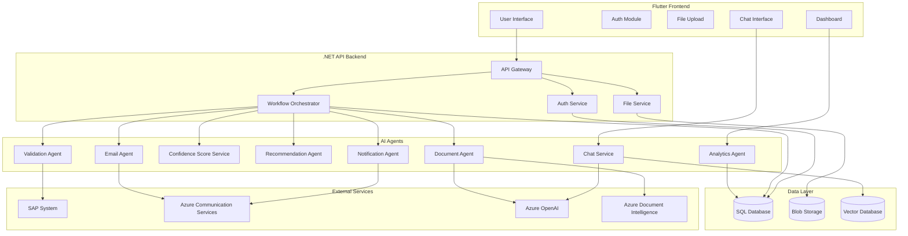
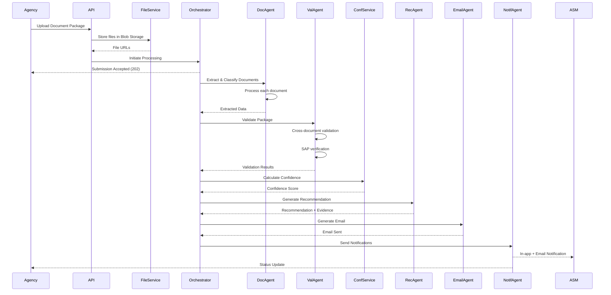

# Design Document: Bajaj Document Processing System

## Overview

The Bajaj Document Processing System is a multi-agent application that automates document processing workflows for purchase orders, invoices, cost summaries, and supporting documentation. The system architecture follows a microservices pattern with specialized AI agents handling distinct responsibilities: document classification, validation, scoring, recommendations, email generation, analytics, notifications, and conversational assistance.

The system serves three user roles with distinct capabilities:
- **Agency**: Submit document packages and track status
- **ASM (Area Sales Manager)**: Review, approve, or reject submissions with AI-powered recommendations
- **HQ (Headquarters)**: Access analytics dashboards and conversational AI insights

### Technology Stack

- **Frontend**: Flutter (cross-platform mobile/web)
  - **State Management**: Riverpod (recommended) or BLoC pattern
  - **Architecture**: Clean Architecture with feature-based structure
  - **HTTP Client**: Dio with interceptors for auth and logging
  - **Local Storage**: Hive or SharedPreferences for caching
  - **Dependency Injection**: Riverpod providers or GetIt
  - **Navigation**: GoRouter for declarative routing
  - **Testing**: flutter_test, mockito, integration_test
- **Backend**: .NET 8 Web API
- **Database**: SQL Server (Azure SQL or on-premises)
- **AI Orchestration**: Semantic Kernel for AI workflow orchestration and plugin management
- **AI Services**: 
  - Azure OpenAI GPT-4 for natural language processing
  - Azure OpenAI text-embedding-ada-002 for vector embeddings
  - Azure Document Intelligence for document extraction
  - Azure Content Safety for guardrails
- **Vector Database**: Azure AI Search for semantic search over analytics embeddings
- **Communication**: Azure Communication Services (ACS) for email
- **Storage**: Azure Blob Storage for document files
- **Caching**: Redis for KPI caching (5-minute TTL)

### Design Principles

1. **Agent Specialization**: Each agent has a single, well-defined responsibility
2. **Asynchronous Processing**: Long-running operations (extraction, validation) execute asynchronously
3. **Idempotency**: All operations can be safely retried without side effects
4. **Audit Trail**: Every state change is logged with user attribution and timestamps
5. **Graceful Degradation**: External service failures don't block core workflows
6. **AI Safety**: Multi-layer guardrails prevent unauthorized access and harmful outputs
7. **Semantic Search**: Vector database enables natural language queries over structured data

### Semantic Kernel Integration

Semantic Kernel is the core orchestration framework for all AI operations in the system:

**Usage Areas**:

1. **ChatService**: Primary use case for conversational analytics
   - Plugin system for analytics functions
   - Automatic planning for multi-step queries
   - Memory management for conversation context
   
2. **RecommendationAgent**: Evidence generation using Semantic Kernel prompts
   - Structured prompts for consistent evidence format
   - Function calling for validation result retrieval
   
3. **EmailAgent**: Email content generation using Semantic Kernel templates
   - Scenario-based prompt templates
   - Dynamic content insertion based on validation results

**Benefits**:
- Consistent AI interaction patterns across all agents
- Built-in prompt management and versioning
- Automatic retry and error handling
- Telemetry and observability for AI operations

### Vector Database Architecture

**Purpose**: Enable semantic search over analytics data for natural language queries

**Implementation**: Azure AI Search

**Data Model**:

```json
{
  "id": "unique-id",
  "content": "Maharashtra had 150 submissions in January 2024 with 87% approval rate and average confidence score of 84",
  "contentVector": [0.123, 0.456, ...],  // 1536-dimensional embedding
  "metadata": {
    "state": "Maharashtra",
    "timeRange": "2024-01",
    "submissionCount": 150,
    "approvalRate": 0.87,
    "avgConfidence": 84,
    "campaigns": ["Campaign A", "Campaign B"]
  }
}
```

**Indexing Pipeline**:

1. **Daily Aggregation Job** (runs at 2 AM):
   - Query SQL database for previous day's metrics
   - Aggregate by state, campaign, date
   - Generate natural language descriptions
   - Create embeddings using text-embedding-ada-002
   - Upsert to Azure AI Search index

2. **Real-Time Updates** (optional):
   - On significant events (e.g., 100 new submissions), trigger immediate index update
   - Ensures ChatService has near-real-time data

**Search Configuration**:

- **Hybrid Search**: Combine vector similarity with keyword matching
- **Filters**: Apply metadata filters for authorization (state, date range)
- **Top K**: Retrieve top 5 most relevant results
- **Similarity Threshold**: Minimum cosine similarity of 0.7

### Guardrails Architecture

**Multi-Layer Defense**:

```
User Query → Input Guardrails → Authorization → Vector Search → 
Semantic Kernel Processing → Output Guardrails → Response
```

**Layer 1: Input Guardrails**

```csharp
public class InputGuardrailService
{
    public async Task ValidateInputAsync(string query)
    {
        // 1. Length check
        if (query.Length > 500)
            throw new ValidationException("Query too long");
        
        // 2. Prompt injection detection
        var safetyResult = await _contentSafetyClient.AnalyzeTextAsync(query);
        if (safetyResult.JailbreakDetected)
            throw new SecurityException("Potential prompt injection detected");
        
        // 3. SQL injection patterns
        if (Regex.IsMatch(query, @"(DROP|DELETE|INSERT|UPDATE|SELECT)\s", RegexOptions.IgnoreCase))
            throw new SecurityException("Invalid query pattern");
        
        // 4. Rate limiting
        var userQueryCount = await _rateLimiter.GetCountAsync(userId, TimeSpan.FromMinutes(1));
        if (userQueryCount >= 10)
            throw new RateLimitException("Too many queries");
    }
}
```

**Layer 2: Authorization Guardrails**

```csharp
public class AuthorizationGuardrailService
{
    public async Task<DataScope> GetUserDataScopeAsync(Guid userId)
    {
        var user = await _userService.GetUserAsync(userId);
        
        // Only HQ users can access ChatService
        if (user.Role != UserRole.HQ)
            throw new UnauthorizedException("Only HQ users can access analytics chat");
        
        // Return data scope for filtering
        return new DataScope
        {
            States = user.AllowedStates,  // null = all states
            Campaigns = user.AllowedCampaigns,  // null = all campaigns
            DateRange = user.AllowedDateRange  // null = all dates
        };
    }
}
```

**Layer 3: Output Guardrails**

```csharp
public class OutputGuardrailService
{
    public async Task ValidateOutputAsync(string response, List<VectorSearchResult> sourceData)
    {
        // 1. Citation verification
        var citations = ExtractCitations(response);
        foreach (var citation in citations)
        {
            if (!sourceData.Any(d => d.Content.Contains(citation)))
                throw new HallucinationException("Response contains uncited information");
        }
        
        // 2. PII detection and redaction
        var piiResult = await _contentSafetyClient.DetectPIIAsync(response);
        if (piiResult.PIIDetected)
        {
            response = RedactPII(response, piiResult.PIILocations);
        }
        
        // 3. Harmful content detection
        var safetyResult = await _contentSafetyClient.AnalyzeTextAsync(response);
        if (safetyResult.IsHarmful)
            throw new ContentSafetyException("Response contains harmful content");
        
        // 4. Numeric verification
        var numbers = ExtractNumbers(response);
        foreach (var number in numbers)
        {
            if (!VerifyAgainstDatabase(number))
                throw new HallucinationException("Response contains incorrect numeric data");
        }
    }
}
```

**Layer 4: Semantic Kernel Guardrails**

```csharp
public class SemanticKernelGuardrailService
{
    public IKernel BuildSecureKernel()
    {
        var kernel = Kernel.CreateBuilder()
            .AddAzureOpenAIChatCompletion("gpt-4", endpoint, apiKey)
            .Build();
        
        // Only allow approved plugins
        kernel.ImportPluginFromObject(new AnalyticsPlugin(_analyticsService));
        
        // Add function calling filter
        kernel.FunctionInvocationFilters.Add(new FunctionCallGuardrail());
        
        // Add prompt rendering filter
        kernel.PromptRenderingFilters.Add(new PromptInjectionGuardrail());
        
        // Set execution timeout
        kernel.FunctionInvocationFilters.Add(new TimeoutGuardrail(TimeSpan.FromSeconds(30)));
        
        return kernel;
    }
}
```

## Architecture


### System Architecture Diagram



### Processing Flow




### Workflow States

A Document Package progresses through these states:

1. **UPLOADED**: Files received, awaiting processing
2. **EXTRACTING**: DocumentAgent processing documents
3. **VALIDATING**: ValidationAgent checking consistency
4. **SCORING**: ConfidenceScoreService calculating score
5. **RECOMMENDING**: RecommendationAgent generating recommendation
6. **PENDING_APPROVAL**: Awaiting ASM decision
7. **APPROVED**: ASM approved the package
8. **REJECTED**: ASM rejected the package
9. **REUPLOAD_REQUESTED**: ASM requested corrections

## Components and Interfaces


### 1. API Gateway

**Responsibility**: Route requests, authenticate users, validate inputs

**Endpoints**:

```
POST   /api/auth/login
POST   /api/auth/logout
GET    /api/auth/me

POST   /api/submissions
GET    /api/submissions/{id}
GET    /api/submissions
PATCH  /api/submissions/{id}/approve
PATCH  /api/submissions/{id}/reject
PATCH  /api/submissions/{id}/request-reupload

POST   /api/documents/upload
GET    /api/documents/{id}

GET    /api/analytics/kpis
GET    /api/analytics/state-roi
GET    /api/analytics/campaign-breakdown
POST   /api/analytics/export

POST   /api/chat/message
GET    /api/chat/history

GET    /api/notifications
PATCH  /api/notifications/{id}/read
```

**Authentication**: JWT tokens with role claims (Agency, ASM, HQ)

**Request Validation**: FluentValidation for all DTOs

**Error Handling**: Global exception middleware returning standardized error responses

### 2. Document Agent

**Responsibility**: Classify documents and extract structured fields

**Technology**: Azure Document Intelligence (Form Recognizer) + Azure OpenAI for classification

**Processing Pipeline**:

1. **Classification**: Use Azure OpenAI GPT-4 Vision to classify document type
2. **Extraction**: Use Azure Document Intelligence custom models for each document type
3. **Confidence Calculation**: Per-field confidence from Document Intelligence
4. **Persistence**: Store extracted data in SQL database

**Document Type Models**:

- **PO Model**: Extract PO number, vendor, date, line items, amounts
- **Invoice Model**: Extract invoice number, date, line items, amounts, tax
- **Cost Summary Model**: Extract campaign details, cost breakdowns, totals
- **Photo Model**: Extract EXIF metadata (timestamp, location, device)

**Interface**:

```csharp
public interface IDocumentAgent
{
    Task<DocumentClassification> ClassifyAsync(string blobUrl);
    Task<POData> ExtractPOAsync(string blobUrl);
    Task<InvoiceData> ExtractInvoiceAsync(string blobUrl);
    Task<CostSummaryData> ExtractCostSummaryAsync(string blobUrl);
    Task<PhotoMetadata> ExtractPhotoMetadataAsync(string blobUrl);
}
```

### 3. Validation Agent

**Responsibility**: Cross-document validation and SAP verification

**Validation Rules**:


1. **SAP PO Verification**: Query SAP OData API to verify PO exists and matches extracted data
2. **Amount Consistency**: Invoice total matches Cost Summary total (±2% tolerance)
3. **Line Item Matching**: All PO line items appear in Invoice
4. **Completeness Check**: All 11 required items present (PO, Invoice, Cost Summary, Activity records, Photos, etc.)
5. **Date Validation**: Invoice date >= PO date, Invoice date <= Submission date
6. **Vendor Matching**: PO vendor matches Invoice vendor

**SAP Integration**:

- Use SAP OData API for PO lookup
- Implement circuit breaker pattern for SAP failures
- Queue validation requests when SAP unavailable
- Retry with exponential backoff (3 attempts)

**Interface**:

```csharp
public interface IValidationAgent
{
    Task<ValidationResult> ValidatePackageAsync(Guid packageId);
    Task<SAPVerificationResult> VerifySAPPOAsync(string poNumber);
    Task<bool> ValidateAmountConsistencyAsync(decimal invoiceTotal, decimal costSummaryTotal);
    Task<bool> ValidateLineItemsAsync(List<POLineItem> poItems, List<InvoiceLineItem> invoiceItems);
    Task<CompletenessResult> ValidateCompletenessAsync(DocumentPackage package);
}
```

### 4. Confidence Score Service

**Responsibility**: Calculate weighted confidence scores

**Scoring Formula**:

```
OverallConfidence = (PO_Confidence × 0.30) + 
                    (Invoice_Confidence × 0.30) + 
                    (CostSummary_Confidence × 0.20) + 
                    (Activity_Confidence × 0.10) + 
                    (Photos_Confidence × 0.10)
```

**Per-Document Confidence**:

- Average of all field-level confidences from Document Intelligence
- Minimum threshold: 60% per field
- Missing required fields: 0% confidence for that document

**Interface**:

```csharp
public interface IConfidenceScoreService
{
    Task<ConfidenceScore> CalculateAsync(Guid packageId);
    double CalculateDocumentConfidence(Dictionary<string, double> fieldConfidences);
}
```

### 5. Recommendation Agent

**Responsibility**: Generate approval recommendations with evidence

**Decision Logic**:

```
IF Confidence >= 85 AND Validation.AllPassed THEN APPROVE
ELSE IF Confidence >= 70 AND Confidence < 85 THEN REVIEW
ELSE IF Confidence < 70 OR Validation.AnyFailed THEN REJECT
```

**Evidence Generation**:

Use Azure OpenAI GPT-4 to generate natural language evidence summary:

- Input: Validation results, confidence scores, field-level details
- Output: Plain-English summary with specific citations
- Example: "PO #12345 verified in SAP. Invoice total ($10,500) matches Cost Summary within tolerance. All line items present. High confidence (92%) across all documents."

**Interface**:

```csharp
public interface IRecommendationAgent
{
    Task<Recommendation> GenerateAsync(Guid packageId);
}

public class Recommendation
{
    public RecommendationType Type { get; set; } // APPROVE, REVIEW, REJECT
    public string Evidence { get; set; }
    public List<string> ValidationIssues { get; set; }
    public double ConfidenceScore { get; set; }
}
```

### 6. Email Agent

**Responsibility**: Generate and send scenario-based emails

**Email Scenarios**:


1. **Data Failure - Re-upload Request**: Sent to Agency when validation fails
   - Include specific fields needing correction
   - Provide clear instructions
   
2. **Data Pass - ASM Approval**: Sent to ASM when validation passes
   - Include confidence score and recommendation
   - Link to approval interface
   
3. **Approved**: Sent to Agency when ASM approves
   - Confirmation message
   - Next steps
   
4. **Rejected**: Sent to Agency when ASM rejects
   - Reason for rejection
   - Re-submission instructions

**Template Generation**:

Use Azure OpenAI to generate personalized email content based on:
- Scenario type
- Validation results
- User role
- Specific field issues

**Delivery**:

- Azure Communication Services (ACS) for email delivery
- Retry logic: 3 attempts with exponential backoff (1s, 2s, 4s)
- Store delivery status in database
- Alert administrators on persistent failures

**Interface**:

```csharp
public interface IEmailAgent
{
    Task<EmailResult> SendDataFailureEmailAsync(Guid packageId, List<ValidationIssue> issues);
    Task<EmailResult> SendDataPassEmailAsync(Guid packageId, string asmEmail);
    Task<EmailResult> SendApprovedEmailAsync(Guid packageId, string agencyEmail);
    Task<EmailResult> SendRejectedEmailAsync(Guid packageId, string agencyEmail, string reason);
}
```

### 7. Analytics Agent

**Responsibility**: Generate KPIs, dashboards, and AI narratives

**KPI Calculations**:

1. **Total Submissions**: Count of all Document Packages
2. **Approval Rate**: (Approved / Total) × 100
3. **Average Processing Time**: Mean time from submission to decision
4. **Auto-Approval Rate**: Packages approved without ASM intervention
5. **Confidence Distribution**: Histogram of confidence scores
6. **State-Level ROI**: ROI metrics grouped by state
7. **Campaign Performance**: Submission counts and approval rates by campaign

**Data Aggregation**:

- Real-time queries against SQL database
- Materialized views for expensive aggregations
- Caching layer (Redis) for frequently accessed metrics (5-minute TTL)

**AI Narrative Generation**:

Use Azure OpenAI GPT-4 to generate insights:

```
Input: KPI data, trends, anomalies
Output: "This week saw a 15% increase in submissions from Maharashtra, 
         with an approval rate of 87%, up from 82% last week. 
         The average confidence score improved to 84, indicating 
         better document quality from agencies."
```

**Export Functionality**:

- Generate Excel files using EPPlus library
- Include all KPIs, state breakdowns, campaign data
- Format with Bajaj branding (colors, logo)

**Interface**:

```csharp
public interface IAnalyticsAgent
{
    Task<KPIDashboard> GetKPIsAsync(DateRange range);
    Task<List<StateROI>> GetStateROIAsync(DateRange range);
    Task<List<CampaignBreakdown>> GetCampaignBreakdownAsync(DateRange range);
    Task<byte[]> ExportToExcelAsync(DateRange range);
    Task<string> GenerateNarrativeAsync(KPIDashboard kpis);
}
```

### 8. Notification Agent

**Responsibility**: Manage in-app and email notifications

**Notification Types**:


1. **Submission Received** (to ASM): New package awaiting review
2. **Flagged for Review** (to ASM): Low confidence or validation issues
3. **Approved** (to Agency): Package approved by ASM
4. **Rejected** (to Agency): Package rejected by ASM
5. **Re-upload Requested** (to Agency): Corrections needed

**Delivery Channels**:

- **In-App**: Store in database, display in notification inbox
- **Email**: Send via ACS with retry logic

**Notification Storage**:

```sql
Notifications Table:
- Id (GUID)
- UserId (GUID)
- Type (enum)
- Title (string)
- Message (string)
- IsRead (bool)
- CreatedAt (datetime)
- ReadAt (datetime, nullable)
- RelatedEntityId (GUID, nullable)
```

**Interface**:

```csharp
public interface INotificationAgent
{
    Task SendNotificationAsync(Guid userId, NotificationType type, string title, string message, Guid? relatedEntityId = null);
    Task<List<Notification>> GetUserNotificationsAsync(Guid userId, bool unreadOnly = false);
    Task MarkAsReadAsync(Guid notificationId);
}
```

### 9. Chat Service

**Responsibility**: Conversational AI assistant for analytics queries

**Technology Stack**:

- **Semantic Kernel**: Orchestration framework for AI workflows
- **Azure OpenAI GPT-4**: Language model for natural language understanding and generation
- **Vector Database**: Azure AI Search for semantic search over analytics embeddings
- **Embeddings**: text-embedding-ada-002 for analytics data vectorization

**Semantic Kernel Architecture**:

The ChatService is built entirely on Semantic Kernel, which provides:

1. **Plugin System**: Modular functions for analytics queries
2. **Planner**: Automatic orchestration of multi-step queries
3. **Memory**: Conversation context management
4. **Connectors**: Integration with Azure OpenAI and Vector Database

**Semantic Kernel Plugins**:

```csharp
public class AnalyticsPlugin
{
    [KernelFunction, Description("Get KPI metrics for a date range")]
    public async Task<string> GetKPIs(string startDate, string endDate) { ... }
    
    [KernelFunction, Description("Get state-level ROI data")]
    public async Task<string> GetStateROI(string state) { ... }
    
    [KernelFunction, Description("Get campaign performance data")]
    public async Task<string> GetCampaignData(string campaignName) { ... }
    
    [KernelFunction, Description("Search analytics data semantically")]
    public async Task<string> SearchAnalytics(string query) { ... }
}
```

**Vector Database Implementation**:

1. **Embedding Pipeline**: Nightly job to vectorize analytics data
   - Aggregate daily/weekly/monthly metrics from SQL database
   - Generate text descriptions of data points (e.g., "Maharashtra had 150 submissions in January 2024 with 87% approval rate")
   - Create embeddings using text-embedding-ada-002
   - Store embeddings in Azure AI Search with metadata (date range, state, campaign, metrics)
   
2. **Vector Search**:
   - User query is embedded using the same model
   - Cosine similarity search in Azure AI Search
   - Retrieve top 5 most relevant analytics data points
   - Pass retrieved context to Semantic Kernel for response generation

**Guardrails Implementation**:

The ChatService implements multiple layers of guardrails to ensure safe and authorized operation:

1. **Input Guardrails**:
   - **Prompt Injection Detection**: Use Azure Content Safety API to detect jailbreak attempts
   - **Input Sanitization**: Remove special characters and SQL injection patterns
   - **Query Length Limits**: Maximum 500 characters per query
   - **Rate Limiting**: Maximum 10 queries per minute per user

2. **Authorization Guardrails**:
   - **Role Verification**: Only HQ users can access ChatService (checked before every query)
   - **Data Scope Filtering**: Filter vector search results to only include data the user has permission to view
   - **State-Level Access**: If user has state-specific permissions, filter results to that state

3. **Output Guardrails**:
   - **Response Validation**: Ensure responses only cite data from vector search results
   - **PII Redaction**: Scan responses for personal information and redact if found
   - **Hallucination Detection**: Verify all numeric claims against actual database values
   - **Content Safety**: Use Azure Content Safety API to check for harmful content in responses

4. **Semantic Kernel Guardrails**:
   - **Function Calling Restrictions**: Only allow calls to approved AnalyticsPlugin functions
   - **Parameter Validation**: Validate all function parameters before execution
   - **Execution Timeout**: Maximum 30 seconds per query execution
   - **Error Handling**: Catch and sanitize all errors before returning to user

**Query Processing Flow with Semantic Kernel**:

```csharp
public async Task<ChatResponse> ProcessQueryAsync(Guid userId, string query, Guid? conversationId)
{
    // 1. Input Guardrails
    await _guardrailService.ValidateInputAsync(query);
    
    // 2. Authorization Check
    var user = await _userService.GetUserAsync(userId);
    if (user.Role != UserRole.HQ)
        throw new UnauthorizedException("Only HQ users can access analytics chat");
    
    // 3. Vector Search
    var embedding = await _embeddingService.GenerateEmbeddingAsync(query);
    var relevantData = await _vectorDatabase.SearchAsync(embedding, topK: 5, filter: user.DataScope);
    
    // 4. Semantic Kernel Processing
    var kernel = _kernelBuilder
        .AddAzureOpenAIChatCompletion("gpt-4", endpoint, apiKey)
        .Build();
    
    kernel.ImportPluginFromObject(new AnalyticsPlugin(_analyticsService));
    
    var context = string.Join("\n", relevantData.Select(d => d.Text));
    var prompt = $@"
        You are an analytics assistant for the Bajaj Document Processing System.
        Answer the user's question using ONLY the provided context.
        Always cite specific data sources and time ranges.
        
        Context:
        {context}
        
        User Question: {query}
    ";
    
    var result = await kernel.InvokePromptAsync(prompt);
    
    // 5. Output Guardrails
    var response = result.ToString();
    await _guardrailService.ValidateOutputAsync(response, relevantData);
    
    // 6. Store Conversation
    await _conversationService.SaveMessageAsync(conversationId, query, response);
    
    return new ChatResponse
    {
        Message = response,
        Citations = relevantData.Select(d => new DataCitation { Source = d.Source, TimeRange = d.TimeRange }).ToList(),
        ConversationId = conversationId ?? Guid.NewGuid()
    };
}
```

**Conversation Context Management**:

- Semantic Kernel Memory stores last 10 messages
- Context is passed to each query for continuity
- Conversations stored in SQL database for audit
- Clear context on new session or user request

**Interface**:

```csharp
public interface IChatService
{
    Task<ChatResponse> ProcessQueryAsync(Guid userId, string query, Guid? conversationId = null);
    Task<List<ChatMessage>> GetConversationHistoryAsync(Guid conversationId);
    Task ClearConversationAsync(Guid conversationId);
}

public class ChatResponse
{
    public string Message { get; set; }
    public List<DataCitation> Citations { get; set; }
    public Guid ConversationId { get; set; }
}

public class DataCitation
{
    public string Source { get; set; }
    public string TimeRange { get; set; }
    public Dictionary<string, object> Metrics { get; set; }
}
```

### 10. Workflow Orchestrator

**Responsibility**: Coordinate agent execution and manage state transitions

**Orchestration Pattern**: Saga pattern with compensation

**Processing Steps**:


```csharp
public async Task ProcessSubmissionAsync(Guid packageId)
{
    try
    {
        // Step 1: Extract documents
        await UpdateStateAsync(packageId, PackageState.EXTRACTING);
        var extractionResults = await _documentAgent.ExtractAllAsync(packageId);
        
        // Step 2: Validate package
        await UpdateStateAsync(packageId, PackageState.VALIDATING);
        var validationResults = await _validationAgent.ValidatePackageAsync(packageId);
        
        // Step 3: Calculate confidence
        await UpdateStateAsync(packageId, PackageState.SCORING);
        var confidenceScore = await _confidenceScoreService.CalculateAsync(packageId);
        
        // Step 4: Generate recommendation
        await UpdateStateAsync(packageId, PackageState.RECOMMENDING);
        var recommendation = await _recommendationAgent.GenerateAsync(packageId);
        
        // Step 5: Send notifications
        await UpdateStateAsync(packageId, PackageState.PENDING_APPROVAL);
        
        if (validationResults.AllPassed)
        {
            await _emailAgent.SendDataPassEmailAsync(packageId, asmEmail);
            await _notificationAgent.SendNotificationAsync(asmUserId, NotificationType.SubmissionReceived, ...);
        }
        else
        {
            await _emailAgent.SendDataFailureEmailAsync(packageId, validationResults.Issues);
            await _notificationAgent.SendNotificationAsync(agencyUserId, NotificationType.ReuploadRequested, ...);
        }
    }
    catch (Exception ex)
    {
        await HandleErrorAsync(packageId, ex);
    }
}
```

**Error Handling**:

- Transient failures: Retry with exponential backoff
- Permanent failures: Mark package as ERROR state, notify administrators
- Compensation: Rollback state changes on critical failures

**Idempotency**:

- Each step checks if already completed before executing
- Use database transactions for state updates
- Store operation results to prevent duplicate processing

## Data Models

### Core Entities

**DocumentPackage**:

```csharp
public class DocumentPackage
{
    public Guid Id { get; set; }
    public Guid AgencyUserId { get; set; }
    public Guid? AssignedASMId { get; set; }
    public PackageState State { get; set; }
    public DateTime SubmittedAt { get; set; }
    public DateTime? ProcessedAt { get; set; }
    public DateTime? DecisionAt { get; set; }
    
    // Navigation properties
    public List<Document> Documents { get; set; }
    public ValidationResult ValidationResult { get; set; }
    public ConfidenceScore ConfidenceScore { get; set; }
    public Recommendation Recommendation { get; set; }
}

public enum PackageState
{
    UPLOADED,
    EXTRACTING,
    VALIDATING,
    SCORING,
    RECOMMENDING,
    PENDING_APPROVAL,
    APPROVED,
    REJECTED,
    REUPLOAD_REQUESTED,
    ERROR
}
```

**Document**:

```csharp
public class Document
{
    public Guid Id { get; set; }
    public Guid PackageId { get; set; }
    public DocumentType Type { get; set; }
    public string BlobUrl { get; set; }
    public string FileName { get; set; }
    public long FileSizeBytes { get; set; }
    public DateTime UploadedAt { get; set; }
    
    // Extracted data (JSON columns)
    public string ExtractedDataJson { get; set; }
    public double? ExtractionConfidence { get; set; }
}

public enum DocumentType
{
    PO,
    Invoice,
    CostSummary,
    Photo,
    AdditionalDocument,
    ActivityRecord
}
```

**POData** (stored as JSON in Document.ExtractedDataJson):

```csharp
public class POData
{
    public string PONumber { get; set; }
    public string VendorName { get; set; }
    public DateTime PODate { get; set; }
    public List<POLineItem> LineItems { get; set; }
    public decimal TotalAmount { get; set; }
    public Dictionary<string, double> FieldConfidences { get; set; }
}

public class POLineItem
{
    public string ItemCode { get; set; }
    public string Description { get; set; }
    public int Quantity { get; set; }
    public decimal UnitPrice { get; set; }
    public decimal LineTotal { get; set; }
}
```

**InvoiceData** (stored as JSON):


```csharp
public class InvoiceData
{
    public string InvoiceNumber { get; set; }
    public string VendorName { get; set; }
    public DateTime InvoiceDate { get; set; }
    public List<InvoiceLineItem> LineItems { get; set; }
    public decimal SubTotal { get; set; }
    public decimal TaxAmount { get; set; }
    public decimal TotalAmount { get; set; }
    public Dictionary<string, double> FieldConfidences { get; set; }
}

public class InvoiceLineItem
{
    public string ItemCode { get; set; }
    public string Description { get; set; }
    public int Quantity { get; set; }
    public decimal UnitPrice { get; set; }
    public decimal LineTotal { get; set; }
}
```

**CostSummaryData** (stored as JSON):

```csharp
public class CostSummaryData
{
    public string CampaignName { get; set; }
    public string State { get; set; }
    public DateTime CampaignStartDate { get; set; }
    public DateTime CampaignEndDate { get; set; }
    public List<CostBreakdown> CostBreakdowns { get; set; }
    public decimal TotalCost { get; set; }
    public Dictionary<string, double> FieldConfidences { get; set; }
}

public class CostBreakdown
{
    public string Category { get; set; }
    public decimal Amount { get; set; }
}
```

**ValidationResult**:

```csharp
public class ValidationResult
{
    public Guid Id { get; set; }
    public Guid PackageId { get; set; }
    public bool AllPassed { get; set; }
    public DateTime ValidatedAt { get; set; }
    
    public bool SAPVerificationPassed { get; set; }
    public bool AmountConsistencyPassed { get; set; }
    public bool LineItemMatchingPassed { get; set; }
    public bool CompletenessCheckPassed { get; set; }
    public bool DateValidationPassed { get; set; }
    public bool VendorMatchingPassed { get; set; }
    
    public List<ValidationIssue> Issues { get; set; }
}

public class ValidationIssue
{
    public string Field { get; set; }
    public string IssueType { get; set; }
    public string Description { get; set; }
    public string ExpectedValue { get; set; }
    public string ActualValue { get; set; }
}
```

**ConfidenceScore**:

```csharp
public class ConfidenceScore
{
    public Guid Id { get; set; }
    public Guid PackageId { get; set; }
    public double OverallScore { get; set; }
    public double POConfidence { get; set; }
    public double InvoiceConfidence { get; set; }
    public double CostSummaryConfidence { get; set; }
    public double ActivityConfidence { get; set; }
    public double PhotosConfidence { get; set; }
    public DateTime CalculatedAt { get; set; }
}
```

**Recommendation**:

```csharp
public class Recommendation
{
    public Guid Id { get; set; }
    public Guid PackageId { get; set; }
    public RecommendationType Type { get; set; }
    public string Evidence { get; set; }
    public DateTime GeneratedAt { get; set; }
}

public enum RecommendationType
{
    APPROVE,
    REVIEW,
    REJECT
}
```

**User**:

```csharp
public class User
{
    public Guid Id { get; set; }
    public string Email { get; set; }
    public string PasswordHash { get; set; }
    public UserRole Role { get; set; }
    public string FullName { get; set; }
    public string State { get; set; } // For Agency and ASM users
    public DateTime CreatedAt { get; set; }
    public DateTime? LastLoginAt { get; set; }
}

public enum UserRole
{
    Agency,
    ASM,
    HQ
}
```

**Notification**:

```csharp
public class Notification
{
    public Guid Id { get; set; }
    public Guid UserId { get; set; }
    public NotificationType Type { get; set; }
    public string Title { get; set; }
    public string Message { get; set; }
    public bool IsRead { get; set; }
    public DateTime CreatedAt { get; set; }
    public DateTime? ReadAt { get; set; }
    public Guid? RelatedEntityId { get; set; }
}

public enum NotificationType
{
    SubmissionReceived,
    FlaggedForReview,
    Approved,
    Rejected,
    ReuploadRequested
}
```

### Database Schema


```sql
-- Users table
CREATE TABLE Users (
    Id UNIQUEIDENTIFIER PRIMARY KEY DEFAULT NEWID(),
    Email NVARCHAR(255) NOT NULL UNIQUE,
    PasswordHash NVARCHAR(255) NOT NULL,
    Role NVARCHAR(50) NOT NULL,
    FullName NVARCHAR(255) NOT NULL,
    State NVARCHAR(100),
    CreatedAt DATETIME2 NOT NULL DEFAULT GETUTCDATE(),
    LastLoginAt DATETIME2
);

-- DocumentPackages table
CREATE TABLE DocumentPackages (
    Id UNIQUEIDENTIFIER PRIMARY KEY DEFAULT NEWID(),
    AgencyUserId UNIQUEIDENTIFIER NOT NULL,
    AssignedASMId UNIQUEIDENTIFIER,
    State NVARCHAR(50) NOT NULL,
    SubmittedAt DATETIME2 NOT NULL DEFAULT GETUTCDATE(),
    ProcessedAt DATETIME2,
    DecisionAt DATETIME2,
    FOREIGN KEY (AgencyUserId) REFERENCES Users(Id),
    FOREIGN KEY (AssignedASMId) REFERENCES Users(Id)
);

-- Documents table
CREATE TABLE Documents (
    Id UNIQUEIDENTIFIER PRIMARY KEY DEFAULT NEWID(),
    PackageId UNIQUEIDENTIFIER NOT NULL,
    Type NVARCHAR(50) NOT NULL,
    BlobUrl NVARCHAR(1000) NOT NULL,
    FileName NVARCHAR(255) NOT NULL,
    FileSizeBytes BIGINT NOT NULL,
    UploadedAt DATETIME2 NOT NULL DEFAULT GETUTCDATE(),
    ExtractedDataJson NVARCHAR(MAX),
    ExtractionConfidence FLOAT,
    FOREIGN KEY (PackageId) REFERENCES DocumentPackages(Id) ON DELETE CASCADE
);

-- ValidationResults table
CREATE TABLE ValidationResults (
    Id UNIQUEIDENTIFIER PRIMARY KEY DEFAULT NEWID(),
    PackageId UNIQUEIDENTIFIER NOT NULL UNIQUE,
    AllPassed BIT NOT NULL,
    ValidatedAt DATETIME2 NOT NULL DEFAULT GETUTCDATE(),
    SAPVerificationPassed BIT NOT NULL,
    AmountConsistencyPassed BIT NOT NULL,
    LineItemMatchingPassed BIT NOT NULL,
    CompletenessCheckPassed BIT NOT NULL,
    DateValidationPassed BIT NOT NULL,
    VendorMatchingPassed BIT NOT NULL,
    IssuesJson NVARCHAR(MAX),
    FOREIGN KEY (PackageId) REFERENCES DocumentPackages(Id) ON DELETE CASCADE
);

-- ConfidenceScores table
CREATE TABLE ConfidenceScores (
    Id UNIQUEIDENTIFIER PRIMARY KEY DEFAULT NEWID(),
    PackageId UNIQUEIDENTIFIER NOT NULL UNIQUE,
    OverallScore FLOAT NOT NULL,
    POConfidence FLOAT NOT NULL,
    InvoiceConfidence FLOAT NOT NULL,
    CostSummaryConfidence FLOAT NOT NULL,
    ActivityConfidence FLOAT NOT NULL,
    PhotosConfidence FLOAT NOT NULL,
    CalculatedAt DATETIME2 NOT NULL DEFAULT GETUTCDATE(),
    FOREIGN KEY (PackageId) REFERENCES DocumentPackages(Id) ON DELETE CASCADE
);

-- Recommendations table
CREATE TABLE Recommendations (
    Id UNIQUEIDENTIFIER PRIMARY KEY DEFAULT NEWID(),
    PackageId UNIQUEIDENTIFIER NOT NULL UNIQUE,
    Type NVARCHAR(50) NOT NULL,
    Evidence NVARCHAR(MAX) NOT NULL,
    GeneratedAt DATETIME2 NOT NULL DEFAULT GETUTCDATE(),
    FOREIGN KEY (PackageId) REFERENCES DocumentPackages(Id) ON DELETE CASCADE
);

-- Notifications table
CREATE TABLE Notifications (
    Id UNIQUEIDENTIFIER PRIMARY KEY DEFAULT NEWID(),
    UserId UNIQUEIDENTIFIER NOT NULL,
    Type NVARCHAR(50) NOT NULL,
    Title NVARCHAR(255) NOT NULL,
    Message NVARCHAR(MAX) NOT NULL,
    IsRead BIT NOT NULL DEFAULT 0,
    CreatedAt DATETIME2 NOT NULL DEFAULT GETUTCDATE(),
    ReadAt DATETIME2,
    RelatedEntityId UNIQUEIDENTIFIER,
    FOREIGN KEY (UserId) REFERENCES Users(Id) ON DELETE CASCADE
);

-- AuditLog table
CREATE TABLE AuditLog (
    Id UNIQUEIDENTIFIER PRIMARY KEY DEFAULT NEWID(),
    UserId UNIQUEIDENTIFIER,
    Action NVARCHAR(255) NOT NULL,
    EntityType NVARCHAR(100),
    EntityId UNIQUEIDENTIFIER,
    Details NVARCHAR(MAX),
    IPAddress NVARCHAR(50),
    Timestamp DATETIME2 NOT NULL DEFAULT GETUTCDATE(),
    FOREIGN KEY (UserId) REFERENCES Users(Id)
);

-- Indexes
CREATE INDEX IX_DocumentPackages_AgencyUserId ON DocumentPackages(AgencyUserId);
CREATE INDEX IX_DocumentPackages_AssignedASMId ON DocumentPackages(AssignedASMId);
CREATE INDEX IX_DocumentPackages_State ON DocumentPackages(State);
CREATE INDEX IX_Documents_PackageId ON Documents(PackageId);
CREATE INDEX IX_Notifications_UserId_IsRead ON Notifications(UserId, IsRead);
CREATE INDEX IX_AuditLog_UserId ON AuditLog(UserId);
CREATE INDEX IX_AuditLog_Timestamp ON AuditLog(Timestamp);
```

## Correctness Properties


A property is a characteristic or behavior that should hold true across all valid executions of a system—essentially, a formal statement about what the system should do. Properties serve as the bridge between human-readable specifications and machine-verifiable correctness guarantees.

### Property Reflection

After analyzing all acceptance criteria, several properties can be combined to eliminate redundancy:

- **File Upload Validation (1.2-1.6)**: All document types follow the same validation pattern (format and size checks). These can be combined into a single property about document upload validation rules.

- **Confidence Score Weights (4.2-4.6)**: All weight assignments are part of the same calculation formula. These should be combined into a single property about weighted score calculation.

- **Recommendation Logic (5.3-5.5)**: The three recommendation rules (APPROVE, REVIEW, REJECT) are mutually exclusive cases of the same decision logic. These should be combined into a single property about recommendation generation based on score and validation state.

- **Role-Based Access (10.3-10.5)**: The three role-based access rules follow the same pattern. These can be combined into a single property about role-based authorization.

- **Document Extraction (2.2-2.4)**: All document types follow the same extraction pattern (extract all required fields). These can be combined into a single property about extraction completeness.

### Properties

**Property 1: Document Upload Validation**

*For any* document upload with a specific document type, file format, and file size, the system should accept the upload if and only if the format is in the allowed list for that document type and the size is within the limit for that document type.

**Validates: Requirements 1.2, 1.3, 1.4, 1.5, 1.6, 1.7**

**Property 2: Upload Confirmation Display**

*For any* successful file upload, the confirmation message should contain both the filename and file size of the uploaded document.

**Validates: Requirements 1.8**

**Property 3: Photo Upload Limit**

*For any* submission, the system should accept up to 20 photos and reject any attempt to upload more than 20 photos.

**Validates: Requirements 1.9**

**Property 4: Submit Button Enablement**

*For any* submission form state, the submit button should be enabled if and only if all required documents (PO, Invoice, Cost Summary) are uploaded.

**Validates: Requirements 1.10**

**Property 5: Document Classification**

*For any* uploaded document, the DocumentAgent should classify it as exactly one of the valid document types (PO, Invoice, Cost_Summary, Photo, or Additional_Document).

**Validates: Requirements 2.1**

**Property 6: Extraction Completeness**

*For any* classified document of a specific type, the extracted data should contain all required fields for that document type with non-null values.

**Validates: Requirements 2.2, 2.3, 2.4**

**Property 7: Photo Metadata Extraction**

*For any* classified photo, the extracted metadata should contain timestamp and location fields (location may be null if not available in EXIF data).

**Validates: Requirements 2.5**

**Property 8: Low Confidence Flagging**

*For any* document where classification confidence is below the threshold, the DocumentAgent should flag it for manual review.

**Validates: Requirements 2.6**

**Property 9: Extraction Persistence Round-Trip**

*For any* extracted document data, persisting it to the database and then retrieving it should produce equivalent data.

**Validates: Requirements 2.7**

**Property 10: SAP PO Verification**

*For any* Document Package with a PO, the ValidationAgent should verify that the PO number exists in SAP and that key fields (vendor, amount, date) match the SAP record.

**Validates: Requirements 3.1**

**Property 11: Amount Consistency Validation**

*For any* Document Package, if the absolute difference between Invoice total and Cost Summary total is within 2% of the Invoice total, the amount consistency validation should pass; otherwise it should fail.

**Validates: Requirements 3.2**

**Property 12: Line Item Matching**

*For any* Document Package, the line item validation should pass if and only if every PO line item (by item code) appears in the Invoice line items.

**Validates: Requirements 3.3**

**Property 13: Completeness Validation**

*For any* Document Package, the completeness validation should pass if and only if all 11 required items are present in the package.

**Validates: Requirements 3.4**

**Property 14: Validation Failure Recording**

*For any* validation that fails, the ValidationResult should contain a ValidationIssue with field name, issue type, description, expected value, and actual value.

**Validates: Requirements 3.5**

**Property 15: Validation Complete State**

*For any* Document Package where all validations pass, the package state should be marked as validation_complete.

**Validates: Requirements 3.6**

**Property 16: SAP Connection Failure Handling**

*For any* validation attempt when SAP connection fails, the system should log the error and mark SAP validation status as pending (not failed).

**Validates: Requirements 3.7**

**Property 17: Confidence Score Calculation**

*For any* Document Package with extracted documents, the overall confidence score should equal (PO_confidence × 0.30) + (Invoice_confidence × 0.30) + (CostSummary_confidence × 0.20) + (Activity_confidence × 0.10) + (Photos_confidence × 0.10).

**Validates: Requirements 4.1, 4.2, 4.3, 4.4, 4.5, 4.6**

**Property 18: Confidence Score Bounds**

*For any* calculated confidence score, the value should be between 0 and 100 (inclusive).

**Validates: Requirements 4.7**

**Property 19: Low Confidence Flagging**

*For any* Document Package with a confidence score below 70, the system should flag the package for mandatory review.

**Validates: Requirements 4.8**

**Property 20: Recommendation Generation**

*For any* Document Package that completes validation and scoring, the RecommendationAgent should generate exactly one recommendation of type APPROVE, REVIEW, or REJECT.

**Validates: Requirements 5.1**

**Property 21: Evidence Provision**

*For any* generated recommendation, the evidence field should be non-empty and contain plain-English text.

**Validates: Requirements 5.2**

**Property 22: Recommendation Logic**

*For any* Document Package, the recommendation should be APPROVE if confidence >= 85 and all validations passed, REVIEW if confidence is between 70 and 85, and REJECT if confidence < 70 or any validation failed.

**Validates: Requirements 5.3, 5.4, 5.5**

**Property 23: Evidence Citations**

*For any* generated evidence, the text should contain references to specific validation results (pass/fail status) and confidence factors (score values).

**Validates: Requirements 5.6**

**Property 24: Recommendation Persistence Round-Trip**

*For any* generated recommendation, persisting it to the database and then retrieving it should produce an equivalent recommendation.

**Validates: Requirements 5.7**

**Property 25: Data Failure Email Generation**

*For any* Document Package that fails validation, the EmailAgent should generate a data failure email containing the specific fields that need correction.

**Validates: Requirements 6.1, 6.2**

**Property 26: Data Pass Email Generation**

*For any* Document Package that passes validation, the EmailAgent should generate a data pass email addressed to the assigned ASM.

**Validates: Requirements 6.3**

**Property 27: Scenario-Based Email Templates**

*For any* email generation request, the EmailAgent should select a template that matches the scenario type (data failure, data pass, approved, rejected).

**Validates: Requirements 6.4**

**Property 28: Email Recipient Routing**

*For any* generated email, the recipient address should match the role appropriate for the scenario (Agency for failure/approval/rejection, ASM for data pass).

**Validates: Requirements 6.5**

**Property 29: Email Delivery Retry**

*For any* email delivery failure, the system should retry up to 3 times with exponentially increasing delays before marking as permanently failed.

**Validates: Requirements 6.6**

**Property 30: Email Delivery Logging**

*For any* successful email delivery, the system should create a log entry with delivery confirmation details.

**Validates: Requirements 6.7**

**Property 31: State-Level ROI Calculation**

*For any* analytics query with a date range, the AnalyticsAgent should calculate ROI metrics for each state that has submissions in that date range.

**Validates: Requirements 7.2**

**Property 32: Campaign Breakdown Analytics**

*For any* analytics query, the campaign breakdown should include submission count and approval rate for each campaign.

**Validates: Requirements 7.3**

**Property 33: Analytics Export Completeness**

*For any* analytics export request, the generated Excel file should contain all KPI data, state ROI data, and campaign breakdown data for the requested date range.

**Validates: Requirements 7.4**

**Property 34: AI Narrative Generation**

*For any* KPI dashboard data, the AnalyticsAgent should generate a non-empty AI narrative summarizing key insights.

**Validates: Requirements 7.5**

**Property 35: Real-Time KPI Data**

*For any* KPI calculation, the data should reflect the current state of the SQL database (no stale cached data older than 5 minutes).

**Validates: Requirements 7.6**

**Property 36: Submission Notification Creation**

*For any* Document Package submission, the NotificationAgent should create an in-app notification for the assigned ASM and send an email notification to the ASM's email address.

**Validates: Requirements 8.1, 8.2**

**Property 37: Flagged Package Notification**

*For any* Document Package flagged for review, the NotificationAgent should send both in-app and email notifications to the assigned ASM.

**Validates: Requirements 8.3**

**Property 38: Approval Notification**

*For any* Document Package approval by an ASM, the NotificationAgent should send both in-app and email notifications to the Agency user who submitted the package.

**Validates: Requirements 8.4**

**Property 39: Re-upload Request Notification**

*For any* re-upload request by an ASM, the notification to the Agency should include the specific requirements or fields that need correction.

**Validates: Requirements 8.5**

**Property 40: Unread Notifications First**

*For any* user's notification inbox, unread notifications should appear before read notifications in the display order.

**Validates: Requirements 8.6**

**Property 41: Notification Read State Update**

*For any* notification marked as read, the IsRead field should be set to true, the ReadAt timestamp should be set to the current time, and the user's unread count should decrease by 1.

**Validates: Requirements 8.7**

**Property 42: Chat Message Processing**

*For any* chat message from an HQ user, the ChatService should process it using Semantic Kernel and return a response.

**Validates: Requirements 9.1**

**Property 43: Vector Database Search**

*For any* chat query, the ChatService should perform a semantic search in the Vector Database and retrieve relevant analytics data.

**Validates: Requirements 9.2**

**Property 44: Unauthorized Data Access Prevention**

*For any* chat query requesting data outside the user's permissions, the ChatService should deny the request and return an explanation of why access was denied.

**Validates: Requirements 9.3, 9.4**

**Property 45: Response Citations**

*For any* chat response, the response should include citations with specific data sources and time ranges for the information provided.

**Validates: Requirements 9.5**

**Property 46: Latest Embeddings Usage**

*For any* chat query, if the Vector Database has been updated since the last query, the ChatService should use the latest embeddings in the search.

**Validates: Requirements 9.6**

**Property 47: Conversation Context Maintenance**

*For any* chat session with more than 10 messages, the ChatService should maintain context from all previous messages in the session when generating responses.

**Validates: Requirements 9.7**

**Property 48: Credential Authentication**

*For any* login attempt, the system should authenticate by verifying the provided credentials against the user database, returning success for valid credentials and failure for invalid credentials.

**Validates: Requirements 10.1**

**Property 49: Role Assignment**

*For any* successful authentication, the system should assign the user's role (Agency, ASM, or HQ) from the user database to the session.

**Validates: Requirements 10.2**

**Property 50: Role-Based Authorization**

*For any* user with a specific role, the system should grant access to exactly the features defined for that role (Agency: submission and status; ASM: approval workflows and validation; HQ: analytics and chat).

**Validates: Requirements 10.3, 10.4, 10.5**

**Property 51: Unauthorized Access Denial**

*For any* attempt to access a feature without proper authorization, the system should deny access and create an audit log entry with user ID, attempted action, and timestamp.

**Validates: Requirements 10.6**

**Property 52: Session Expiration**

*For any* user session inactive for 30 minutes, the next request should require re-authentication.

**Validates: Requirements 10.7**

**Property 53: Brand Color Usage**

*For any* UI element with color styling, the color should be one of the Bajaj brand colors (White, Light Blue, or Dark Blue).

**Validates: Requirements 11.1**

**Property 54: Responsive Layout**

*For any* screen size, the application should render a layout optimized for that screen size (mobile, tablet, or desktop breakpoints).

**Validates: Requirements 11.5**

**Property 55: Error Message Styling**

*For any* error message displayed to the user, the message should use Bajaj brand styling (colors, typography).

**Validates: Requirements 11.7**

**Property 56: Entity Persistence**

*For any* entity creation or modification, the changes should be immediately persisted to the SQL database.

**Validates: Requirements 12.1**

**Property 57: Database Operation Retry**

*For any* database operation failure, the system should retry up to 3 times before reporting an error to the caller.

**Validates: Requirements 12.2**

**Property 58: Referential Integrity**

*For any* Document Package with related entities (documents, validation results, confidence scores, recommendations), all foreign key relationships should be valid and no orphaned records should exist.

**Validates: Requirements 12.3**

**Property 59: Soft Delete Preservation**

*For any* document deletion, the document record should remain in the database with a deleted flag set to true and a deletion timestamp, preserving audit history.

**Validates: Requirements 12.4**

**Property 60: Transaction Atomicity**

*For any* database transaction involving multiple operations, either all operations should succeed and be committed, or all should be rolled back on any failure.

**Validates: Requirements 12.5**

**Property 61: Audit Field Inclusion**

*For any* stored extracted document data, the record should include a timestamp and user ID indicating when and by whom the data was created.

**Validates: Requirements 12.6**

**Property 62: API Request Validation**

*For any* API request, the system should validate the request payload against the defined schema and reject invalid requests with a 400 Bad Request status code.

**Validates: Requirements 13.2**

**Property 63: API Error Status Codes**

*For any* API operation failure, the response should include an appropriate HTTP status code (400 for bad request, 401 for unauthorized, 403 for forbidden, 404 for not found, 500 for server error) and an error message.

**Validates: Requirements 13.3**

**Property 64: API Authentication Requirement**

*For any* API endpoint call (except login), the request should include a valid authentication token, and requests without valid tokens should be rejected with 401 Unauthorized.

**Validates: Requirements 13.4**

**Property 65: API Request Logging**

*For any* API request, the system should log the request method, path, payload, response status, and response body.

**Validates: Requirements 13.5**

**Property 66: Correlation ID Inclusion**

*For any* API response, the response headers should include a correlation ID that can be used to trace the request through the system.

**Validates: Requirements 13.6**

**Property 67: Multipart File Upload Support**

*For any* file upload API request, the system should accept multipart form data with files up to 50MB per file.

**Validates: Requirements 13.7**

**Property 68: Concurrent Request Queuing**

*For any* set of concurrent agent processing requests, the system should queue requests to prevent more than N concurrent operations (where N is the configured concurrency limit).

**Validates: Requirements 14.7**

**Property 69: Error Logging Completeness**

*For any* service error, the log entry should include error message, full context (request details, user ID, entity IDs), and stack trace.

**Validates: Requirements 15.1**

**Property 70: External Service Retry**

*For any* external service call failure (SAP, ACS, Azure AI), the system should retry with exponential backoff (1s, 2s, 4s) up to 3 times before reporting permanent failure.

**Validates: Requirements 15.2**

**Property 71: SAP Unavailability Queuing**

*For any* validation request when SAP is unavailable, the system should add the request to a queue for later processing when SAP becomes available.

**Validates: Requirements 15.3**

**Property 72: Email Failure Storage**

*For any* ACS email delivery failure, the system should store the email content for retry and send an alert notification to system administrators.

**Validates: Requirements 15.4**

**Property 73: Document Processing Failure Handling**

*For any* document processing failure in DocumentAgent, the system should notify the user of the failure and preserve the uploaded file in blob storage.

**Validates: Requirements 15.5**

**Property 74: Database Reconnection**

*For any* lost database connection, the system should attempt to reconnect before failing the current request.

**Validates: Requirements 15.6**

**Property 75: Critical Error Alerting**

*For any* critical error (database unavailable, all external services down, unhandled exception), the system should send an alert to system administrators via configured channels.

**Validates: Requirements 15.7**

**Property 76: Data Encryption at Rest**

*For any* sensitive data stored in the database, the data should be encrypted using AES-256 encryption before persistence.

**Validates: Requirements 16.1**

**Property 77: Password Hashing**

*For any* user password storage, the password should be hashed using bcrypt with at least 12 rounds before storing in the database.

**Validates: Requirements 16.3**

**Property 78: Malware Scanning**

*For any* document file upload, the system should scan the file for malware before persisting it to blob storage.

**Validates: Requirements 16.4**

**Property 79: Audit Event Logging**

*For any* audit event (login, document submission, approval, rejection), the system should create an audit log entry with user ID, action, timestamp, and IP address.

**Validates: Requirements 16.5**

**Property 80: Personal Data Access Logging**

*For any* access to personal data (user details, document contents), the system should create a log entry for compliance auditing.

**Validates: Requirements 16.6**

**Property 81: Secure Secret Storage**

*For any* API key or secret, the system should store it using a secure key management service (Azure Key Vault) rather than in plain text configuration.

**Validates: Requirements 16.7**

## Error Handling


### Error Categories

1. **Validation Errors**: User input doesn't meet requirements (400 Bad Request)
2. **Authentication Errors**: Invalid or missing credentials (401 Unauthorized)
3. **Authorization Errors**: User lacks permission (403 Forbidden)
4. **Not Found Errors**: Requested resource doesn't exist (404 Not Found)
5. **External Service Errors**: SAP, ACS, Azure AI unavailable (503 Service Unavailable)
6. **Database Errors**: Connection lost, query timeout (500 Internal Server Error)
7. **Processing Errors**: Document extraction fails, validation fails (500 Internal Server Error)

### Error Handling Strategy

**Transient Errors** (network timeouts, temporary service unavailability):
- Retry with exponential backoff (1s, 2s, 4s)
- Maximum 3 retry attempts
- Log each retry attempt
- Return 503 Service Unavailable if all retries fail

**Permanent Errors** (invalid input, authorization failure):
- No retry
- Return appropriate HTTP status code immediately
- Include detailed error message for client
- Log error with full context

**Critical Errors** (database unavailable, unhandled exceptions):
- Log error with stack trace
- Send alert to administrators
- Return 500 Internal Server Error with generic message (don't expose internals)
- Preserve system state (no partial updates)

### Circuit Breaker Pattern

For external services (SAP, ACS, Azure AI):

- **Closed State**: Normal operation, requests pass through
- **Open State**: Service unavailable, fail fast without calling service
- **Half-Open State**: Test if service recovered, allow limited requests

**Thresholds**:
- Open circuit after 5 consecutive failures
- Keep circuit open for 60 seconds
- Allow 1 test request in half-open state
- Close circuit after 2 successful test requests

### Compensation Actions

When a workflow step fails after previous steps succeeded:

1. **Document Extraction Failure**: Mark package as ERROR, notify user, preserve uploaded files
2. **Validation Failure**: Store partial validation results, notify user of specific issues
3. **Email Delivery Failure**: Queue email for retry, continue workflow
4. **Database Transaction Failure**: Rollback all changes, return error to client

## Testing Strategy

### Dual Testing Approach

The system requires both unit testing and property-based testing for comprehensive coverage:

- **Unit Tests**: Verify specific examples, edge cases, and error conditions
- **Property Tests**: Verify universal properties across all inputs

Both approaches are complementary and necessary. Unit tests catch concrete bugs in specific scenarios, while property tests verify general correctness across a wide range of inputs.

### Unit Testing

**Focus Areas**:
- Specific examples demonstrating correct behavior
- Integration points between components (API → Service → Database)
- Edge cases (empty lists, null values, boundary conditions)
- Error conditions (network failures, invalid input, authorization failures)

**Example Unit Tests**:
- Test that a valid PO document with known fields extracts correctly
- Test that amount validation fails when invoice total is 10% higher than cost summary
- Test that unauthorized API requests return 401 status code
- Test that email retry logic stops after 3 failures

**Testing Framework**: xUnit for .NET, Flutter Test for Flutter

### Property-Based Testing

**Focus Areas**:
- Universal properties that hold for all inputs
- Comprehensive input coverage through randomization
- Invariants that must be maintained across operations

**Configuration**:
- Minimum 100 iterations per property test (due to randomization)
- Each property test must reference its design document property
- Tag format: `// Feature: bajaj-document-processing-system, Property {number}: {property_text}`

**Property Testing Library**: FsCheck for .NET

**Example Property Tests**:

```csharp
// Feature: bajaj-document-processing-system, Property 17: Confidence Score Calculation
[Property]
public Property ConfidenceScoreCalculation()
{
    return Prop.ForAll(
        Arb.From<double>().Where(x => x >= 0 && x <= 100),
        Arb.From<double>().Where(x => x >= 0 && x <= 100),
        Arb.From<double>().Where(x => x >= 0 && x <= 100),
        Arb.From<double>().Where(x => x >= 0 && x <= 100),
        Arb.From<double>().Where(x => x >= 0 && x <= 100),
        (po, invoice, cost, activity, photos) =>
        {
            var expected = (po * 0.30) + (invoice * 0.30) + (cost * 0.20) + 
                          (activity * 0.10) + (photos * 0.10);
            var actual = _confidenceScoreService.Calculate(po, invoice, cost, activity, photos);
            return Math.Abs(expected - actual) < 0.01;
        });
}

// Feature: bajaj-document-processing-system, Property 22: Recommendation Logic
[Property]
public Property RecommendationLogic()
{
    return Prop.ForAll(
        Arb.From<double>().Where(x => x >= 0 && x <= 100),
        Arb.From<bool>(),
        (confidence, allValidationsPassed) =>
        {
            var recommendation = _recommendationAgent.Generate(confidence, allValidationsPassed);
            
            if (confidence >= 85 && allValidationsPassed)
                return recommendation.Type == RecommendationType.APPROVE;
            else if (confidence >= 70 && confidence < 85)
                return recommendation.Type == RecommendationType.REVIEW;
            else
                return recommendation.Type == RecommendationType.REJECT;
        });
}
```

### Integration Testing

**Focus Areas**:
- End-to-end workflows (submission → extraction → validation → recommendation → notification)
- Database transactions and rollbacks
- External service integration (SAP, ACS, Azure AI)
- API endpoint behavior

**Test Environment**:
- Use test database with known seed data
- Mock external services (SAP, ACS, Azure AI) for predictable behavior
- Use test Azure storage account for file uploads

### Performance Testing

**Focus Areas**:
- Concurrent user load (100 users)
- Document processing time (< 30 seconds per document)
- API response times (< 2 seconds)
- Database query performance (< 1 second with 1M records)

**Tools**: Apache JMeter or k6 for load testing

### Security Testing

**Focus Areas**:
- Authentication and authorization
- SQL injection prevention
- XSS prevention
- CSRF protection
- Malware scanning
- Encryption at rest and in transit

**Tools**: OWASP ZAP for vulnerability scanning


## Flutter Best Practices and Implementation Guidelines

### Architecture Patterns

The Flutter frontend follows Clean Architecture principles with a feature-based folder structure to ensure maintainability, testability, and scalability.

#### Recommended Architecture: Clean Architecture with Riverpod

**Layer Structure**:

```
lib/
├── core/
│   ├── constants/
│   ├── theme/
│   ├── utils/
│   ├── errors/
│   └── network/
├── features/
│   ├── auth/
│   │   ├── data/
│   │   │   ├── models/
│   │   │   ├── datasources/
│   │   │   └── repositories/
│   │   ├── domain/
│   │   │   ├── entities/
│   │   │   ├── repositories/
│   │   │   └── usecases/
│   │   └── presentation/
│   │       ├── providers/
│   │       ├── screens/
│   │       └── widgets/
│   ├── submission/
│   ├── approval/
│   ├── analytics/
│   └── chat/
└── main.dart
```

**Layer Responsibilities**:

1. **Domain Layer**: Business logic and entities (pure Dart, no Flutter dependencies)
   - Entities: Core business objects (User, DocumentPackage, ValidationResult)
   - Repositories: Abstract interfaces for data operations
   - Use Cases: Single-responsibility business operations (SubmitDocuments, ApprovePackage)

2. **Data Layer**: Data sources and repository implementations
   - Models: JSON serialization/deserialization
   - Data Sources: API clients, local storage
   - Repositories: Concrete implementations of domain repositories

3. **Presentation Layer**: UI and state management
   - Providers: Riverpod state management
   - Screens: Full-page widgets
   - Widgets: Reusable UI components


### State Management with Riverpod

**Why Riverpod**: Type-safe, compile-time safe, testable, no BuildContext required, excellent for dependency injection.

**Provider Types**:

1. **Provider**: For immutable values (configuration, constants)
2. **StateProvider**: For simple state (counters, toggles)
3. **StateNotifierProvider**: For complex state with business logic
4. **FutureProvider**: For async operations
5. **StreamProvider**: For real-time data streams

**Example Implementation**:

```dart
// Domain Entity
class DocumentPackage {
  final String id;
  final PackageState state;
  final List<Document> documents;
  
  DocumentPackage({required this.id, required this.state, required this.documents});
}

// State Notifier
class SubmissionNotifier extends StateNotifier<AsyncValue<DocumentPackage?>> {
  final SubmitDocumentsUseCase _submitUseCase;
  
  SubmissionNotifier(this._submitUseCase) : super(const AsyncValue.data(null));
  
  Future<void> submitDocuments(List<File> files) async {
    state = const AsyncValue.loading();
    state = await AsyncValue.guard(() => _submitUseCase.execute(files));
  }
}

// Provider
final submissionProvider = StateNotifierProvider<SubmissionNotifier, AsyncValue<DocumentPackage?>>((ref) {
  final submitUseCase = ref.watch(submitDocumentsUseCaseProvider);
  return SubmissionNotifier(submitUseCase);
});
```


### Widget Composition and Reusability

**Principles**:
- Single Responsibility: Each widget does one thing well
- Composition over Inheritance: Build complex UIs from simple widgets
- Const Constructors: Use `const` wherever possible for performance
- Extract Reusable Widgets: Don't repeat widget trees

**Example Structure**:

```dart
// Reusable Button Widget
class BajajPrimaryButton extends StatelessWidget {
  final String label;
  final VoidCallback onPressed;
  final bool isLoading;
  
  const BajajPrimaryButton({
    Key? key,
    required this.label,
    required this.onPressed,
    this.isLoading = false,
  }) : super(key: key);
  
  @override
  Widget build(BuildContext context) {
    return ElevatedButton(
      onPressed: isLoading ? null : onPressed,
      style: ElevatedButton.styleFrom(
        backgroundColor: BajajColors.darkBlue,
        padding: const EdgeInsets.symmetric(horizontal: 32, vertical: 16),
      ),
      child: isLoading
          ? const SizedBox(
              width: 20,
              height: 20,
              child: CircularProgressIndicator(color: Colors.white, strokeWidth: 2),
            )
          : Text(label, style: const TextStyle(fontSize: 16)),
    );
  }
}

// Document Upload Card Widget
class DocumentUploadCard extends StatelessWidget {
  final String documentType;
  final String? fileName;
  final VoidCallback onUpload;
  
  const DocumentUploadCard({
    Key? key,
    required this.documentType,
    this.fileName,
    required this.onUpload,
  }) : super(key: key);
  
  @override
  Widget build(BuildContext context) {
    return Card(
      child: ListTile(
        leading: Icon(
          fileName != null ? Icons.check_circle : Icons.upload_file,
          color: fileName != null ? Colors.green : BajajColors.lightBlue,
        ),
        title: Text(documentType),
        subtitle: fileName != null ? Text(fileName!) : const Text('Tap to upload'),
        trailing: IconButton(
          icon: const Icon(Icons.add),
          onPressed: onUpload,
        ),
      ),
    );
  }
}
```


### Performance Optimization

**1. Const Constructors**:
- Use `const` for all immutable widgets
- Reduces widget rebuilds and improves performance
- Flutter can reuse const widgets across rebuilds

```dart
// Good
const Text('Submit', style: TextStyle(fontSize: 16))

// Bad
Text('Submit', style: TextStyle(fontSize: 16))
```

**2. Widget Keys**:
- Use keys when widget order changes (lists, animations)
- ValueKey for unique values, ObjectKey for objects, UniqueKey for truly unique widgets

```dart
ListView.builder(
  itemCount: documents.length,
  itemBuilder: (context, index) {
    final doc = documents[index];
    return DocumentCard(
      key: ValueKey(doc.id),  // Preserves state when list reorders
      document: doc,
    );
  },
)
```

**3. Lazy Loading**:
- Use ListView.builder for long lists (not ListView with children)
- Implement pagination for large datasets
- Load images lazily with CachedNetworkImage

```dart
// Good: Lazy loading
ListView.builder(
  itemCount: submissions.length,
  itemBuilder: (context, index) => SubmissionCard(submission: submissions[index]),
)

// Bad: Loads all widgets at once
ListView(
  children: submissions.map((s) => SubmissionCard(submission: s)).toList(),
)
```

**4. Image Optimization**:
- Use cached_network_image package for remote images
- Specify image dimensions to avoid layout shifts
- Use appropriate image formats (WebP for web)

```dart
CachedNetworkImage(
  imageUrl: document.thumbnailUrl,
  width: 100,
  height: 100,
  placeholder: (context, url) => const CircularProgressIndicator(),
  errorWidget: (context, url, error) => const Icon(Icons.error),
)
```

**5. Build Method Optimization**:
- Keep build methods pure (no side effects)
- Extract complex widgets to separate classes
- Use const constructors for static widgets
- Avoid creating objects in build methods


### Responsive Design Patterns

**Breakpoints**:
```dart
class Breakpoints {
  static const double mobile = 600;
  static const double tablet = 900;
  static const double desktop = 1200;
}
```

**Responsive Layout Builder**:

```dart
class ResponsiveLayout extends StatelessWidget {
  final Widget mobile;
  final Widget? tablet;
  final Widget desktop;
  
  const ResponsiveLayout({
    Key? key,
    required this.mobile,
    this.tablet,
    required this.desktop,
  }) : super(key: key);
  
  @override
  Widget build(BuildContext context) {
    return LayoutBuilder(
      builder: (context, constraints) {
        if (constraints.maxWidth >= Breakpoints.desktop) {
          return desktop;
        } else if (constraints.maxWidth >= Breakpoints.tablet) {
          return tablet ?? mobile;
        } else {
          return mobile;
        }
      },
    );
  }
}

// Usage
ResponsiveLayout(
  mobile: SubmissionListMobile(),
  tablet: SubmissionListTablet(),
  desktop: SubmissionListDesktop(),
)
```

**Responsive Padding and Spacing**:

```dart
class ResponsiveSpacing {
  static double getPadding(BuildContext context) {
    final width = MediaQuery.of(context).size.width;
    if (width >= Breakpoints.desktop) return 32.0;
    if (width >= Breakpoints.tablet) return 24.0;
    return 16.0;
  }
}
```


### Navigation Patterns

**GoRouter for Declarative Routing**:

```dart
final goRouter = GoRouter(
  initialLocation: '/login',
  redirect: (context, state) {
    final isAuthenticated = ref.read(authProvider).value?.isAuthenticated ?? false;
    final isLoginRoute = state.location == '/login';
    
    if (!isAuthenticated && !isLoginRoute) return '/login';
    if (isAuthenticated && isLoginRoute) return '/home';
    return null;
  },
  routes: [
    GoRoute(
      path: '/login',
      builder: (context, state) => const LoginScreen(),
    ),
    GoRoute(
      path: '/home',
      builder: (context, state) => const HomeScreen(),
      routes: [
        GoRoute(
          path: 'submission/:id',
          builder: (context, state) {
            final id = state.params['id']!;
            return SubmissionDetailScreen(submissionId: id);
          },
        ),
      ],
    ),
    GoRoute(
      path: '/analytics',
      builder: (context, state) => const AnalyticsScreen(),
    ),
  ],
);

// Navigation
context.go('/home/submission/123');
context.push('/analytics');
```

**Deep Linking Support**:
- Configure deep links in AndroidManifest.xml and Info.plist
- Handle incoming links with GoRouter
- Support web URLs for web platform


### Error Handling and Validation

**Form Validation**:

```dart
class SubmissionFormValidator {
  static String? validatePO(File? file) {
    if (file == null) return 'PO document is required';
    if (!file.path.endsWith('.pdf')) return 'PO must be a PDF file';
    if (file.lengthSync() > 10 * 1024 * 1024) return 'PO file size must be less than 10MB';
    return null;
  }
  
  static String? validateInvoice(File? file) {
    if (file == null) return 'Invoice is required';
    if (!file.path.endsWith('.pdf')) return 'Invoice must be a PDF file';
    if (file.lengthSync() > 10 * 1024 * 1024) return 'Invoice file size must be less than 10MB';
    return null;
  }
}

// Usage in Form
TextFormField(
  validator: (value) => SubmissionFormValidator.validateEmail(value),
  decoration: const InputDecoration(labelText: 'Email'),
)
```

**Error State Handling with Riverpod**:

```dart
class SubmissionScreen extends ConsumerWidget {
  @override
  Widget build(BuildContext context, WidgetRef ref) {
    final submissionState = ref.watch(submissionProvider);
    
    return submissionState.when(
      data: (package) => SubmissionSuccessView(package: package),
      loading: () => const Center(child: CircularProgressIndicator()),
      error: (error, stack) => ErrorView(
        message: error.toString(),
        onRetry: () => ref.refresh(submissionProvider),
      ),
    );
  }
}
```

**Global Error Handling**:

```dart
class ErrorHandler {
  static void handleError(Object error, StackTrace stack) {
    if (error is NetworkException) {
      // Show network error dialog
      showErrorDialog('Network error. Please check your connection.');
    } else if (error is AuthException) {
      // Redirect to login
      navigateToLogin();
    } else {
      // Log to crash reporting service
      FirebaseCrashlytics.instance.recordError(error, stack);
      showErrorDialog('An unexpected error occurred.');
    }
  }
}
```


### Testing Strategies

**1. Widget Tests**:

```dart
void main() {
  testWidgets('Login button is disabled when fields are empty', (tester) async {
    await tester.pumpWidget(
      const MaterialApp(home: LoginScreen()),
    );
    
    final loginButton = find.byType(ElevatedButton);
    expect(tester.widget<ElevatedButton>(loginButton).enabled, false);
  });
  
  testWidgets('Submission form shows all required document upload cards', (tester) async {
    await tester.pumpWidget(
      const MaterialApp(home: SubmissionScreen()),
    );
    
    expect(find.text('Purchase Order'), findsOneWidget);
    expect(find.text('Invoice'), findsOneWidget);
    expect(find.text('Cost Summary'), findsOneWidget);
  });
}
```

**2. Integration Tests**:

```dart
void main() {
  IntegrationTestWidgetsFlutterBinding.ensureInitialized();
  
  testWidgets('Complete submission flow', (tester) async {
    app.main();
    await tester.pumpAndSettle();
    
    // Login
    await tester.enterText(find.byKey(const Key('emailField')), 'test@example.com');
    await tester.enterText(find.byKey(const Key('passwordField')), 'password123');
    await tester.tap(find.byKey(const Key('loginButton')));
    await tester.pumpAndSettle();
    
    // Navigate to submission
    await tester.tap(find.byIcon(Icons.add));
    await tester.pumpAndSettle();
    
    // Upload documents (mocked)
    await tester.tap(find.text('Upload PO'));
    await tester.pumpAndSettle();
    
    // Submit
    await tester.tap(find.text('Submit'));
    await tester.pumpAndSettle();
    
    // Verify success
    expect(find.text('Submission successful'), findsOneWidget);
  });
}
```

**3. Unit Tests for Business Logic**:

```dart
void main() {
  group('SubmitDocumentsUseCase', () {
    late SubmitDocumentsUseCase useCase;
    late MockDocumentRepository mockRepo;
    
    setUp(() {
      mockRepo = MockDocumentRepository();
      useCase = SubmitDocumentsUseCase(mockRepo);
    });
    
    test('should submit documents successfully', () async {
      when(mockRepo.submitDocuments(any))
          .thenAnswer((_) async => Right(DocumentPackage(id: '123')));
      
      final result = await useCase.execute([mockFile1, mockFile2]);
      
      expect(result.isRight(), true);
      verify(mockRepo.submitDocuments(any)).called(1);
    });
  });
}
```


### Code Organization and Folder Structure

**Feature-Based Structure**:

```
lib/
├── core/
│   ├── constants/
│   │   ├── api_constants.dart
│   │   ├── app_constants.dart
│   │   └── storage_keys.dart
│   ├── theme/
│   │   ├── app_theme.dart
│   │   ├── bajaj_colors.dart
│   │   └── text_styles.dart
│   ├── utils/
│   │   ├── date_formatter.dart
│   │   ├── file_validator.dart
│   │   └── responsive_helper.dart
│   ├── errors/
│   │   ├── exceptions.dart
│   │   └── failures.dart
│   ├── network/
│   │   ├── dio_client.dart
│   │   ├── api_interceptor.dart
│   │   └── network_info.dart
│   └── widgets/
│       ├── bajaj_button.dart
│       ├── bajaj_text_field.dart
│       └── loading_indicator.dart
├── features/
│   ├── auth/
│   │   ├── data/
│   │   │   ├── models/
│   │   │   │   ├── user_model.dart
│   │   │   │   └── login_response_model.dart
│   │   │   ├── datasources/
│   │   │   │   ├── auth_remote_datasource.dart
│   │   │   │   └── auth_local_datasource.dart
│   │   │   └── repositories/
│   │   │       └── auth_repository_impl.dart
│   │   ├── domain/
│   │   │   ├── entities/
│   │   │   │   └── user.dart
│   │   │   ├── repositories/
│   │   │   │   └── auth_repository.dart
│   │   │   └── usecases/
│   │   │       ├── login_usecase.dart
│   │   │       └── logout_usecase.dart
│   │   └── presentation/
│   │       ├── providers/
│   │       │   └── auth_provider.dart
│   │       ├── screens/
│   │       │   └── login_screen.dart
│   │       └── widgets/
│   │           └── login_form.dart
│   ├── submission/
│   ├── approval/
│   ├── analytics/
│   └── chat/
└── main.dart
```

**Naming Conventions**:
- Files: snake_case (user_model.dart)
- Classes: PascalCase (UserModel)
- Variables/Functions: camelCase (getUserData)
- Constants: SCREAMING_SNAKE_CASE (API_BASE_URL)
- Private members: prefix with underscore (_privateMethod)


### Dependency Injection with Riverpod

**Provider Hierarchy**:

```dart
// Core Providers
final dioProvider = Provider<Dio>((ref) {
  final dio = Dio(BaseOptions(baseUrl: ApiConstants.baseUrl));
  dio.interceptors.add(AuthInterceptor(ref));
  dio.interceptors.add(LoggingInterceptor());
  return dio;
});

final secureStorageProvider = Provider<FlutterSecureStorage>((ref) {
  return const FlutterSecureStorage();
});

// Data Source Providers
final authRemoteDataSourceProvider = Provider<AuthRemoteDataSource>((ref) {
  return AuthRemoteDataSourceImpl(ref.watch(dioProvider));
});

final authLocalDataSourceProvider = Provider<AuthLocalDataSource>((ref) {
  return AuthLocalDataSourceImpl(ref.watch(secureStorageProvider));
});

// Repository Providers
final authRepositoryProvider = Provider<AuthRepository>((ref) {
  return AuthRepositoryImpl(
    remoteDataSource: ref.watch(authRemoteDataSourceProvider),
    localDataSource: ref.watch(authLocalDataSourceProvider),
  );
});

// Use Case Providers
final loginUseCaseProvider = Provider<LoginUseCase>((ref) {
  return LoginUseCase(ref.watch(authRepositoryProvider));
});

// State Providers
final authProvider = StateNotifierProvider<AuthNotifier, AsyncValue<User?>>((ref) {
  return AuthNotifier(
    loginUseCase: ref.watch(loginUseCaseProvider),
    logoutUseCase: ref.watch(logoutUseCaseProvider),
  );
});
```

**Benefits**:
- Compile-time safety
- Easy testing (override providers in tests)
- No BuildContext required
- Automatic disposal
- Lazy initialization


### API Integration Patterns

**Dio HTTP Client Configuration**:

```dart
class DioClient {
  late final Dio _dio;
  
  DioClient() {
    _dio = Dio(
      BaseOptions(
        baseUrl: ApiConstants.baseUrl,
        connectTimeout: const Duration(seconds: 30),
        receiveTimeout: const Duration(seconds: 30),
        headers: {
          'Content-Type': 'application/json',
          'Accept': 'application/json',
        },
      ),
    );
    
    _dio.interceptors.addAll([
      AuthInterceptor(),
      LoggingInterceptor(),
      ErrorInterceptor(),
    ]);
  }
  
  Dio get dio => _dio;
}

// Auth Interceptor
class AuthInterceptor extends Interceptor {
  final FlutterSecureStorage _storage;
  
  AuthInterceptor(this._storage);
  
  @override
  void onRequest(RequestOptions options, RequestInterceptorHandler handler) async {
    final token = await _storage.read(key: StorageKeys.authToken);
    if (token != null) {
      options.headers['Authorization'] = 'Bearer $token';
    }
    handler.next(options);
  }
  
  @override
  void onError(DioException err, ErrorInterceptorHandler handler) async {
    if (err.response?.statusCode == 401) {
      // Token expired, refresh or logout
      await _handleTokenExpiration();
    }
    handler.next(err);
  }
}

// Error Interceptor
class ErrorInterceptor extends Interceptor {
  @override
  void onError(DioException err, ErrorInterceptorHandler handler) {
    final error = _handleError(err);
    handler.reject(DioException(
      requestOptions: err.requestOptions,
      error: error,
    ));
  }
  
  Exception _handleError(DioException error) {
    switch (error.type) {
      case DioExceptionType.connectionTimeout:
      case DioExceptionType.sendTimeout:
      case DioExceptionType.receiveTimeout:
        return NetworkException('Connection timeout');
      case DioExceptionType.badResponse:
        return ServerException(error.response?.data['message'] ?? 'Server error');
      default:
        return NetworkException('Network error');
    }
  }
}
```

**Repository Pattern**:

```dart
abstract class DocumentRepository {
  Future<Either<Failure, DocumentPackage>> submitDocuments(List<File> files);
  Future<Either<Failure, DocumentPackage>> getSubmission(String id);
  Future<Either<Failure, List<DocumentPackage>>> getSubmissions();
}

class DocumentRepositoryImpl implements DocumentRepository {
  final DocumentRemoteDataSource remoteDataSource;
  final NetworkInfo networkInfo;
  
  DocumentRepositoryImpl({
    required this.remoteDataSource,
    required this.networkInfo,
  });
  
  @override
  Future<Either<Failure, DocumentPackage>> submitDocuments(List<File> files) async {
    if (!await networkInfo.isConnected) {
      return Left(NetworkFailure('No internet connection'));
    }
    
    try {
      final result = await remoteDataSource.submitDocuments(files);
      return Right(result.toEntity());
    } on ServerException catch (e) {
      return Left(ServerFailure(e.message));
    } on NetworkException catch (e) {
      return Left(NetworkFailure(e.message));
    }
  }
}
```


### Secure Storage for Tokens

**FlutterSecureStorage for Sensitive Data**:

```dart
class SecureStorageService {
  final FlutterSecureStorage _storage;
  
  SecureStorageService(this._storage);
  
  Future<void> saveAuthToken(String token) async {
    await _storage.write(key: StorageKeys.authToken, value: token);
  }
  
  Future<String?> getAuthToken() async {
    return await _storage.read(key: StorageKeys.authToken);
  }
  
  Future<void> deleteAuthToken() async {
    await _storage.delete(key: StorageKeys.authToken);
  }
  
  Future<void> saveUserData(User user) async {
    await _storage.write(key: StorageKeys.userId, value: user.id);
    await _storage.write(key: StorageKeys.userEmail, value: user.email);
    await _storage.write(key: StorageKeys.userRole, value: user.role.toString());
  }
  
  Future<void> clearAll() async {
    await _storage.deleteAll();
  }
}

// Storage Keys
class StorageKeys {
  static const String authToken = 'auth_token';
  static const String refreshToken = 'refresh_token';
  static const String userId = 'user_id';
  static const String userEmail = 'user_email';
  static const String userRole = 'user_role';
}
```

**Hive for Local Caching**:

```dart
// For non-sensitive data caching
class CacheService {
  late Box<dynamic> _box;
  
  Future<void> init() async {
    await Hive.initFlutter();
    _box = await Hive.openBox('app_cache');
  }
  
  Future<void> cacheSubmissions(List<DocumentPackage> submissions) async {
    await _box.put('submissions', submissions.map((s) => s.toJson()).toList());
  }
  
  List<DocumentPackage>? getCachedSubmissions() {
    final data = _box.get('submissions');
    if (data == null) return null;
    return (data as List).map((json) => DocumentPackage.fromJson(json)).toList();
  }
  
  Future<void> clearCache() async {
    await _box.clear();
  }
}
```


### Asset Management

**Asset Organization**:

```
assets/
├── images/
│   ├── logo/
│   │   ├── bajaj_logo.png
│   │   ├── bajaj_logo@2x.png
│   │   └── bajaj_logo@3x.png
│   ├── icons/
│   │   ├── document_icon.png
│   │   └── upload_icon.png
│   └── illustrations/
│       ├── empty_state.svg
│       └── error_state.svg
├── fonts/
│   ├── Roboto-Regular.ttf
│   ├── Roboto-Medium.ttf
│   └── Roboto-Bold.ttf
└── animations/
    └── loading.json
```

**pubspec.yaml Configuration**:

```yaml
flutter:
  assets:
    - assets/images/logo/
    - assets/images/icons/
    - assets/images/illustrations/
    - assets/animations/
  
  fonts:
    - family: Roboto
      fonts:
        - asset: assets/fonts/Roboto-Regular.ttf
        - asset: assets/fonts/Roboto-Medium.ttf
          weight: 500
        - asset: assets/fonts/Roboto-Bold.ttf
          weight: 700
```

**Asset Constants**:

```dart
class Assets {
  static const String logo = 'assets/images/logo/bajaj_logo.png';
  static const String documentIcon = 'assets/images/icons/document_icon.png';
  static const String emptyState = 'assets/images/illustrations/empty_state.svg';
  static const String loadingAnimation = 'assets/animations/loading.json';
}

// Usage
Image.asset(Assets.logo, width: 120, height: 40)
```


### Localization Readiness

**Setup for Future Localization**:

```dart
// l10n.yaml
arb-dir: lib/l10n
template-arb-file: app_en.arb
output-localization-file: app_localizations.dart

// lib/l10n/app_en.arb
{
  "@@locale": "en",
  "appTitle": "Bajaj Document Processing",
  "login": "Login",
  "email": "Email",
  "password": "Password",
  "submit": "Submit",
  "uploadDocument": "Upload Document",
  "purchaseOrder": "Purchase Order",
  "invoice": "Invoice",
  "costSummary": "Cost Summary"
}

// Usage in code
import 'package:flutter_gen/gen_l10n/app_localizations.dart';

Text(AppLocalizations.of(context)!.login)

// MaterialApp configuration
MaterialApp(
  localizationsDelegates: AppLocalizations.localizationsDelegates,
  supportedLocales: AppLocalizations.supportedLocales,
  locale: const Locale('en'),
  // ...
)
```

**String Externalization**:
- All user-facing strings should use localization
- No hardcoded strings in UI code
- Use descriptive keys in ARB files
- Prepare for Hindi localization (future requirement)


### Accessibility Guidelines

**Semantic Labels**:

```dart
// Add semantic labels for screen readers
Semantics(
  label: 'Upload purchase order document',
  button: true,
  child: IconButton(
    icon: const Icon(Icons.upload),
    onPressed: _uploadPO,
  ),
)

// Exclude decorative images from semantics
Semantics(
  excludeSemantics: true,
  child: Image.asset(Assets.decorativePattern),
)
```

**Color Contrast**:
- Ensure minimum 4.5:1 contrast ratio for normal text
- Ensure minimum 3:1 contrast ratio for large text
- Test with color blindness simulators
- Don't rely solely on color to convey information

```dart
// Good: Uses both color and icon
Row(
  children: [
    Icon(Icons.check_circle, color: Colors.green),
    Text('Approved', style: TextStyle(color: Colors.green)),
  ],
)

// Bad: Color only
Text('Approved', style: TextStyle(color: Colors.green))
```

**Touch Targets**:
- Minimum 48x48 logical pixels for touch targets
- Add padding if visual size is smaller

```dart
// Ensure minimum touch target size
InkWell(
  onTap: _onTap,
  child: Container(
    padding: const EdgeInsets.all(12), // Ensures 48x48 minimum
    child: Icon(Icons.info, size: 24),
  ),
)
```

**Focus Management**:
- Support keyboard navigation
- Provide visible focus indicators
- Logical tab order

```dart
Focus(
  onFocusChange: (hasFocus) {
    setState(() => _isFocused = hasFocus);
  },
  child: TextField(
    decoration: InputDecoration(
      border: OutlineInputBorder(
        borderSide: BorderSide(
          color: _isFocused ? BajajColors.darkBlue : Colors.grey,
          width: _isFocused ? 2 : 1,
        ),
      ),
    ),
  ),
)
```

**Screen Reader Support**:
- Test with TalkBack (Android) and VoiceOver (iOS)
- Provide meaningful labels for all interactive elements
- Announce dynamic content changes

```dart
// Announce loading state changes
if (_isLoading) {
  Semantics(
    liveRegion: true,
    child: const Text('Loading submissions...'),
  );
}
```


### Flutter Best Practices Summary

**Key Principles**:

1. **Architecture**: Use Clean Architecture with feature-based structure
2. **State Management**: Riverpod for type-safe, testable state management
3. **Performance**: Const constructors, keys, lazy loading, image optimization
4. **Responsive Design**: LayoutBuilder, MediaQuery, breakpoint-based layouts
5. **Navigation**: GoRouter for declarative, type-safe routing
6. **Error Handling**: Comprehensive validation, error states, global error handling
7. **Testing**: Widget tests, integration tests, unit tests for business logic
8. **Code Organization**: Feature-based folders, clear separation of concerns
9. **Dependency Injection**: Riverpod providers for all dependencies
10. **API Integration**: Dio with interceptors, repository pattern, Either for error handling
11. **Security**: FlutterSecureStorage for tokens, Hive for non-sensitive caching
12. **Assets**: Organized structure, multiple resolutions, SVG support
13. **Localization**: ARB files, externalized strings, ready for multi-language
14. **Accessibility**: Semantic labels, color contrast, touch targets, screen reader support

**Required Packages**:

```yaml
dependencies:
  flutter:
    sdk: flutter
  
  # State Management
  flutter_riverpod: ^2.4.0
  riverpod_annotation: ^2.3.0
  
  # Navigation
  go_router: ^12.0.0
  
  # HTTP Client
  dio: ^5.4.0
  
  # Storage
  flutter_secure_storage: ^9.0.0
  hive: ^2.2.3
  hive_flutter: ^1.1.0
  
  # Functional Programming
  dartz: ^0.10.1
  
  # Image Handling
  cached_network_image: ^3.3.0
  image_picker: ^1.0.4
  
  # File Handling
  file_picker: ^6.1.1
  path_provider: ^2.1.1
  
  # UI
  flutter_svg: ^2.0.9
  lottie: ^2.7.0
  
  # Utilities
  intl: ^0.18.1
  equatable: ^2.0.5
  
dev_dependencies:
  flutter_test:
    sdk: flutter
  
  # Code Generation
  build_runner: ^2.4.6
  riverpod_generator: ^2.3.0
  
  # Testing
  mockito: ^5.4.3
  integration_test:
    sdk: flutter
  
  # Linting
  flutter_lints: ^3.0.0
```

This comprehensive Flutter implementation will ensure a maintainable, performant, and accessible mobile application that follows industry best practices.
