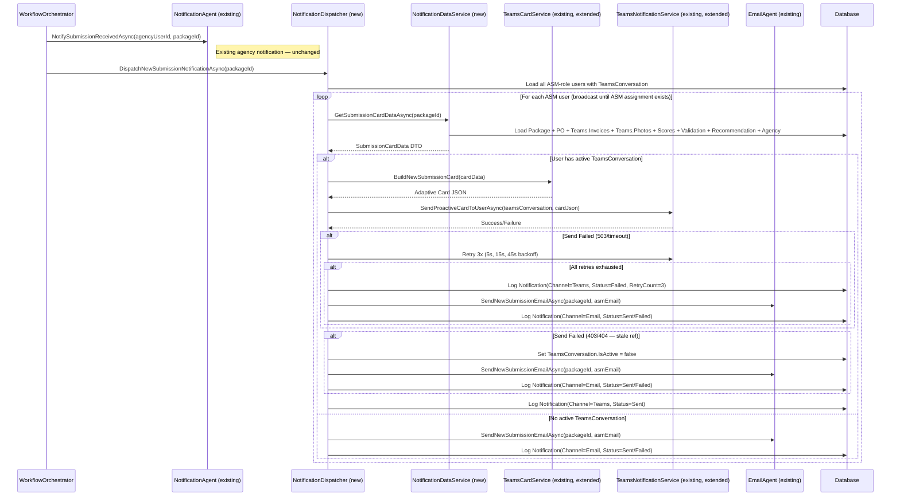
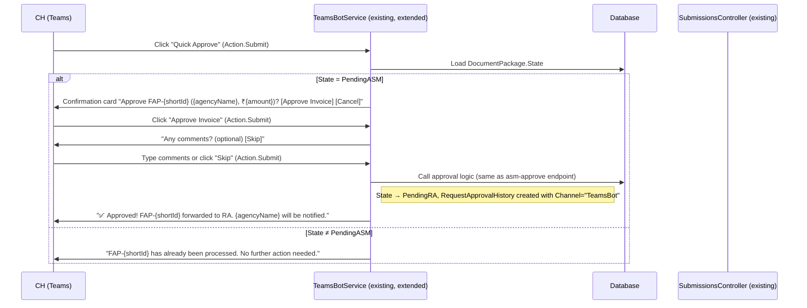
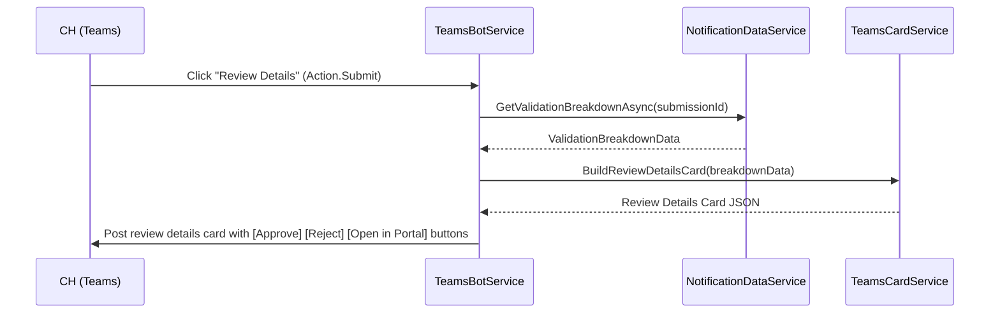

# Design: CH Teams Bot — New Claim Notification

## Overview

This feature extends the existing Teams Bot integration to deliver rich Adaptive Card notifications to CH (Circle Head / ASM) users when submissions reach `PendingASM` state. The notification provides enough context for quick decision-making directly within Teams, with a conversational Quick Approve flow and email fallback when the bot is not installed.

The design builds on existing infrastructure: `TeamsBotService` (bot handler), `TeamsNotificationService` (proactive messaging), `TeamsCardService` (template-based card building), `TeamsConversation` entity (conversation reference storage), `ApprovalCardBuilder` (card construction), and `NotificationAgent`/`EmailAgent` (notification delivery). New components are added only where existing ones cannot fulfill the requirements.

### Key Design Decisions

1. **Extend existing bot, not a separate project**: The `TeamsBotService` already runs inside the main API project as a Singleton `IBot`, handling install/uninstall and card actions via `OnAdaptiveCardInvokeAsync`. We extend it with Quick Approve dialog flow and Review Details handling rather than creating a separate `BajajDocumentProcessing.Bot` project. This avoids duplicating DI, auth, and DB configuration.

2. **NotificationDispatcher pattern**: A new `NotificationDispatcher` orchestrates channel selection (Teams → Email fallback), retry logic, and notification logging. It is called by `WorkflowOrchestrator` after the `PendingASM` state transition, alongside the existing `NotifySubmissionReceivedAsync` call (which continues unchanged for agency users).

3. **Extend existing `TeamsCardService`**: The `TeamsCardService` already loads embedded JSON templates and uses `AdaptiveCards.Templating`. We extend `SubmissionCardData` with all required token fields and update the `new-submission-card.json` template to include all 5 sections (Header, Key Facts, AI Recommendation, PO Balance placeholder, Action Buttons).

4. **Reuse `TeamsConversation` entity as-is**: The existing `TeamsConversation` entity already stores `ConversationReferenceJson`, `TeamsUserId`, `ServiceUrl`, `ChannelId`, `TenantId`, and `IsActive`. No schema changes needed for conversation reference storage. The `TeamsBotService.PersistConversationReferenceAsync` already handles upsert on install.

5. **Extend `Notification` entity for multi-channel tracking**: Add `Channel`, `DeliveryStatus`, `RetryCount`, `SentAt`, `ExternalMessageId`, and `FailureReason` fields to the existing `Notification` entity. Existing in-app notifications default to `Channel = InApp`, `DeliveryStatus = Sent`.

6. **Reuse existing approval endpoints**: The Quick Approve flow calls the existing `PATCH /api/submissions/{id}/asm-approve` endpoint internally (via direct service call, not HTTP) to ensure all existing state transition guards, `RequestApprovalHistory` creation, and downstream notifications execute identically to portal approvals.

7. **PO Balance section deferred**: Per Requirement 4, PO balance data is not available from SAP. The card includes a placeholder section with "Check PO Balance in Portal" link. Properties 8–10 from the previous design draft are removed since they validate deferred functionality.

8. **FAP ID format**: The human-readable identifier uses `FAP-{first 8 chars of DocumentPackage.Id GUID, uppercased}` (e.g., `FAP-28C9823C`), matching the existing convention in `ChatService` and `AnalyticsPlugin`. The existing `TeamsNotificationService` already derives this as `package.Id.ToString()[..8].ToUpper()`.

---

## Architecture

### High-Level Notification Flow



### Quick Approve Bot Flow



### Review Details Bot Flow




### Project Structure — Changes to Existing Codebase

```
backend/
├── src/
│   ├── BajajDocumentProcessing.API/
│   │   ├── Controllers/
│   │   │   └── BotController.cs                        # EXISTS: POST /api/messages endpoint
│   │   └── templates/
│   │       └── email/
│   │           └── new-submission.html                  # NEW: Email fallback HTML template
│   │
│   ├── BajajDocumentProcessing.Application/
│   │   ├── Common/Interfaces/
│   │   │   ├── ITeamsCardService.cs                     # EXISTS: extend with BuildReviewDetailsCard
│   │   │   ├── ITeamsNotificationService.cs             # EXISTS: extend with SendProactiveCardToUserAsync
│   │   │   ├── INotificationDispatcher.cs               # NEW: orchestrates channel selection + retry
│   │   │   └── INotificationDataService.cs              # NEW: assembles card/email data DTOs
│   │   └── DTOs/
│   │       └── Notifications/
│   │           ├── SubmissionCardData.cs                 # EXISTS: extend with all token fields
│   │           └── ValidationBreakdownData.cs            # NEW: review details DTO
│   │
│   ├── BajajDocumentProcessing.Domain/
│   │   ├── Entities/
│   │   │   ├── Notification.cs                          # MODIFY: add Channel, DeliveryStatus, RetryCount, SentAt, ExternalMessageId, FailureReason
│   │   │   ├── RequestApprovalHistory.cs                # MODIFY: add Channel field
│   │   │   └── TeamsConversation.cs                     # EXISTS: no changes needed
│   │   └── Enums/
│   │       ├── NotificationChannel.cs                   # NEW
│   │       ├── NotificationDeliveryStatus.cs            # NEW
│   │       └── NotificationType.cs                      # MODIFY: add ReadyForReview value
│   │
│   └── BajajDocumentProcessing.Infrastructure/
│       ├── Services/
│       │   ├── NotificationDispatcher.cs                # NEW: channel selection, retry, fallback, logging
│       │   ├── NotificationDataService.cs               # NEW: loads submission data into DTOs
│       │   ├── TeamsCardService.cs                      # EXISTS: extend with all token expansion + review details card
│       │   └── Teams/
│       │       ├── TeamsBotService.cs                   # EXISTS: extend with Quick Approve dialog, Review Details, pending query
│       │       ├── TeamsNotificationService.cs          # EXISTS: extend with per-user proactive send + retry
│       │       ├── ApprovalCardBuilder.cs               # EXISTS: reuse for confirmation cards
│       │       └── PilotTeamsConfig.cs                  # EXISTS: no changes
│       ├── Templates/TeamsCards/
│       │   ├── new-submission-card.json                 # EXISTS: extend with all 5 sections
│       │   └── review-details-card.json                 # NEW: validation breakdown card
│       └── DependencyInjection.cs                       # MODIFY: register new services
```

### Layer Responsibilities

| Layer | Component | Status | Responsibility |
|-------|-----------|--------|---------------|
| **Application** | `INotificationDispatcher` | NEW | Interface for notification orchestration |
| **Application** | `INotificationDataService` | NEW | Interface for assembling card/email data |
| **Application** | `ITeamsCardService` | EXTEND | Add `BuildReviewDetailsCard` method |
| **Application** | `ITeamsNotificationService` | EXTEND | Add `SendProactiveCardToUserAsync` method |
| **Application** | `SubmissionCardData` | EXTEND | Add all token fields (Key Facts, AI, Actions) |
| **Application** | `ValidationBreakdownData` | NEW | DTO for review details card |
| **Domain** | `Notification` | MODIFY | Add multi-channel delivery tracking fields |
| **Domain** | `RequestApprovalHistory` | MODIFY | Add `Channel` field |
| **Domain** | `NotificationType` | MODIFY | Add `ReadyForReview = 6` |
| **Domain** | `NotificationChannel` | NEW | Enum: InApp, Teams, Email |
| **Domain** | `NotificationDeliveryStatus` | NEW | Enum: Pending, Sent, Failed, FallbackSent |
| **Infrastructure** | `NotificationDispatcher` | NEW | Channel selection, retry, fallback, logging |
| **Infrastructure** | `NotificationDataService` | NEW | Loads package data into DTOs |
| **Infrastructure** | `TeamsCardService` | EXTEND | Full token expansion for all sections |
| **Infrastructure** | `TeamsBotService` | EXTEND | Quick Approve dialog, Review Details, pending query |
| **Infrastructure** | `TeamsNotificationService` | EXTEND | Per-user proactive send with retry |

---

## Components and Interfaces

### INotificationDispatcher (NEW)

Orchestrates the notification delivery pipeline: channel selection, card building, sending, retry, fallback, and logging.

```csharp
namespace BajajDocumentProcessing.Application.Common.Interfaces;

public interface INotificationDispatcher
{
    /// <summary>
    /// Dispatches a new-submission notification to all ASM users (broadcast model).
    /// For each ASM: selects Teams or Email channel based on TeamsConversation availability.
    /// Called by WorkflowOrchestrator after PendingASM state transition.
    /// </summary>
    Task DispatchNewSubmissionNotificationAsync(
        Guid packageId,
        CancellationToken cancellationToken = default);
}
```

### INotificationDataService (NEW)

Assembles strongly-typed DTOs with all token values needed for card/email population.

```csharp
namespace BajajDocumentProcessing.Application.Common.Interfaces;

public interface INotificationDataService
{
    /// <summary>
    /// Loads all submission data needed to populate the adaptive card or email template.
    /// Includes: Package, PO, Teams.Invoices, Teams.Photos, EnquiryDocument,
    /// ConfidenceScore, Recommendation, ValidationResult, Agency.
    /// </summary>
    Task<SubmissionCardData> GetSubmissionCardDataAsync(
        Guid packageId,
        CancellationToken cancellationToken = default);

    /// <summary>
    /// Loads per-document validation breakdown for the Review Details flow.
    /// Groups validation checks by type (SAP, Amount, LineItem, Completeness, Date, Vendor).
    /// </summary>
    Task<ValidationBreakdownData> GetValidationBreakdownAsync(
        Guid packageId,
        CancellationToken cancellationToken = default);
}
```

### ITeamsCardService (EXTEND existing)

Add `BuildReviewDetailsCard` to the existing interface. The existing `BuildNewSubmissionCard` signature is unchanged but its implementation expands all token fields.

```csharp
// Add to existing ITeamsCardService
string BuildReviewDetailsCard(ValidationBreakdownData data);
```

### ITeamsNotificationService (EXTEND existing)

Add a per-user proactive send method. The existing `SendApprovalCardAsync` broadcasts to all conversations; the new method targets a specific `TeamsConversation` record.

```csharp
// Add to existing ITeamsNotificationService
Task<ProactiveMessageResult> SendProactiveCardToUserAsync(
    TeamsConversation conversation,
    string cardJson,
    CancellationToken cancellationToken = default);
```

```csharp
// New result type in Application/DTOs/Notifications/
public class ProactiveMessageResult
{
    public bool Success { get; set; }
    public int HttpStatusCode { get; set; }
    public string? ErrorMessage { get; set; }
    public string? ActivityId { get; set; }  // Teams message ID for tracking
}
```

### TeamsBotService (EXTEND existing)

The existing `TeamsBotService` already handles:
- `OnMembersAddedAsync` — captures conversation reference (persists to `TeamsConversation`)
- `OnMembersRemovedAsync` — deactivates conversation reference
- `OnAdaptiveCardInvokeAsync` — routes approve/reject actions
- `OnMessageActivityAsync` — returns help text

Extensions needed:
1. **Quick Approve 4-step dialog**: Replace the current single-step approve with a confirmation → comments → execute flow
2. **Review Details action**: Load validation breakdown and post a follow-up card
3. **Pending submissions query**: Handle "show my pending" messages by calling the list endpoint logic
4. **Idempotency check**: Before any action, verify `DocumentPackage.State == PendingASM`
5. **Channel tracking**: Set `Channel = "TeamsBot"` on `RequestApprovalHistory` records
6. **User identity resolution**: Map `TeamsConversation.TeamsUserId` to `User.Id` for authenticated API calls

```csharp
// Extended action routing in OnAdaptiveCardInvokeAsync
// action = "quick_approve" → Start Quick Approve dialog
// action = "review_details" → Post validation breakdown card
// action = "confirm_approve" → Execute approval with optional comments
// action = "cancel_approve" → Post cancellation message
// action = "approve_from_review" → Approve after reviewing details
// action = "reject_from_review" → Start rejection flow from review
```

---

## Data Models

### Extended Notification Entity (MODIFY existing)

```csharp
public class Notification : BaseEntity
{
    // === Existing fields (unchanged) ===
    public Guid UserId { get; set; }
    public NotificationType Type { get; set; }
    public string Title { get; set; } = string.Empty;
    public string Message { get; set; } = string.Empty;
    public bool IsRead { get; set; }
    public DateTime? ReadAt { get; set; }
    public Guid? RelatedEntityId { get; set; }
    public User User { get; set; } = null!;
    public DocumentPackage? RelatedPackage { get; set; }

    // === NEW fields for multi-channel delivery tracking ===
    public NotificationChannel Channel { get; set; } = NotificationChannel.InApp;
    public NotificationDeliveryStatus DeliveryStatus { get; set; } = NotificationDeliveryStatus.Sent;
    public int RetryCount { get; set; } = 0;
    public DateTime? SentAt { get; set; }
    public string? ExternalMessageId { get; set; }  // Teams activity ID or email message ID
    public string? FailureReason { get; set; }
}
```

### New Enums

```csharp
public enum NotificationChannel
{
    InApp = 1,
    Teams = 2,
    Email = 3
}

public enum NotificationDeliveryStatus
{
    Pending = 1,
    Sent = 2,
    Failed = 3,
    FallbackSent = 4
}
```

### Extended NotificationType (MODIFY existing)

```csharp
public enum NotificationType
{
    SubmissionReceived = 1,
    FlaggedForReview = 2,
    Approved = 3,
    Rejected = 4,
    ReuploadRequested = 5,
    ReadyForReview = 6       // NEW: ASM notification when submission reaches PendingASM
}
```

### Extended RequestApprovalHistory (MODIFY existing)

```csharp
public class RequestApprovalHistory : BaseEntity
{
    // === Existing fields (unchanged) ===
    public Guid PackageId { get; set; }
    public Guid ApproverId { get; set; }
    public UserRole ApproverRole { get; set; }
    public ApprovalAction Action { get; set; }
    public string? Comments { get; set; }
    public DateTime ActionDate { get; set; }
    public int VersionNumber { get; set; }
    public DocumentPackage DocumentPackage { get; set; } = null!;
    public User Approver { get; set; } = null!;

    // === NEW field ===
    /// <summary>
    /// Source channel: "Portal", "TeamsBot", or null (legacy/portal default).
    /// </summary>
    public string? Channel { get; set; }
}
```

### Extended SubmissionCardData DTO (MODIFY existing)

The existing DTO has only `SubmissionId`, `SubmissionNumber`, and `NotificationTimestamp`. Extend with all token fields:

```csharp
public class SubmissionCardData
{
    // === Existing fields ===
    public Guid SubmissionId { get; set; }
    public string SubmissionNumber { get; set; } = string.Empty;  // "FAP-{Id[..8].ToUpper()}"
    public DateTime NotificationTimestamp { get; set; }

    // === NEW: Key Facts (Req 2.2) ===
    public string AgencyName { get; set; } = string.Empty;       // Agency.SupplierName
    public string PoNumber { get; set; } = "N/A";                // PO.PONumber or fallback
    public string InvoiceNumber { get; set; } = "N/A";           // First CampaignInvoice.InvoiceNumber
    public string InvoiceAmount { get; set; } = "₹0";            // Formatted sum of CampaignInvoice.TotalAmount
    public decimal InvoiceAmountRaw { get; set; }                 // Raw decimal for email subject
    public string State { get; set; } = "N/A";                   // Teams geographic State field
    public DateTime SubmittedAt { get; set; }                     // DocumentPackage.CreatedAt
    public string SubmittedAtFormatted { get; set; } = string.Empty;
    public int TeamCount { get; set; }                            // DocumentPackage.Teams.Count
    public int PhotoCount { get; set; }                           // Sum of Teams.Photos.Count
    public string TeamPhotoSummary { get; set; } = string.Empty;  // "3 teams | 19 photos"
    public string InquirySummary { get; set; } = "N/A";           // "87 records (84 complete)" or "N/A"

    // === NEW: AI Recommendation (Req 3) ===
    public string Recommendation { get; set; } = string.Empty;    // "Approve", "Review", "Reject"
    public string RecommendationEmoji { get; set; } = string.Empty; // "✅", "⚠️", "❌"
    public string CardStyle { get; set; } = "default";            // "good", "attention", "warning"
    public double ConfidenceScore { get; set; }                   // ConfidenceScore.OverallConfidence
    public string ConfidenceScoreFormatted { get; set; } = string.Empty; // "85/100"
    public int PassedChecks { get; set; }
    public int TotalChecks { get; set; }
    public string ChecksSummary { get; set; } = string.Empty;     // "12/14 checks passed"
    public bool AllChecksPassed { get; set; }
    public List<ValidationIssueItem> TopIssues { get; set; } = new();
    public int RemainingIssueCount { get; set; }
    public string RemainingIssueText { get; set; } = string.Empty; // "... and 2 more issues"

    // === NEW: PO Balance placeholder (Req 4 — deferred) ===
    public string PoBalanceMessage { get; set; } = "PO balance check available in portal";

    // === NEW: Action Buttons (Req 5) ===
    public bool ShowQuickApprove { get; set; }                    // true only when Recommendation = Approve
    public string PortalUrl { get; set; } = string.Empty;         // Configurable base URL + submissionId
}

public class ValidationIssueItem
{
    public string Severity { get; set; } = string.Empty;  // "Fail" or "Warning"
    public string Description { get; set; } = string.Empty;
}
```

### ValidationBreakdownData DTO (NEW)

```csharp
public class ValidationBreakdownData
{
    public Guid SubmissionId { get; set; }
    public string SubmissionNumber { get; set; } = string.Empty;  // "FAP-{shortId}"
    public string CurrentStatus { get; set; } = string.Empty;     // Current PackageState
    public DateTime? ProcessedAt { get; set; }                     // Latest RequestApprovalHistory.ActionDate
    public string? ProcessedBy { get; set; }                       // Approver name if already processed
    public bool IsAlreadyProcessed { get; set; }                   // State != PendingASM
    public List<ValidationCheckGroup> CheckGroups { get; set; } = new();
    public string PortalUrl { get; set; } = string.Empty;
}

public class ValidationCheckGroup
{
    public string GroupName { get; set; } = string.Empty;  // "SAP Verification", "Amount Consistency", etc.
    public string Status { get; set; } = string.Empty;     // "Pass" or "Fail"
    public string? Details { get; set; }                    // Detailed issue description from ValidationDetailsJson
}
```

### Adaptive Card Template Structure (new-submission-card.json)

The existing template has only Section 1 (Header). Extend to include all 5 sections using Adaptive Card schema v1.4 with `${property}` token syntax from `AdaptiveCards.Templating`:

```
┌─────────────────────────────────────────┐
│ Section 1: Header                       │
│   "New Claim Submitted"    12:34 PM     │
├─────────────────────────────────────────┤
│ Section 2: Key Facts (FactSet)          │
│   FAP ID:     FAP-28C9823C             │
│   Agency:     Acme Corp                 │
│   PO Number:  PO-2026-001              │
│   Invoice:    INV-001                   │
│   Amount:     ₹1,25,000                │
│   State:      Maharashtra               │
│   Submitted:  12-Mar-2026, 10:30 AM    │
│   Teams:      3 teams | 19 photos       │
│   Inquiries:  87 records (84 complete)  │
├─────────────────────────────────────────┤
│ Section 3: AI Recommendation            │
│   ┌─────────────────────────────────┐   │
│   │ ✅ Recommended: Approve (85/100)│   │
│   │ 12/14 checks passed            │   │
│   │ • Fail: Amount mismatch        │   │
│   │ • Warning: Date discrepancy    │   │
│   └─────────────────────────────────┘   │
├─────────────────────────────────────────┤
│ Section 4: PO Balance (placeholder)     │
│   PO balance check available in portal  │
│   [Open in Portal]                      │
├─────────────────────────────────────────┤
│ Section 5: Action Buttons               │
│   [Quick Approve] [Review Details]      │
│   [Open in Portal]                      │
└─────────────────────────────────────────┘
```

Token placeholders in the template:

- Header: `${notificationTimestamp}`
- Key Facts: `${submissionNumber}`, `${agencyName}`, `${poNumber}`, `${invoiceNumber}`, `${invoiceAmount}`, `${state}`, `${submittedAtFormatted}`, `${teamPhotoSummary}`, `${inquirySummary}`
- AI Section: `${recommendationEmoji}`, `${recommendation}`, `${confidenceScoreFormatted}`, `${cardStyle}`, `${checksSummary}`, `${allChecksPassed}`, `${topIssues}` (array), `${remainingIssueText}`
- PO Balance: `${poBalanceMessage}`
- Actions: `${showQuickApprove}` (conditional visibility), `${submissionId}` (in Action.Submit data), `${portalUrl}` (Action.OpenUrl)

### Database Schema Changes (EF Core Migration)

```sql
-- 1. Extend Notifications table
ALTER TABLE Notifications ADD Channel INT NOT NULL DEFAULT 1;              -- NotificationChannel.InApp
ALTER TABLE Notifications ADD DeliveryStatus INT NOT NULL DEFAULT 2;       -- NotificationDeliveryStatus.Sent
ALTER TABLE Notifications ADD RetryCount INT NOT NULL DEFAULT 0;
ALTER TABLE Notifications ADD SentAt DATETIME2 NULL;
ALTER TABLE Notifications ADD ExternalMessageId NVARCHAR(500) NULL;
ALTER TABLE Notifications ADD FailureReason NVARCHAR(2000) NULL;

-- 2. Extend RequestApprovalHistory table
ALTER TABLE RequestApprovalHistory ADD Channel NVARCHAR(50) NULL;

-- 3. Indexes for notification queries
CREATE INDEX IX_Notifications_UserId_Channel_DeliveryStatus
    ON Notifications (UserId, Channel, DeliveryStatus);

CREATE INDEX IX_Notifications_RelatedEntityId_Channel
    ON Notifications (RelatedEntityId, Channel);
```

---

## Existing Components Reused (No Changes Needed)

| Component | Location | Reuse |
|-----------|----------|-------|
| `TeamsConversation` entity | `Domain/Entities/TeamsConversation.cs` | Stores conversation references; already has all needed fields |
| `PilotTeamsConfig` | `Infrastructure/Services/Teams/PilotTeamsConfig.cs` | In-memory conversation reference for pilot mode |
| `ApprovalCardBuilder` | `Infrastructure/Services/Teams/ApprovalCardBuilder.cs` | Reuse `BuildActionConfirmationCard` for post-action confirmation |
| `AdapterWithErrorHandler` | `Infrastructure/Services/Teams/AdapterWithErrorHandler.cs` | CloudAdapter with error handling |
| `ResiliencePolicies` | `Infrastructure/Resilience/ResiliencePolicies.cs` | Retry + circuit breaker patterns |
| `EmailAgent` | `Infrastructure/Services/EmailAgent.cs` | Email delivery with retry logic |
| `NotificationAgent` | `Infrastructure/Services/NotificationAgent.cs` | In-app notification creation |
| `WorkflowOrchestrator` | `Infrastructure/Services/WorkflowOrchestrator.cs` | Trigger point — already calls `TeamsNotificationService` |
| `SubmissionsController` | `API/Controllers/SubmissionsController.cs` | ASM approve/reject endpoints with state guards |

---

## Integration Points

### WorkflowOrchestrator Integration

The `WorkflowOrchestrator.ProcessSubmissionAsync` already has the integration point after Step 5 (state transition to `PendingASM`). Currently it calls:
1. `_notificationAgent.NotifySubmissionReceivedAsync(package.SubmittedByUserId, ...)` — agency notification
2. `_teamsNotificationService.SendApprovalCardAsync(package.Id, ...)` — broadcast Teams card

Replace step 2 with a call to `_notificationDispatcher.DispatchNewSubmissionNotificationAsync(package.Id, ...)` which handles:
- Loading ASM users
- Channel selection per user
- Card building via `TeamsCardService`
- Proactive send via `TeamsNotificationService`
- Email fallback via `EmailAgent`
- Notification logging

The existing agency notification (step 1) remains unchanged per Requirement 1.6.

### TeamsBotService Integration — User Identity Resolution

The existing `TeamsBotService` uses `turnContext.Activity.From.Id` (Teams user ID) but does not resolve it to a `User.Id` in the database. For the Quick Approve flow to call the approval endpoint logic, we need to map the Teams identity to a system user:

1. On bot install (`OnMembersAddedAsync`), the `TeamsConversation` record stores `TeamsUserId` (Teams channel account ID)
2. A new nullable `TeamsConversationId` FK on the `User` entity (or a lookup via `TeamsConversation.TeamsUserId` → `User` matching) resolves the identity
3. For the pilot phase (single ASM user), the bot can look up the ASM user by role. For production, the `TeamsConversation` should be linked to a `User` record

**Recommended approach**: Add a nullable `UserId` FK to `TeamsConversation` (the entity already has all other fields). When the bot captures a conversation reference, it attempts to match the Teams user to a system user by email (Teams provides the user's UPN/email via `turnContext.Activity.From.Properties["email"]` or via Graph API). If no match is found, the conversation is stored without a `UserId` link and the bot prompts the user to link their account.

### NotificationDataService — Data Assembly Logic

The `NotificationDataService.GetSubmissionCardDataAsync` method loads the package with all required includes and maps to `SubmissionCardData`:

```csharp
// Pseudo-code for data assembly
var package = await _context.DocumentPackages
    .Include(p => p.PO)
    .Include(p => p.Agency)
    .Include(p => p.Teams.Where(t => !t.IsDeleted))
        .ThenInclude(t => t.Invoices.Where(i => !i.IsDeleted))
    .Include(p => p.Teams.Where(t => !t.IsDeleted))
        .ThenInclude(t => t.Photos.Where(ph => !ph.IsDeleted))
    .Include(p => p.EnquiryDocument)
    .Include(p => p.ConfidenceScore)
    .Include(p => p.Recommendation)
    .Include(p => p.ValidationResult)
    .AsSplitQuery()
    .AsNoTracking()
    .FirstOrDefaultAsync(p => p.Id == packageId, ct);

// Key Facts derivation:
// - FAP ID: "FAP-" + package.Id.ToString()[..8].ToUpper()
// - Agency: package.Agency.SupplierName
// - PO Number: package.PO?.PONumber ?? TryParseFromExtractedDataJson(package.PO?.ExtractedDataJson) ?? "N/A"
// - Invoice Number: package.Teams.SelectMany(t => t.Invoices).FirstOrDefault()?.InvoiceNumber ?? "N/A"
// - Invoice Amount: package.Teams.SelectMany(t => t.Invoices).Sum(i => i.TotalAmount ?? 0)
// - State: package.Teams.FirstOrDefault()?.State ?? "N/A"
// - Team Count: package.Teams.Count(t => !t.IsDeleted)
// - Photo Count: package.Teams.SelectMany(t => t.Photos).Count(p => !p.IsDeleted)
// - Inquiry: Parse from EnquiryDocument.ExtractedDataJson if available

// AI Recommendation derivation:
// - Use Recommendation.Type enum directly (Approve=1, Review=2, Reject=3)
// - CardStyle: Approve→"good", Review→"attention", Reject→"warning"
// - RecommendationEmoji: Approve→"✅", Review→"⚠️", Reject→"❌"
// - ConfidenceScore: ConfidenceScore.OverallConfidence
// - Validation checks: Count boolean fields on ValidationResult (6 total checks)
// - Top issues: Collect failed checks, parse ValidationDetailsJson for descriptions, sort Fail before Warning, cap at 3
// - ShowQuickApprove: true only when Recommendation.Type == RecommendationType.Approve
```

---

## Correctness Properties

### Property 1: Only PendingASM state triggers CH notification

*For any* submission and CH user, the `NotificationDispatcher` should create a notification record if and only if the submission's state is `PendingASM`. Submissions in `Extracting`, `Validating`, `Uploaded`, or any other state should produce zero notification records.

**Validates: Requirements 1.1, 1.2, 1.4, 1.5, 14.5**

### Property 2: Channel selection — Teams when available, Email when not

*For any* CH user and valid PendingASM submission, if the user has an active `TeamsConversation` record, the dispatcher should create a notification with `Channel = Teams`. If the user has no active `TeamsConversation`, the dispatcher should create a notification with `Channel = Email` and never attempt Teams delivery.

**Validates: Requirements 1.1, 1.3, 7.1**

### Property 3: Recommendation type maps to correct card style and emoji

*For any* `Recommendation.Type` value, the `NotificationDataService` should map: `Approve` → (CardStyle="good", Emoji="✅"), `Review` → (CardStyle="attention", Emoji="⚠️"), `Reject` → (CardStyle="warning", Emoji="❌"). The mapping must be exhaustive and mutually exclusive.

**Validates: Requirements 3.1, 3.2, 3.3**

### Property 4: Quick Approve visibility follows recommendation type

*For any* `SubmissionCardData`, `ShowQuickApprove` should be `true` if and only if `Recommendation.Type == RecommendationType.Approve`. For `Review` and `Reject`, `ShowQuickApprove` must be `false`.

**Validates: Requirements 5.1, 5.2, 5.3**

### Property 5: Card template resolves all tokens — no raw placeholders

*For any* `SubmissionCardData` (including cases with null optional fields), the card JSON produced by `TeamsCardService.BuildNewSubmissionCard` should never contain the substrings `${` or `{{`. All tokens must be resolved to actual values or sensible fallbacks (e.g., "N/A", "—").

**Validates: Requirements 10.3, 10.4**

### Property 6: Card contains all required key facts

*For any* `SubmissionCardData`, the card JSON produced by `TeamsCardService.BuildNewSubmissionCard` should contain: the FAP ID (submission number), agency name, PO number (or "N/A"), invoice number (or "N/A"), formatted invoice amount with ₹, state (or "N/A"), submitted timestamp, team/photo summary, and inquiry summary.

**Validates: Requirements 2.1, 2.2**

### Property 7: Validation issues sorted by severity, capped at 3

*For any* list of validation issues derived from `ValidationResult` boolean fields and `ValidationDetailsJson`, the `NotificationDataService` should return `TopIssues` sorted with failures before warnings, containing at most 3 items. `RemainingIssueCount` should equal `max(0, totalIssues - 3)`. When all checks pass (`AllValidationsPassed = true`), `TopIssues` should be empty and `AllChecksPassed` should be `true`.

**Validates: Requirements 3.4, 3.5, 3.6**

### Property 8: Idempotent approval — duplicate clicks don't create duplicate records

*For any* submission that is no longer in `PendingASM` state (or `RARejected` for re-approval), invoking the Quick Approve action should return an idempotent "already processed" response and create zero new `RequestApprovalHistory` records.

**Validates: Requirements 12.1, 12.2**

### Property 9: Retry exhaustion triggers email fallback with correct logging

*For any* Teams proactive message that fails with a transient error (503/timeout), the system should retry exactly 3 times with exponential backoff (5s, 15s, 45s). After all retries are exhausted, the `Notifications` table should contain one record with `Channel=Teams, DeliveryStatus=Failed, RetryCount=3` and one record with `Channel=Email`.

**Validates: Requirements 9.4, 14.2, 14.3, 15.2**

### Property 10: Stale conversation reference invalidation and fallback

*For any* proactive message that returns HTTP 403 or 404, the system should set `TeamsConversation.IsActive = false`, create an Email fallback notification, and NOT retry the Teams channel.

**Validates: Requirements 8.4, 14.1**

### Property 11: Conversation reference capture on first interaction

*For any* message or install event received from a Teams user, the bot should create or update a `TeamsConversation` record with non-empty `ConversationReferenceJson`, `ConversationId`, `ServiceUrl`, `ChannelId`, and `TeamsUserId`.

**Validates: Requirements 8.1**

### Property 12: Approval via Teams records correct channel in audit trail

*For any* approval action processed through the Teams bot, the resulting `RequestApprovalHistory` record should have `Channel = "TeamsBot"`.

**Validates: Requirements 6.6, 15.3**

### Property 13: Notification logging completeness

*For any* notification dispatch (Teams or Email), a `Notification` record must be created with: `Type = ReadyForReview`, non-null `Channel`, non-null `DeliveryStatus`, `SentAt` populated when `DeliveryStatus = Sent`, and `RelatedEntityId` set to the `DocumentPackage.Id`.

**Validates: Requirements 15.1**

### Property 14: Card payload size constraint

*For any* generated adaptive card JSON, the payload size should be under 4KB and contain no base64-encoded image data (no `data:image` substrings).

**Validates: Requirements 13.5**

### Property 15: Validation breakdown grouped by check type

*For any* submission with a `ValidationResult`, the `ValidationBreakdownData` returned by `GetValidationBreakdownAsync` should contain validation checks grouped by check type (SAP Verification, Amount Consistency, Line Item Matching, Completeness, Date Validation, Vendor Matching), with each check having a non-empty `GroupName` and a `Status` of "Pass" or "Fail".

**Validates: Requirements 11.1, 11.3**

### Property 16: Quick Approve confirmation contains correct submission details

*For any* submission in `PendingASM` state, the Quick Approve confirmation message should contain the FAP ID, agency name, and invoice amount matching the submission data.

**Validates: Requirements 6.1, 6.3**

### Property 17: Cancel preserves submission state

*For any* submission in `PendingASM` state where the CH initiates Quick Approve then clicks Cancel, the submission state should remain `PendingASM` and no `RequestApprovalHistory` record should be created.

**Validates: Requirements 6.4**

### Property 18: Email subject line format

*For any* email fallback notification, the email subject should match the pattern `ClaimsIQ: New claim from {agencyName} — ₹{invoiceAmount}` where `agencyName` and `invoiceAmount` are populated from the submission data.

**Validates: Requirements 7.2**

### Property 19: Portal URL format

*For any* submission ID, the `PortalUrl` in `SubmissionCardData` should equal `{configuredBaseUrl}/fap/{submissionId}/review` where `configuredBaseUrl` comes from `TeamsBot:PortalBaseUrl` configuration.

**Validates: Requirements 5.6**

### Property 20: Existing agency notification preserved

*For any* submission that reaches `PendingASM`, the existing `NotifySubmissionReceivedAsync` call to the agency user must still execute. The new ASM notification dispatch must not replace or interfere with it.

**Validates: Requirements 1.6**

---

## Error Handling

### Proactive Messaging Errors

| Error | Action | Retry? |
|-------|--------|--------|
| **403 Forbidden** (bot uninstalled) | Set `TeamsConversation.IsActive = false`, fall back to email, log at WARNING | No |
| **404 Not Found** (conversation gone) | Same as 403 | No |
| **503 Service Unavailable** | Retry with exponential backoff (5s, 15s, 45s) | Yes, 3× |
| **Timeout** (>30s) | Treat as transient, same as 503 | Yes, 3× |
| **429 Too Many Requests** | Respect `Retry-After` header, delay and retry | Yes |
| **All retries exhausted** | Fall back to email, log Teams attempt as Failed | N/A |

### Card Building Errors

| Error | Action |
|-------|--------|
| **Template not found** | Log CRITICAL, fall back to email with basic text content |
| **Token resolution failure** | Use fallback values ("N/A", "—") for missing tokens. Never show raw placeholders |
| **Card JSON exceeds 4KB** | Truncate issue list, remove optional sections. Log WARNING |

### Approval Flow Errors

| Error | Action |
|-------|--------|
| **Submission not in PendingASM** | Return idempotent message: "FAP-{shortId} has already been processed. No further action needed." |
| **Concurrent approval (race condition)** | Existing endpoint returns 400; bot handles gracefully with "already actioned" message |
| **Service throws** | Bot posts: "Something went wrong. Please try again or use the portal." Log ERROR with correlation ID |
| **User not authorized** | Bot posts: "You don't have permission to approve this submission." |

### Email Fallback Errors

| Error | Action |
|-------|--------|
| **ACS send failure** | Retry 3× with existing `EmailAgent` retry logic. After exhaustion, create in-app notification as last resort |
| **Invalid email address** | Log ERROR, create in-app notification only |

### Resilience Policies

The `NotificationDispatcher` implements retry logic internally for Teams delivery (not via Polly HTTP policies, since `BotAdapter.ContinueConversationAsync` is not an HTTP client call). The retry delays match Requirement 9.4: 5s, 15s, 45s.

```csharp
// Retry logic in NotificationDispatcher (pseudo-code)
private static readonly TimeSpan[] RetryDelays = { 
    TimeSpan.FromSeconds(5), 
    TimeSpan.FromSeconds(15), 
    TimeSpan.FromSeconds(45) 
};

for (int attempt = 0; attempt <= MaxRetries; attempt++)
{
    var result = await _teamsNotificationService.SendProactiveCardToUserAsync(conversation, cardJson, ct);
    if (result.Success) break;
    if (result.HttpStatusCode is 403 or 404) { /* invalidate + email fallback, no retry */ break; }
    if (attempt < MaxRetries) await Task.Delay(RetryDelays[attempt], ct);
}
```

For email delivery, the existing `EmailAgent.SendEmailWithRetryAsync` already implements 3-attempt retry with exponential backoff (1s, 2s, 4s).

---

## Testing Strategy

### Dual Testing Approach

- **Unit tests** (xUnit + Moq): Verify specific examples, edge cases, integration points, and error conditions.
- **Property-based tests** (xUnit + FsCheck): Verify universal properties across randomly generated inputs with minimum 100 iterations per property.

### Property-Based Testing Configuration

- **Library**: FsCheck (already in project)
- **Minimum iterations**: 100 per property test
- **Tag format**: `// Feature: ch-teams-bot-notification, Property {N}: {title}`
- **Each correctness property maps to exactly one PBT test**

### Test Organization

```
backend/tests/BajajDocumentProcessing.Tests/
├── Infrastructure/
│   ├── Properties/
│   │   ├── NotificationDispatcherProperties.cs    # Properties 1, 2, 9, 10, 13, 20
│   │   ├── NotificationDataServiceProperties.cs   # Properties 3, 7, 15, 19
│   │   ├── TeamsCardServiceProperties.cs          # Properties 4, 5, 6, 14
│   │   └── ApprovalFlowProperties.cs              # Properties 8, 12, 16, 17
│   ├── NotificationDispatcherTests.cs             # Unit tests for dispatcher
│   ├── NotificationDataServiceTests.cs            # Unit tests for data assembly
│   ├── TeamsCardServiceTests.cs                   # Unit tests for card building (extends existing)
│   ├── ProactiveMessagingServiceTests.cs          # Unit tests for per-user proactive send
│   └── EmailFallbackTests.cs                      # Unit tests for email fallback path
├── Infrastructure/Teams/
│   ├── TeamsBotServiceTests.cs                    # EXISTS: extend with Quick Approve + Review Details tests
│   └── QuickApproveFlowTests.cs                   # NEW: 4-step dialog flow tests
```

### Unit Test Coverage

- **Specific examples**: Known submission data produces expected card output with all tokens resolved
- **Edge cases**: Null PO number, zero teams, empty validation results, boundary confidence scores (0, 59, 60, 79, 80, 100), null `EnquiryDocument`, missing `Agency` navigation
- **Error conditions**: Template not found, stale conversation reference (403/404), concurrent approval attempts, all retries exhausted
- **Integration points**: Dispatcher → TeamsNotificationService → Email fallback chain, Bot → approval logic → RequestApprovalHistory creation
- **Dialog flow**: Quick Approve 4-step flow (card → confirm → comments → done), Cancel flow, Review Details flow, already-processed idempotency

### Property Test Coverage

Each of the 20 correctness properties maps to one FsCheck property test. Key generators:

- `Arb<SubmissionCardData>`: Random card data with valid ranges (amounts ≥ 0, scores 0–100, non-empty strings, valid RecommendationType)
- `Arb<List<ValidationIssueItem>>`: Random issue lists of varying lengths (0–10) with "Fail"/"Warning" severities
- `Arb<PackageState>`: All enum values for state transition testing
- `Arb<RecommendationType>`: All three recommendation types
- `Arb<TeamsConversation?>`: Nullable conversation references with random IsActive values

### Email Template Testing

- Verify email subject line format: `ClaimsIQ: New claim from {agencyName} — ₹{invoiceAmount}`
- Verify email body contains all key facts from `SubmissionCardData`
- Verify email footer contains bot installation prompt text
- Verify email does NOT contain action buttons (portal link only, per Req 7.4)

### Manual Testing Required

The following requirements need manual testing on actual Teams clients:
- Cross-platform card rendering (Requirements 13.1–13.4)
- Mobile readability and touch targets (Requirement 2.3)
- Bot installation flow via Teams admin center (Requirements 8.2, 8.3)
- Quick Approve conversational flow end-to-end (Requirement 6)
- Proactive messaging delivery timing (Requirement 1.1 — within 2 minutes)
