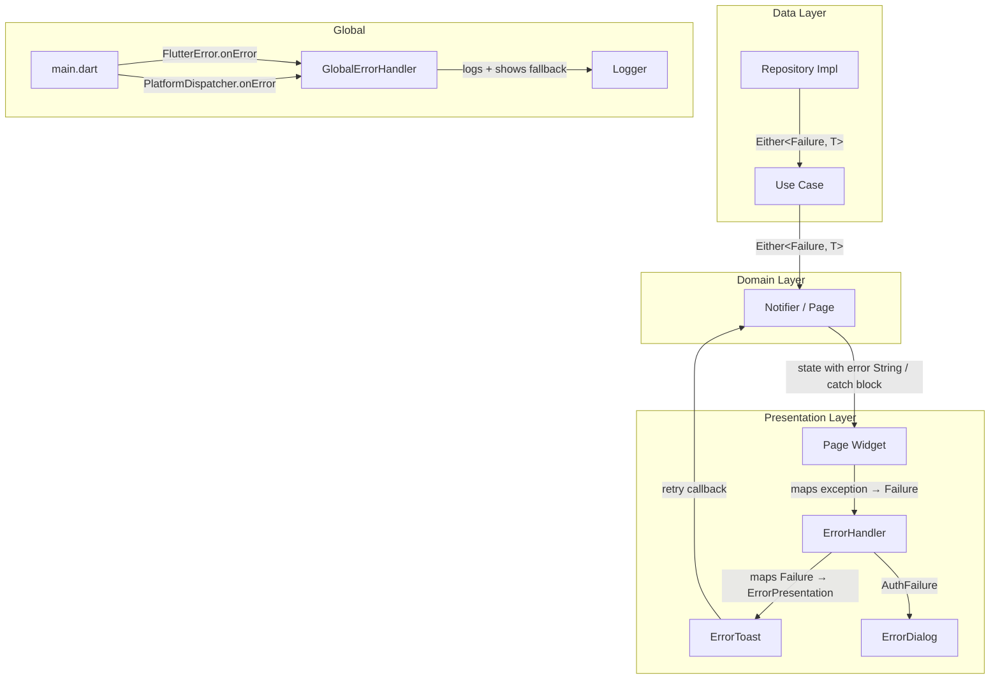

# Design Document: Frontend Error Handling

## Overview

This design introduces a comprehensive, non-blocking error handling system for the Flutter frontend. The current codebase handles errors by storing plain `String` error messages in Riverpod notifier states and displaying raw red `SnackBar` notifications — discarding the `Failure` type information that repositories already produce. This means the UI cannot differentiate between a network outage, an expired session, or a validation error.

The new system preserves the full `Failure` object through the state layer, maps each failure subtype to a branded toast presentation (icon, message, color), and provides retry affordances for transient errors. Auth failures trigger a modal sign-in dialog. A global error handler catches unhandled exceptions so the app never shows Flutter's red error screen in production.

**Key design constraint**: Errors never block the screen. Previously loaded data always remains visible underneath the error toast overlay.

**Migration note**: The codebase uses Riverpod `StateNotifier` for state management and direct Dio/setState patterns in some pages. The existing state management is kept as-is. The error handling migration focuses on replacing raw red SnackBar error displays with the new `ErrorHandler.show()` system (ErrorToast/ErrorDialog), and adding a `_mapExceptionToFailure()` helper in pages that catch exceptions directly.

## Architecture

The error handling system is a cross-cutting concern that lives in `core/error/` and `core/widgets/`, consumed by all feature pages and notifiers.



**Data flow**:
1. Repository returns `Either<Failure, T>` (already implemented) or pages catch Dio exceptions directly.
2. Notifier folds the Either (or page catches exception in try/catch), maps to a `Failure` subtype.
3. Page catch block or `ref.listen` callback calls `ErrorHandler.show()` with the `Failure`.
4. `ErrorHandler` maps the `Failure` subtype to an `ErrorPresentation` (icon, message, color, retryable flag).
5. For `AuthFailure`: shows a modal `ErrorDialog` with "Sign In" button → navigates to `/login`.
6. For all others: shows a non-blocking `ErrorToast` overlay. If retryable, includes a "Retry" button that invokes the retry callback.

**Design decision — Keep existing state management**: The existing Riverpod notifiers and direct Dio/setState patterns are kept as-is. The migration focuses solely on replacing SnackBar error displays with ErrorHandler.show(), which maps exceptions to typed Failure objects for branded toast/dialog presentation.

## Components and Interfaces

### 1. ErrorPresentation (Value Object)

Maps a `Failure` to its UI representation.

```dart
class ErrorPresentation {
  final IconData icon;
  final String message;
  final Color accentColor;
  final Color backgroundColor;
  final bool isRetryable;

  const ErrorPresentation({
    required this.icon,
    required this.message,
    required this.accentColor,
    required this.backgroundColor,
    this.isRetryable = false,
  });
}
```

### 2. ErrorHandler (Static Mapper)

Centralized mapping from `Failure` → `ErrorPresentation`. Also provides `show()` to dispatch the correct UI (toast vs dialog).

```dart
abstract class ErrorHandler {
  /// Maps a Failure to its UI presentation.
  static ErrorPresentation mapFailure(Failure failure);

  /// Shows the appropriate error UI (toast or dialog).
  /// For AuthFailure: shows ErrorDialog.
  /// For all others: shows ErrorToast.
  static void show(
    BuildContext context, {
    required Failure failure,
    VoidCallback? onRetry,
  });
}
```

### 3. ErrorToast (Widget)

A non-blocking overlay toast. Displayed via an `OverlayEntry` or a custom `showTopSnackBar`-style mechanism — NOT via `ScaffoldMessenger` (which replaces content).

```dart
class ErrorToast extends StatelessWidget {
  final ErrorPresentation presentation;
  final VoidCallback? onRetry;
  final VoidCallback onDismiss;

  const ErrorToast({
    required this.presentation,
    this.onRetry,
    required this.onDismiss,
  });
}
```

### 4. ErrorToastManager (Singleton)

Manages a queue of toasts so that multiple rapid errors don't stack on top of each other. Shows one at a time, auto-dismisses after 5 seconds.

```dart
class ErrorToastManager {
  /// Shows a toast. If one is already visible, queues it.
  void show(BuildContext context, ErrorPresentation presentation, {VoidCallback? onRetry});

  /// Dismisses the current toast and shows the next queued one.
  void dismiss();
}
```

### 5. ErrorDialog (Widget)

Modal dialog for critical errors (AuthFailure). Non-dismissible by tapping outside.

```dart
class ErrorDialog {
  /// Shows a modal auth error dialog.
  static Future<void> showAuthError(BuildContext context);
}
```

### 6. GlobalErrorHandler (Configuration)

Configures `FlutterError.onError` and `PlatformDispatcher.instance.onError` in `main.dart`.

```dart
abstract class GlobalErrorHandler {
  /// Call in main() before runApp().
  static void init();
}
```

### 7. EmptyStateWidget (Reusable Widget)

Displayed when a list/page has no data and no error.

```dart
class EmptyStateWidget extends StatelessWidget {
  final IconData icon;
  final String title;
  final String message;
  final String? actionLabel;
  final VoidCallback? onAction;
}
```

### 8. RetryHandler (Utility)

Wraps retry logic for failed operations.

```dart
class RetryHandler {
  /// Executes the callback once. Returns the result or a new Failure.
  static Future<Either<Failure, T>> execute<T>(
    Future<Either<Failure, T>> Function() operation,
  );
}
```

### 9. Exception-to-Failure Mapper (Page Helper)

A helper method added to pages that catch Dio exceptions directly, mapping them to typed `Failure` subtypes for use with `ErrorHandler.show()`:

```dart
/// Maps a caught exception to the appropriate Failure subtype.
Failure _mapExceptionToFailure(Object e) {
  if (e is DioException) {
    switch (e.type) {
      case DioExceptionType.connectionTimeout:
      case DioExceptionType.sendTimeout:
      case DioExceptionType.receiveTimeout:
      case DioExceptionType.connectionError:
        return const NetworkFailure('Connection timeout');
      case DioExceptionType.badResponse:
        final statusCode = e.response?.statusCode;
        if (statusCode == 401) return const AuthFailure('Unauthorized');
        if (statusCode == 403) return const AuthFailure('Forbidden');
        if (statusCode == 404) return const NotFoundFailure();
        return ServerFailure(
          e.response?.data?['message']?.toString() ?? 'Server error',
        );
      default:
        return const NetworkFailure();
    }
  }
  return ServerFailure(e.toString());
}
```

## Data Models

### ErrorPresentation

| Field | Type | Description |
|-------|------|-------------|
| `icon` | `IconData` | Material icon for the failure type |
| `message` | `String` | User-friendly error message |
| `accentColor` | `Color` | Left border / icon color (from AppColors) |
| `backgroundColor` | `Color` | Toast background tint |
| `isRetryable` | `bool` | Whether to show a Retry button |

### Failure → ErrorPresentation Mapping Table

| Failure Subtype | Icon | Default Message | Accent Color | Background | Retryable |
|----------------|------|-----------------|-------------|------------|-----------|
| `NetworkFailure` | `Icons.wifi_off` | "No internet connection. Check your network and try again." | `AppColors.pendingText` | `AppColors.pendingBackground` | ✅ |
| `ServerFailure` | `Icons.cloud_off` | "Something went wrong on our end. Please try again later." | `AppColors.rejectedText` | `AppColors.rejectedBackground` | ✅ |
| `AuthFailure` | `Icons.lock_outline` | "Your session has expired. Please sign in again." | `AppColors.reviewText` | `AppColors.reviewBackground` | ❌ |
| `ValidationFailure` | `Icons.warning_amber_rounded` | "Please check your input and try again." | `AppColors.pendingText` | `AppColors.pendingBackground` | ❌ |
| `NotFoundFailure` | `Icons.search_off` | "The requested resource could not be found." | `AppColors.textSecondary` | `AppColors.inputBackground` | ❌ |
| `CacheFailure` | `Icons.storage_rounded` | "Local data could not be loaded. Please try again." | `AppColors.pendingText` | `AppColors.pendingBackground` | ✅ |

**Custom message override**: If `failure.message` is non-empty and differs from the subtype's default constructor message, the custom message is used instead.

### Page Error State Shape

Pages that use direct Dio calls retain their existing setState pattern but replace SnackBar calls:

```
catch (e) {
  setState(() => _isLoading = false);
  final failure = _mapExceptionToFailure(e);
  ErrorHandler.show(context, failure: failure, onRetry: () => _loadData());
}
```

Pages that use Riverpod notifiers bridge the String error to a Failure:

```
ref.listen<SomeState>(provider, (previous, next) {
  if (next.error != null) {
    ErrorHandler.show(context, failure: ServerFailure(next.error!));
  }
});
```

### Toast Queue Model

```
ToastQueueEntry
├── presentation: ErrorPresentation
├── onRetry: VoidCallback?
├── timestamp: DateTime
```

## Correctness Properties

*A property is a characteristic or behavior that should hold true across all valid executions of a system — essentially, a formal statement about what the system should do. Properties serve as the bridge between human-readable specifications and machine-verifiable correctness guarantees.*

### Property 1: Data preservation on error

*For any* page/notifier state that contains previously loaded data, when an API call fails, the error handling must NOT clear the previously loaded data — the user must continue to see the last successfully loaded content underneath the error toast.

**Validates: Requirements 1.2, 1.4**

### Property 2: Error clearing preserves data

*For any* page state that contains both data and a visible error toast, when the error toast is dismissed, the data must remain intact and visible.

**Validates: Requirements 1.3**

### Property 3: Custom message override

*For any* `Failure` subtype constructed with a non-empty custom message that differs from the subtype's default message, `ErrorHandler.mapFailure(failure).message` must equal the custom message. For any `Failure` constructed with the default message, the mapped message must equal the predefined default for that subtype.

**Validates: Requirements 2.7**

### Property 4: Toast renders ErrorPresentation fields

*For any* `ErrorPresentation` instance, the `ErrorToast` widget built from it must contain the specified icon, the message text, and use the accent color for the left border indicator.

**Validates: Requirements 3.2**

### Property 5: Retryable failures show retry button

*For any* `Failure` instance, the `ErrorToast` widget must display a "Retry" button if and only if `ErrorHandler.mapFailure(failure).isRetryable` is true. Specifically, `NetworkFailure` and `ServerFailure` must produce `isRetryable == true`; all other subtypes must produce `isRetryable == false`.

**Validates: Requirements 3.5**

### Property 6: WCAG AA contrast ratio

*For any* `ErrorPresentation` produced by `ErrorHandler.mapFailure`, the contrast ratio between the text color (`AppColors.textPrimary`) and the `backgroundColor` must be at least 4.5:1, satisfying WCAG AA requirements.

**Validates: Requirements 3.9**

### Property 7: Toast queue processes sequentially

*For any* sequence of N error presentations dispatched to `ErrorToastManager` in quick succession, at most 1 toast is visible at any point in time, and all N toasts are eventually displayed in FIFO order.

**Validates: Requirements 3.10**

### Property 8: Retry executes callback exactly once

*For any* `Future Function()` callback passed to `RetryHandler.execute`, the callback must be invoked exactly once per `execute` call — never zero times, never more than once.

**Validates: Requirements 5.1**

### Property 9: Retry failure produces new error state

*For any* retry operation that fails again, the page must show a new error toast with the updated failure, while still preserving the existing data (same invariant as Property 1).

**Validates: Requirements 5.4**

### Property 10: Global handler logs all caught errors

*For any* unhandled exception caught by `GlobalErrorHandler`, the logger must be called with the exception type, message, and stack trace. No caught exception may be silently swallowed.

**Validates: Requirements 6.3**

### Property 11: Empty state renders all provided fields

*For any* `EmptyStateWidget` constructed with an icon, title, and message, the rendered widget tree must contain all three elements.

**Validates: Requirements 7.1**

### Property 12: Empty state conditionally shows action button

*For any* `EmptyStateWidget`, if `actionLabel` and `onAction` are both provided, the widget must render an action button with the given label. If either is null, no action button must be rendered.

**Validates: Requirements 7.2**

## Error Handling

### Error Flow by Layer

| Layer | Error Type | Handling Strategy |
|-------|-----------|-------------------|
| **Network (Dio)** | `DioException` | Caught in repository impl or page catch block, mapped to `Failure` subtype via `_mapExceptionToFailure()` or `_handleDioError()`. |
| **Repository** | `Exception` | Generic catch → `Left(ServerFailure(e.toString()))`. Already implemented. |
| **Notifier/Page** | `Either<Failure, T>` or `catch` | Folds the Either or catches exception. On error: maps to Failure, calls `ErrorHandler.show()`. Data preserved via setState pattern. |
| **Presentation** | `Failure` | `ErrorHandler.show()` called from catch block or `ref.listen`. AuthFailure → dialog. Others → toast. |
| **Global** | Unhandled `FlutterError` | `FlutterError.onError` → log + fallback widget (release) or print (debug). |
| **Global** | Unhandled platform exception | `PlatformDispatcher.instance.onError` → log + return true (handled). |

### Error Recovery Strategies

| Failure Type | Recovery | User Action |
|-------------|----------|-------------|
| `NetworkFailure` | Toast with retry | Tap "Retry" to re-execute the operation |
| `ServerFailure` | Toast with retry | Tap "Retry" to re-execute the operation |
| `AuthFailure` | Modal dialog | Tap "Sign In" → navigate to `/login`, clear auth state |
| `ValidationFailure` | Toast (no retry) | User corrects input and resubmits |
| `NotFoundFailure` | Toast (no retry) | Informational — user navigates elsewhere |
| `CacheFailure` | Toast with retry | Tap "Retry" to re-read from cache/network |

### Edge Cases

- **Rapid consecutive errors**: `ErrorToastManager` queues them, shows one at a time.
- **Error during retry**: Produces a new error state → new toast (Property 9).
- **Auth error while dialog is already showing**: Deduplicate — don't show a second dialog.
- **Error after widget disposal**: Riverpod listeners and setState are automatically cleaned up when the widget is disposed; no stale callbacks.
- **No prior data on first load error**: `data` field is null, toast still shows. The page shows the `EmptyStateWidget` or a loading skeleton underneath — never a blank screen.

## Testing Strategy

### Property-Based Testing

**Library**: `dart_check` (Dart property-based testing library, similar to QuickCheck).

**Configuration**: Each property test runs a minimum of 100 iterations with random inputs.

**Tag format**: Each test includes a comment: `// Feature: frontend-error-handling, Property {N}: {title}`

Each correctness property (Properties 1–12) maps to exactly one property-based test:

| Property | Test Description | Generator Strategy |
|----------|-----------------|-------------------|
| P1 | Data preservation on error | Verify page retains loaded data when error occurs. Assert data unchanged after error toast shown. |
| P2 | Error clearing preserves data | Verify data remains intact after error toast is dismissed. |
| P3 | Custom message override | Generate random non-empty strings as custom messages for each Failure subtype. Map and verify. |
| P4 | Toast renders ErrorPresentation | Generate random ErrorPresentation instances. Build widget. Find icon, text, and border color in tree. |
| P5 | Retryable ↔ retry button | Generate random Failure subtypes. Map to ErrorPresentation. Assert isRetryable matches expected per type. |
| P6 | WCAG AA contrast | Compute relative luminance for all ErrorPresentation background colors against textPrimary. Assert ratio ≥ 4.5. |
| P7 | Toast queue FIFO | Generate random sequences of 1–10 ErrorPresentations. Dispatch all. Verify sequential display order. |
| P8 | Retry invocation count | Generate random callbacks (success/failure). Call RetryHandler.execute. Assert callback called exactly once. |
| P9 | Retry failure → new error state | Generate random failing operations. Retry. Assert new error toast shown, data preserved. |
| P10 | Global handler logging | Generate random exceptions. Trigger handler. Assert logger called with type, message, stack. |
| P11 | Empty state fields | Generate random icon/title/message combos. Build widget. Assert all present in tree. |
| P12 | Empty state action button | Generate random configs with/without actionLabel. Build widget. Assert button presence matches config. |

### Unit Tests (Examples & Edge Cases)

Unit tests complement property tests by covering specific examples and edge cases:

- **ErrorHandler mapping examples** (Req 2.1–2.6): One test per Failure subtype verifying exact icon, message, and color.
- **Toast auto-dismiss** (Req 3.4): Verify toast disappears after 5 seconds using `fakeAsync`.
- **Toast dismiss button** (Req 3.3): Verify close icon exists and removes toast on tap.
- **Retry button tap** (Req 3.6): Verify callback invocation on tap.
- **AuthFailure dialog** (Req 4.1–4.3): Verify dialog appears, is non-dismissible, and "Sign In" navigates to `/login`.
- **Loading indicator during retry** (Req 5.3): Verify loading state on retry button.
- **GlobalErrorHandler configuration** (Req 6.1–6.2): Verify `FlutterError.onError` and `PlatformDispatcher.instance.onError` are set after `init()`.
- **Debug vs release mode** (Req 6.4–6.5): Verify console print in debug, fallback widget in release.
- **Page migration tests** (Req 8.1–8.6): Integration tests verifying each page uses `ErrorToast` instead of `SnackBar`.

### Test Organization

```
frontend/test/
├── core/
│   ├── error/
│   │   ├── error_handler_test.dart          # Unit: mapping examples (2.1-2.6)
│   │   ├── error_handler_properties_test.dart # PBT: P3, P5, P6
│   │   ├── retry_handler_test.dart          # Unit: edge cases
│   │   └── retry_handler_properties_test.dart # PBT: P8
│   └── widgets/
│       ├── error_toast_test.dart            # Unit: dismiss, auto-dismiss, retry tap
│       ├── error_toast_properties_test.dart  # PBT: P4, P7
│       ├── error_dialog_test.dart           # Unit: auth dialog behavior
│       ├── empty_state_widget_test.dart     # Unit: edge cases
│       └── empty_state_properties_test.dart  # PBT: P11, P12
└── global_error_handler_test.dart           # Unit + PBT: P10
```
