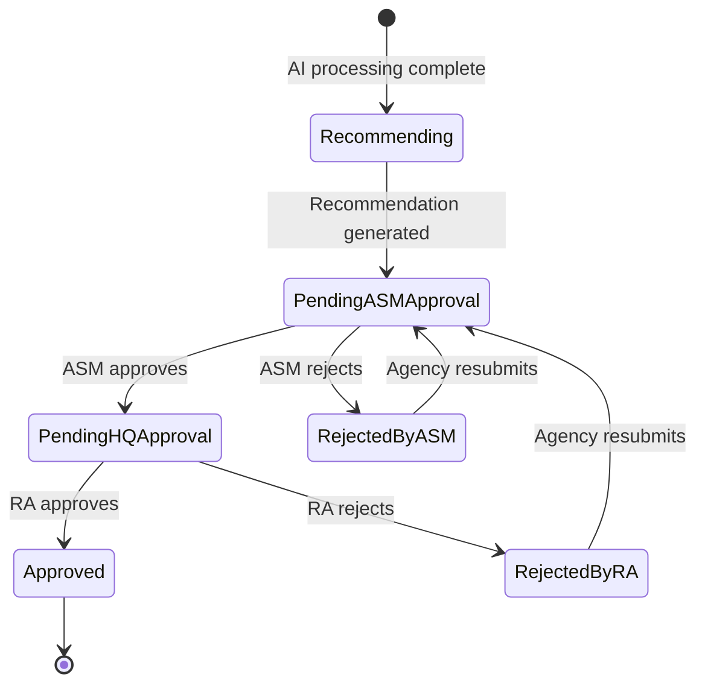

# Design Document: Multi-Level Approval Workflow

## Overview

This design formalizes the three-tier approval workflow (Agency → ASM → RA) for document packages in the Bajaj Document Processing System. The current codebase has partial approval logic scattered across controller actions with direct state assignment on `DocumentPackage`. This design introduces:

1. A dedicated `ApprovalAction` entity for an append-only audit trail.
2. A centralized `ApprovalWorkflowService` that encapsulates all state transition logic, role validation, comment validation, and notification dispatch.
3. Refactored API endpoints that delegate to the workflow service instead of performing inline state mutations.
4. A vertically bifurcated frontend review detail page layout shared across Agency, ASM, and RA roles.

The existing `PackageState` enum already contains the required values (`PendingASMApproval`, `PendingHQApproval`, `RejectedByASM`, `RejectedByRA`, `Approved`). The `PendingHQApproval` state serves as `PendingRAApproval` (HQ is the legacy name for RA). No new enum values are needed.

## Architecture

### Backend Architecture

The approval workflow follows the existing Clean Architecture layers:

```
API Layer (Controllers)
  │  Thin controllers delegate to service
  ▼
Application Layer (Interfaces + DTOs)
  │  IApprovalWorkflowService interface
  │  ApprovalActionDto, ApprovalHistoryDto
  ▼
Infrastructure Layer (Services)
  │  ApprovalWorkflowService implementation
  │  State machine guard, audit trail, notifications
  ▼
Domain Layer (Entities + Enums)
    ApprovalAction entity
    ApprovalActionType enum
```

**Key design decision**: The `ApprovalWorkflowService` is the single entry point for all approval state transitions. Controllers never assign `package.State` directly. This enforces the state machine rules, mandatory comments, role checks, audit logging, and notification dispatch in one place.



### Frontend Architecture

The review detail pages are refactored into a shared bifurcated layout:

```
ReviewDetailPage (role-aware)
  ├── Section 1 (Left ~60%): Current Data
  │   ├── PackageDetailsWidget
  │   ├── DocumentsListWidget
  │   ├── AIRecommendationWidget
  │   ├── ConfidenceScoresWidget
  │   └── ValidationResultsWidget
  └── Section 2 (Right ~40%): Approval Flow
      ├── WorkflowStageIndicator
      ├── ResubmissionCountBadge
      ├── ApprovalHistoryTimeline
      └── ActionPanel (role-dependent)
          ├── ASM: Approve/Reject + comment
          ├── RA: Approve/Reject + comment
          └── Agency: Resubmit + comment (if rejected)
```

## Components and Interfaces

### New Domain Entity

#### ApprovalAction

```csharp
public class ApprovalAction : BaseEntity
{
    public Guid PackageId { get; set; }
    public Guid ActorUserId { get; set; }
    public ApprovalActionType ActionType { get; set; }
    public PackageState PreviousState { get; set; }
    public PackageState NewState { get; set; }
    public string Comment { get; set; } = string.Empty;
    public DateTime ActionTimestamp { get; set; }

    // Navigation properties
    public DocumentPackage Package { get; set; } = null!;
    public User ActorUser { get; set; } = null!;
}
```

#### ApprovalActionType Enum

```csharp
public enum ApprovalActionType
{
    ASMApproved = 1,
    ASMRejected = 2,
    RAApproved = 3,
    RARejected = 4,
    Resubmitted = 5
}
```

### New Application Interface

#### IApprovalWorkflowService

```csharp
public interface IApprovalWorkflowService
{
    /// <summary>
    /// ASM approves a package in PendingASMApproval state.
    /// Transitions to PendingHQApproval, records action, notifies RA users.
    /// </summary>
    Task<ApprovalResultDto> ASMApproveAsync(
        Guid packageId, Guid asmUserId, string comment,
        CancellationToken cancellationToken = default);

    /// <summary>
    /// ASM rejects a package in PendingASMApproval state.
    /// Transitions to RejectedByASM, records action, notifies Agency user.
    /// </summary>
    Task<ApprovalResultDto> ASMRejectAsync(
        Guid packageId, Guid asmUserId, string comment,
        CancellationToken cancellationToken = default);

    /// <summary>
    /// RA approves a package in PendingHQApproval state.
    /// Transitions to Approved, records action, notifies Agency user.
    /// </summary>
    Task<ApprovalResultDto> RAApproveAsync(
        Guid packageId, Guid raUserId, string comment,
        CancellationToken cancellationToken = default);

    /// <summary>
    /// RA rejects a package in PendingHQApproval state.
    /// Transitions to RejectedByRA, records action, notifies Agency user.
    /// </summary>
    Task<ApprovalResultDto> RARejectAsync(
        Guid packageId, Guid raUserId, string comment,
        CancellationToken cancellationToken = default);

    /// <summary>
    /// Agency resubmits a rejected package.
    /// Transitions to PendingASMApproval, increments resubmission count,
    /// records action, notifies ASM users.
    /// </summary>
    Task<ApprovalResultDto> ResubmitAsync(
        Guid packageId, Guid agencyUserId, string comment,
        CancellationToken cancellationToken = default);

    /// <summary>
    /// Returns the full approval history for a package, ordered by timestamp ascending.
    /// </summary>
    Task<List<ApprovalActionDto>> GetApprovalHistoryAsync(
        Guid packageId, CancellationToken cancellationToken = default);
}
```

### New DTOs

#### ApprovalResultDto

```csharp
public class ApprovalResultDto
{
    public Guid PackageId { get; set; }
    public string NewState { get; set; } = string.Empty;
    public string Message { get; set; } = string.Empty;
}
```

#### ApprovalActionDto

```csharp
public class ApprovalActionDto
{
    public Guid Id { get; set; }
    public Guid PackageId { get; set; }
    public string ActorName { get; set; } = string.Empty;
    public string ActorRole { get; set; } = string.Empty;
    public string ActionType { get; set; } = string.Empty;
    public string PreviousState { get; set; } = string.Empty;
    public string NewState { get; set; } = string.Empty;
    public string Comment { get; set; } = string.Empty;
    public DateTime ActionTimestamp { get; set; }
}
```

#### ApprovalWorkflowRequest (API request DTO)

```csharp
public class ApprovalWorkflowRequest
{
    [Required(ErrorMessage = "Comment is required")]
    [MinLength(3, ErrorMessage = "Comment must be at least 3 characters")]
    [MaxLength(500, ErrorMessage = "Comment cannot exceed 500 characters")]
    public string Comment { get; set; } = string.Empty;
}
```

### Updated NotificationType Enum

```csharp
public enum NotificationType
{
    SubmissionReceived = 1,
    FlaggedForReview = 2,
    Approved = 3,           // Final RA approval
    Rejected = 4,           // Legacy
    ReuploadRequested = 5,
    RejectedByASM = 6,     // New
    RejectedByRA = 7,      // New
    PendingRAReview = 8,    // New: notify RA users
    Resubmitted = 9         // New: notify ASM users of resubmission
}
```

### Refactored API Endpoints

The existing `SubmissionsController` endpoints (`asm-approve`, `asm-reject`, `hq-approve`, `hq-reject`) will be refactored to delegate to `IApprovalWorkflowService`. A new `resubmit` endpoint and `approval-history` endpoint will be added.

| Method | Route | Role | Description |
|--------|-------|------|-------------|
| PATCH | `/api/submissions/{id}/asm-approve` | ASM | ASM approves package |
| PATCH | `/api/submissions/{id}/asm-reject` | ASM | ASM rejects package |
| PATCH | `/api/submissions/{id}/ra-approve` | HQ | RA approves package |
| PATCH | `/api/submissions/{id}/ra-reject` | HQ | RA rejects package |
| PATCH | `/api/submissions/{id}/resubmit` | Agency | Agency resubmits rejected package |
| GET | `/api/submissions/{id}/approval-history` | All | Get approval history timeline |

### Frontend Components

#### New/Modified Data Layer

- `ApprovalActionModel` — Dart model for `ApprovalActionDto` JSON deserialization.
- Updated `ApprovalRemoteDataSource` — Add methods: `asmApprove`, `asmReject`, `raApprove`, `raReject`, `resubmit`, `getApprovalHistory`.
- Updated `ApprovalRepository` — Add corresponding repository methods.

#### New Presentation Widgets

- `ApprovalHistoryTimeline` — Renders the ordered list of `ApprovalAction` records as a vertical timeline with actor name, role badge, action type icon, comment, and timestamp.
- `WorkflowStageIndicator` — Horizontal stepper showing the current stage (PendingASMApproval → PendingRAApproval → Approved) with distinct colors per state.
- `ApprovalActionPanel` — Role-aware widget that renders approve/reject buttons (ASM/RA) or resubmit button (Agency) with a mandatory comment `TextField`.
- `BifurcatedReviewLayout` — Shared layout scaffold that splits the page into left (current data) and right (approval flow) sections.

#### Modified Pages

- `ASMReviewDetailPage` — Refactored to use `BifurcatedReviewLayout`.
- `HQReviewDetailPage` — Refactored to use `BifurcatedReviewLayout` (RA review).
- New `AgencyReviewDetailPage` — Agency view of rejected packages using `BifurcatedReviewLayout`.
- `ASMReviewPage` — Filter to `PendingASMApproval` state only.
- `HQReviewPage` — Filter to `PendingHQApproval` state only.


## Data Models

### New Entity: ApprovalAction

| Column | Type | Constraints | Description |
|--------|------|-------------|-------------|
| Id | `Guid` | PK | Inherited from BaseEntity |
| PackageId | `Guid` | FK → DocumentPackages.Id, NOT NULL, Indexed | The package this action belongs to |
| ActorUserId | `Guid` | FK → Users.Id, NOT NULL | The user who performed the action |
| ActionType | `int` (ApprovalActionType enum) | NOT NULL | ASMApproved, ASMRejected, RAApproved, RARejected, Resubmitted |
| PreviousState | `int` (PackageState enum) | NOT NULL | State before the action |
| NewState | `int` (PackageState enum) | NOT NULL | State after the action |
| Comment | `nvarchar(500)` | NOT NULL, MinLength 3 | Mandatory comment for the action |
| ActionTimestamp | `datetime2` | NOT NULL | UTC timestamp of the action |
| CreatedAt | `datetime2` | NOT NULL | Inherited from BaseEntity |
| UpdatedAt | `datetime2` | NULL | Inherited from BaseEntity |
| IsDeleted | `bit` | NOT NULL, DEFAULT 0 | Soft delete (always false for append-only) |

**EF Core Configuration:**

```csharp
builder.HasOne(a => a.Package)
    .WithMany(p => p.ApprovalActions)
    .HasForeignKey(a => a.PackageId)
    .OnDelete(DeleteBehavior.Restrict);

builder.HasOne(a => a.ActorUser)
    .WithMany()
    .HasForeignKey(a => a.ActorUserId)
    .OnDelete(DeleteBehavior.Restrict);

builder.HasIndex(a => a.PackageId);
builder.HasIndex(a => new { a.PackageId, a.ActionTimestamp });
```

### Modified Entity: DocumentPackage

Add navigation property:

```csharp
public ICollection<ApprovalAction> ApprovalActions { get; set; } = new List<ApprovalAction>();
```

The existing `ResubmissionCount` and `HQResubmissionCount` fields are consolidated into a single `ResubmissionCount` that is incremented on every resubmission (whether from ASM or RA rejection). The `HQResubmissionCount` field is kept for backward compatibility but no longer incremented by the new workflow.

### Modified Interface: IApplicationDbContext

Add:

```csharp
DbSet<ApprovalAction> ApprovalActions { get; }
```

### Frontend Data Model: ApprovalActionModel

```dart
class ApprovalActionModel {
  final String id;
  final String packageId;
  final String actorName;
  final String actorRole;
  final String actionType;
  final String previousState;
  final String newState;
  final String comment;
  final DateTime actionTimestamp;

  const ApprovalActionModel({
    required this.id,
    required this.packageId,
    required this.actorName,
    required this.actorRole,
    required this.actionType,
    required this.previousState,
    required this.newState,
    required this.comment,
    required this.actionTimestamp,
  });

  factory ApprovalActionModel.fromJson(Map<String, dynamic> json) {
    return ApprovalActionModel(
      id: json['id'] as String,
      packageId: json['packageId'] as String,
      actorName: json['actorName'] as String,
      actorRole: json['actorRole'] as String,
      actionType: json['actionType'] as String,
      previousState: json['previousState'] as String,
      newState: json['newState'] as String,
      comment: json['comment'] as String,
      actionTimestamp: DateTime.parse(json['actionTimestamp'] as String),
    );
  }
}
```

### State Transition Validation Table

The `ApprovalWorkflowService` enforces these transitions using a guard method:

| Current State | Action | Required Role | New State | Notification Target |
|---------------|--------|---------------|-----------|-------------------|
| PendingASMApproval | ASM Approve | ASM | PendingHQApproval | RA users |
| PendingASMApproval | ASM Reject | ASM | RejectedByASM | Submitting Agency user |
| PendingHQApproval | RA Approve | HQ | Approved | Submitting Agency user |
| PendingHQApproval | RA Reject | HQ | RejectedByRA | Submitting Agency user |
| RejectedByASM | Resubmit | Agency (original submitter) | PendingASMApproval | ASM users |
| RejectedByRA | Resubmit | Agency (original submitter) | PendingASMApproval | ASM users |


## Correctness Properties

*A property is a characteristic or behavior that should hold true across all valid executions of a system — essentially, a formal statement about what the system should do. Properties serve as the bridge between human-readable specifications and machine-verifiable correctness guarantees.*

### Property 1: Valid state transitions produce correct new state

*For any* DocumentPackage in a valid approval-phase state and any valid action for that state, the resulting package state must match the defined transition table:
- (PendingASMApproval, ASMApprove) → PendingHQApproval
- (PendingASMApproval, ASMReject) → RejectedByASM
- (PendingHQApproval, RAApprove) → Approved
- (PendingHQApproval, RAReject) → RejectedByRA
- (RejectedByASM, Resubmit) → PendingASMApproval
- (RejectedByRA, Resubmit) → PendingASMApproval

**Validates: Requirements 1.2, 1.3, 1.5, 2.4, 3.2, 3.4, 4.1, 4.2**

### Property 2: Invalid state transitions are rejected with no side effects

*For any* DocumentPackage in any state and any action that is NOT in the valid transition table for that state, the service must reject the action and the package state must remain unchanged.

**Validates: Requirements 1.4, 1.5**

### Property 3: Comments shorter than 3 trimmed characters are rejected

*For any* approval, rejection, or resubmission action where the comment, after trimming whitespace, has fewer than 3 characters (including empty strings and whitespace-only strings), the action must be rejected and the package state must remain unchanged.

**Validates: Requirements 2.1, 2.3, 3.1, 3.3, 4.4, 5.1, 5.2, 5.3, 5.4**

### Property 4: Successful actions produce correct ApprovalAction records

*For any* successful approval, rejection, or resubmission action, the resulting ApprovalAction record must contain: the correct PackageId, the correct ActorUserId, the correct ActionType matching the action performed, the PreviousState matching the package state before the action, the NewState matching the package state after the action, the exact comment provided, and a non-null ActionTimestamp. When retrieved via the history endpoint, the record must also include a non-empty ActorName and ActorRole.

**Validates: Requirements 2.2, 2.5, 3.2, 3.5, 6.1, 6.4**

### Property 5: Unauthorized users cannot perform actions and state is unchanged

*For any* DocumentPackage in an approval-phase state and any user who does not have the required role for that state (ASM for PendingASMApproval, HQ for PendingHQApproval, original Agency submitter for rejected states), the action must be rejected and the package state must remain unchanged. No ApprovalAction record is created.

**Validates: Requirements 2.6, 3.6, 4.5, 8.1, 8.2, 8.3, 8.4, 8.5**

### Property 6: Approval history is append-only

*For any* DocumentPackage with existing ApprovalAction records, after performing any new action (successful or failed), all previously existing ApprovalAction records must remain unchanged in content and count. The total count of records can only increase or stay the same.

**Validates: Requirements 4.6, 6.2**

### Property 7: Approval history is ordered by timestamp ascending

*For any* DocumentPackage, the approval history returned by the service must be ordered by ActionTimestamp ascending. For all consecutive pairs (action_i, action_{i+1}) in the returned list, action_i.ActionTimestamp <= action_{i+1}.ActionTimestamp.

**Validates: Requirements 6.3**

### Property 8: Replaying approval actions from initial state produces current state

*For any* DocumentPackage, if we start from PendingASMApproval and sequentially apply the state transitions defined by each ApprovalAction record (ordered by timestamp), the final state must equal the package's current state.

**Validates: Requirements 6.5**

### Property 9: Resubmission count equals number of Resubmitted actions in history

*For any* DocumentPackage, the ResubmissionCount field must equal the number of ApprovalAction records with ActionType == Resubmitted for that package.

**Validates: Requirements 4.3, 7.1**

## Error Handling

### Backend Error Handling

The `ApprovalWorkflowService` uses the existing global exception middleware pattern. Custom exceptions map to HTTP status codes:

| Exception | HTTP Status | Scenario |
|-----------|-------------|----------|
| `NotFoundException` | 404 | Package not found |
| `ValidationException` | 400 | Comment too short, whitespace-only, or missing |
| `ForbiddenException` | 403 | User lacks required role or is not original submitter |
| `ConflictException` | 409 | Package not in valid state for requested action |
| `DomainException` | 400 | Invalid state transition attempted |

**Comment validation** is performed before any state mutation:
1. Trim the comment string.
2. If trimmed length < 3, throw `ValidationException` with message "Comment must be at least 3 characters after trimming whitespace."

**State transition guard** is checked before any mutation:
1. Look up the (currentState, actionType) pair in the transition table.
2. If not found, throw `ConflictException` with message "Cannot perform {action} on package in {state} state."

**Role validation** is checked before state transition guard:
1. For PendingASMApproval actions: verify user has ASM role.
2. For PendingHQApproval actions: verify user has HQ role.
3. For resubmission: verify user has Agency role AND user ID matches `SubmittedByUserId`.
4. If validation fails, throw `ForbiddenException`.

**Transaction scope**: Each action (state update + ApprovalAction insert + notification) is wrapped in a single `SaveChangesAsync` call to ensure atomicity. If notification dispatch fails, the approval action still succeeds (notifications are best-effort).

### Frontend Error Handling

- Comment field validates on submit: if trimmed length < 3, show inline error "Comment must be at least 3 characters" and prevent API call.
- API errors are caught by the Dio interceptor and mapped to user-friendly messages:
  - 400 → "Invalid request. Please check your input."
  - 403 → "You don't have permission to perform this action."
  - 404 → "Submission not found."
  - 409 → "This submission is not in the correct state for this action. Please refresh."
  - 500 → "Something went wrong. Please try again."
- After a 409 error, the page auto-refreshes to show the current state.
- Loading states are shown during API calls; buttons are disabled to prevent double-submission.

## Testing Strategy

### Property-Based Testing (Backend — FsCheck + xUnit)

Each correctness property maps to a single FsCheck property test with minimum 100 iterations. The `ApprovalWorkflowService` is tested with an in-memory `ApplicationDbContext` (EF Core InMemory provider) and mocked `INotificationAgent`.

**FsCheck generators needed:**
- `PackageStateGenerator`: Generates valid approval-phase states (PendingASMApproval, PendingHQApproval, RejectedByASM, RejectedByRA, Approved).
- `ApprovalActionTypeGenerator`: Generates valid action types (ASMApproved, ASMRejected, RAApproved, RARejected, Resubmitted).
- `ValidCommentGenerator`: Generates non-whitespace strings of length >= 3.
- `InvalidCommentGenerator`: Generates empty strings, whitespace-only strings, and strings with trimmed length < 3.
- `UserRoleGenerator`: Generates UserRole values (Agency, ASM, HQ).
- `StateActionPairGenerator`: Generates (state, action) pairs, both valid and invalid.

**Property test mapping:**

| Property | Test Class | Tag |
|----------|-----------|-----|
| P1: Valid transitions | `ApprovalStateMachineProperties` | Feature: multi-level-approval-workflow, Property 1: Valid state transitions produce correct new state |
| P2: Invalid transitions | `ApprovalStateMachineProperties` | Feature: multi-level-approval-workflow, Property 2: Invalid state transitions are rejected with no side effects |
| P3: Comment validation | `ApprovalCommentValidationProperties` | Feature: multi-level-approval-workflow, Property 3: Comments shorter than 3 trimmed characters are rejected |
| P4: Action recording | `ApprovalActionRecordingProperties` | Feature: multi-level-approval-workflow, Property 4: Successful actions produce correct ApprovalAction records |
| P5: Role-based access | `ApprovalRoleAccessProperties` | Feature: multi-level-approval-workflow, Property 5: Unauthorized users cannot perform actions |
| P6: Append-only history | `ApprovalHistoryProperties` | Feature: multi-level-approval-workflow, Property 6: Approval history is append-only |
| P7: History ordering | `ApprovalHistoryProperties` | Feature: multi-level-approval-workflow, Property 7: Approval history is ordered by timestamp ascending |
| P8: Replay consistency | `ApprovalHistoryProperties` | Feature: multi-level-approval-workflow, Property 8: Replaying actions produces current state |
| P9: Resubmission count | `ApprovalResubmissionProperties` | Feature: multi-level-approval-workflow, Property 9: Resubmission count equals Resubmitted action count |

### Unit Testing (Backend — xUnit + Moq)

Unit tests cover specific examples, edge cases, and notification dispatch:

- **Notification dispatch**: Verify `INotificationAgent` is called with correct parameters for each state transition (9.1–9.5). One test per transition.
- **Edge cases**: RA rejection resubmission goes to PendingASMApproval (not PendingRAApproval). Comment with exactly 3 characters after trim succeeds. Comment with 2 characters after trim fails.
- **Concurrency**: Optimistic concurrency conflict when two reviewers act on the same package simultaneously.
- **API endpoint tests**: Verify correct HTTP status codes, response shapes, and authorization attributes.

### Frontend Testing

- **Widget tests**: Verify `ApprovalHistoryTimeline` renders correct number of timeline entries. Verify `ApprovalActionPanel` shows correct buttons per role. Verify comment field validation prevents empty submission.
- **Integration tests**: Full approval flow (ASM approve → RA approve) with mock API. Rejection-resubmission loop with mock API.

### Test File Organization

```
backend/tests/BajajDocumentProcessing.Tests/
├── Infrastructure/
│   ├── ApprovalWorkflowServiceTests.cs          # Unit tests
│   └── Properties/
│       ├── ApprovalStateMachineProperties.cs     # P1, P2
│       ├── ApprovalCommentValidationProperties.cs # P3
│       ├── ApprovalActionRecordingProperties.cs  # P4
│       ├── ApprovalRoleAccessProperties.cs       # P5
│       ├── ApprovalHistoryProperties.cs          # P6, P7, P8
│       └── ApprovalResubmissionProperties.cs     # P9
```
