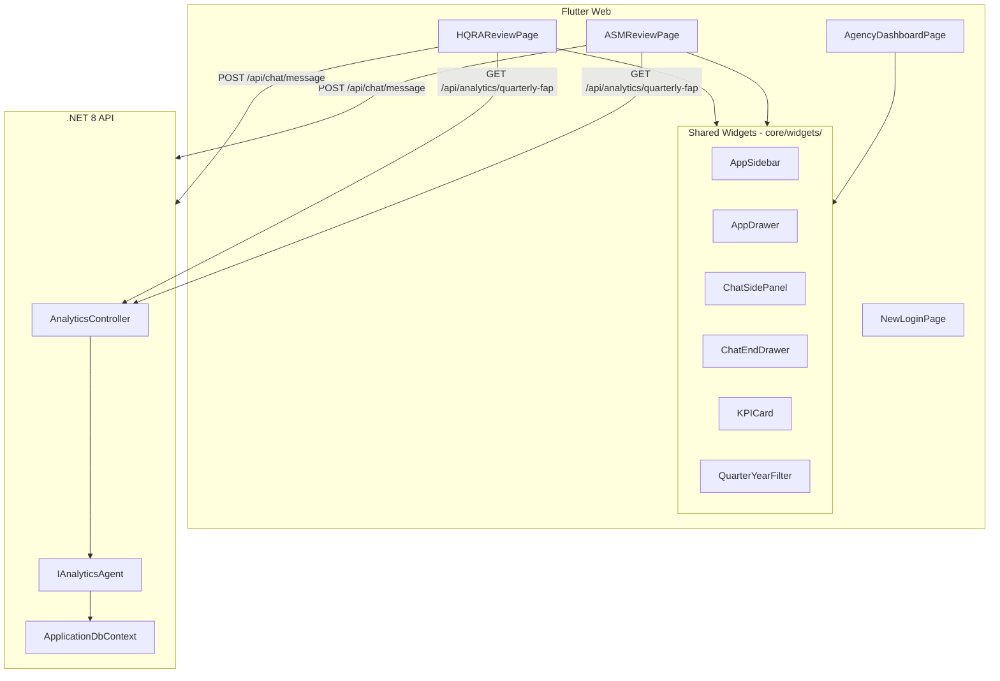

# Design Document: Quarterly Analytics Dashboard

## Overview

This feature delivers three coordinated changes across the Bajaj Document Processing system:

1. **HQ → HQ/RA Rebrand**: Replace all "HQ" labels with "HQ/RA" across login, status badges, navigation, and toast messages.
2. **Layout Unification**: Restructure the ASM and HQ/RA review pages to match the Agency dashboard pattern — shared sidebar/drawer navigation and integrated AI chat panel.
3. **Quarterly FAP KPIs**: Add a backend aggregation endpoint and frontend KPI cards with quarter/year filter dropdowns on both ASM and HQ/RA pages.

The design prioritizes code reuse by extracting shared widgets from the existing Agency dashboard and adding a single new backend endpoint.

## Architecture

### High-Level Component Diagram



### Design Decisions

**Decision 1: Extract shared widgets vs. inheritance**
- Extract `AppSidebar`, `AppDrawer`, `ChatSidePanel`, `ChatEndDrawer` as standalone widgets in `core/widgets/`.
- Rationale: Composition over inheritance. Each page passes its own nav items, user info, and role label. The Agency dashboard refactors to use these same widgets, ensuring a single source of truth.

**Decision 2: Single new endpoint vs. extending existing KPIs endpoint**
- Add `GET /api/analytics/quarterly-fap` as a new endpoint rather than modifying the existing `GET /api/analytics/kpis`.
- Rationale: The existing KPIs endpoint uses date ranges and returns a different shape (`KPIDashboard`). The quarterly FAP endpoint uses quarter/year semantics and returns a simpler `QuarterlyFapKpiResponse`. Keeping them separate avoids breaking existing HQ analytics.

**Decision 3: Authorize both ASM and HQ roles on the new endpoint**
- The existing `AnalyticsController` is `[Authorize(Roles = "HQ")]`. The new endpoint needs `[Authorize(Roles = "ASM,HQ")]`.
- Approach: Add the new endpoint with its own `[Authorize]` attribute overriding the controller-level one, or place it in a separate controller. We'll use an endpoint-level `[Authorize(Roles = "ASM,HQ")]` attribute on the new action method to override the controller default.

**Decision 4: Rebrand approach — string replacement, not enum change**
- The backend `PackageState` enum uses `PendingHQApproval`, `RejectedByHQ`, etc. These are internal identifiers and will NOT be renamed.
- Only frontend display strings change: `"HQ"` → `"HQ/RA"` in labels, badges, toasts, and navigation text.

## Components and Interfaces

### Backend Components

#### 1. New Endpoint: `GET /api/analytics/quarterly-fap`

Added to `AnalyticsController`. Accepts query parameters:

| Parameter | Type   | Required | Default        | Description |
|-----------|--------|----------|----------------|-------------|
| quarter   | string | No       | Current quarter | "Q1", "Q2", "Q3", "Q4", or "All" |
| year      | int    | No       | Current year    | e.g., 2025 |

Response: `QuarterlyFapKpiResponse` (see Data Models).

#### 2. New Interface Method: `IAnalyticsAgent.GetQuarterlyFapKpisAsync`

```csharp
Task<QuarterlyFapKpiResponse> GetQuarterlyFapKpisAsync(
    string quarter, 
    int year, 
    CancellationToken cancellationToken = default);
```

#### 3. Implementation in `AnalyticsAgent`

Query logic:
1. Filter `DocumentPackages` where `State == PackageState.Approved` and `IsDeleted == false`.
2. If `quarter != "All"`, filter by `CreatedAt` within the quarter's date range for the given year.
3. If `quarter == "All"`, filter by `CreatedAt` within the full year.
4. Include `Documents` where `Type == DocumentType.Invoice`.
5. For each qualifying package, deserialize `ExtractedDataJson` from its Invoice documents to extract `TotalAmount`.
6. Sum all `TotalAmount` values → `FapAmount`.
7. Count distinct packages with at least one Invoice → `FapCount`.

### Frontend Components

#### 1. `AppSidebar` Widget (`core/widgets/app_sidebar.dart`)

Extracted from `AgencyDashboardPage._buildSidebar`. Parameterized:

| Property | Type | Description |
|----------|------|-------------|
| userName | String | Display name in user info section |
| userRole | String | Role label (e.g., "Agency", "ASM", "HQ/RA") |
| navItems | List\<NavItem\> | Navigation items with icon, label, isActive, onTap |
| onLogout | VoidCallback | Logout handler |
| isCollapsed | bool | Tablet collapsed mode |

#### 2. `AppDrawer` Widget (`core/widgets/app_drawer.dart`)

Extracted from `AgencyDashboardPage._buildDrawer`. Same parameters as `AppSidebar` minus `isCollapsed`.

#### 3. `ChatSidePanel` Widget (`core/widgets/chat_side_panel.dart`)

Extracted from `AgencyDashboardPage._buildChatPanel` + `_buildChatContent`. Parameterized:

| Property | Type | Description |
|----------|------|-------------|
| token | String | Auth token for API calls |
| deviceType | DeviceType | Controls panel width (300px tablet, 380px desktop) |
| onClose | VoidCallback | Close button handler |

Manages its own chat state internally (messages list, sending state, text controller).

#### 4. `ChatEndDrawer` Widget (`core/widgets/chat_end_drawer.dart`)

Extracted from `AgencyDashboardPage._buildChatDrawer`. Wraps `ChatSidePanel` content in a `Drawer`.

#### 5. `KpiCard` Widget (`core/widgets/kpi_card.dart`)

A simple card displaying a label, formatted value, icon, and color. Reused from the existing `_buildStatCard` pattern.

#### 6. `QuarterYearFilter` Widget (`core/widgets/quarter_year_filter.dart`)

A row of two dropdowns:
- Quarter: Q1, Q2, Q3, Q4, All (defaults to current quarter)
- Year: dynamically populated (defaults to current year)

| Property | Type | Description |
|----------|------|-------------|
| selectedQuarter | String | Currently selected quarter |
| selectedYear | int | Currently selected year |
| onQuarterChanged | ValueChanged\<String\> | Quarter selection callback |
| onYearChanged | ValueChanged\<int\> | Year selection callback |
| availableYears | List\<int\> | Years to show in dropdown |

### Page Restructure Pattern

Both ASM and HQ/RA pages adopt the same `Scaffold` structure as the Agency dashboard:

```
Scaffold(
  appBar: isMobile ? AppBar(hamburger) : null,
  drawer: isMobile ? AppDrawer(...) : null,
  body: Row(
    children: [
      if (!isMobile) AppSidebar(isCollapsed: isTablet, ...),
      Expanded(
        child: Column(
          children: [
            if (!isMobile) _buildHeader(device),
            Expanded(child: _buildContent(device)),  // KPI cards + filters + table
          ],
        ),
      ),
      if (_isChatOpen && !isMobile) ChatSidePanel(...),
    ],
  ),
  endDrawer: isMobile ? ChatEndDrawer(...) : null,
  floatingActionButton: (_isChatOpen && !isMobile) ? null : ChatFAB(...),
)
```

### Rebrand Scope

Files requiring "HQ" → "HQ/RA" string changes:

| File | Change |
|------|--------|
| `new_login_page.dart` | `'HQ'` → `'HQ/RA'` in role tab label |
| `asm_review_page.dart` | `'With HQ'` → `'With HQ/RA'` in status dropdown |
| `hq_review_page.dart` | `'Pending HQ Review'` → `'Pending HQ/RA Review'` in stat cards, status dropdown, status badge |
| `hq_review_detail_page.dart` | `'Pending HQ Review'` → `'Pending HQ/RA Review'` in status badge |
| `agency_dashboard_page.dart` | `'Pending HQ Approval'` → `'Pending HQ/RA Approval'` in status badge |
| `agency_submission_detail_page.dart` | `'HQ'` → `'HQ/RA'` in rejection card label |

## Data Models

### Backend

#### `QuarterlyFapKpiResponse` (new DTO in `Application/DTOs/Analytics/`)

```csharp
public class QuarterlyFapKpiResponse
{
    public string Quarter { get; set; } = string.Empty;  // "Q1", "Q2", "Q3", "Q4", or "All"
    public int Year { get; set; }
    public decimal FapAmount { get; set; }                // Sum of TotalAmount from Invoice ExtractedDataJson
    public int FapCount { get; set; }                     // Count of distinct approved packages with invoices
}
```

#### Invoice `ExtractedDataJson` Structure (existing, read-only)

The `Document.ExtractedDataJson` for Invoice documents is deserialized to extract `TotalAmount`:

```json
{
  "InvoiceNumber": "INV-001",
  "TotalAmount": 150000.00,
  "Date": "2025-01-15",
  ...
}
```

The aggregation reads `TotalAmount` as `decimal`. If `ExtractedDataJson` is null or `TotalAmount` is missing/unparseable, that document contributes 0 to the sum.

#### Quarter Date Range Mapping

| Quarter | Start Date | End Date |
|---------|-----------|----------|
| Q1 | Jan 1 | Mar 31 |
| Q2 | Apr 1 | Jun 30 |
| Q3 | Jul 1 | Sep 30 |
| Q4 | Oct 1 | Dec 31 |

### Frontend

#### `QuarterlyFapKpi` Model (`features/analytics/data/models/`)

```dart
class QuarterlyFapKpi {
  final String quarter;
  final int year;
  final double fapAmount;
  final int fapCount;

  QuarterlyFapKpi({
    required this.quarter,
    required this.year,
    required this.fapAmount,
    required this.fapCount,
  });

  factory QuarterlyFapKpi.fromJson(Map<String, dynamic> json) {
    return QuarterlyFapKpi(
      quarter: json['quarter'] as String,
      year: json['year'] as int,
      fapAmount: (json['fapAmount'] as num).toDouble(),
      fapCount: json['fapCount'] as int,
    );
  }
}
```

#### `NavItem` Model (for shared sidebar)

```dart
class NavItem {
  final IconData icon;
  final String label;
  final bool isActive;
  final VoidCallback onTap;

  const NavItem({
    required this.icon,
    required this.label,
    this.isActive = false,
    required this.onTap,
  });
}
```

## Correctness Properties

*A property is a characteristic or behavior that should hold true across all valid executions of a system — essentially, a formal statement about what the system should do. Properties serve as the bridge between human-readable specifications and machine-verifiable correctness guarantees.*

### Property 1: Quarter Assignment Correctness

*For any* valid `DateTime`, the quarter assignment function shall map it to the correct calendar quarter: January–March → Q1, April–June → Q2, July–September → Q3, October–December → Q4. The year component shall equal the DateTime's year.

**Validates: Requirements 6.5, 7.4, 8.4**

### Property 2: FAP Aggregation Correctness

*For any* set of `DocumentPackage` entities (with varying states, dates, and associated Invoice documents with `ExtractedDataJson`), and *for any* valid quarter/year filter input, the aggregation function shall return:
- `FapAmount` equal to the sum of `TotalAmount` values extracted from Invoice documents belonging to packages where `State == Approved`, `IsDeleted == false`, and `CreatedAt` falls within the specified quarter/year range.
- `FapCount` equal to the count of distinct such packages that contain at least one Invoice document.

Packages with states other than `Approved` shall not contribute to either value. When `quarter == "All"`, the date range covers the full calendar year.

**Validates: Requirements 6.1, 6.2, 6.3, 6.4, 6.6**

### Property 3: Indian Currency Formatting

*For any* non-negative numeric amount, the Indian currency formatting function shall produce a string starting with "₹" followed by the amount formatted with the Indian numbering system (groups of 3 from the right for the first group, then groups of 2). For example: 150000 → "₹1,50,000", 1234567.89 → "₹12,34,567.89".

**Validates: Requirements 7.8, 8.8**

### Property 4: Invoice TotalAmount Extraction Round-Trip

*For any* valid Invoice extracted data object containing a `TotalAmount` decimal value, serializing it to JSON and then extracting `TotalAmount` via the deserialization logic shall return the original value. If `ExtractedDataJson` is null or missing `TotalAmount`, the extraction shall return 0.

**Validates: Requirements 9.1**

### Property 5: Additive Consistency Across Quarters

*For any* set of approved `DocumentPackage` entities within a given year, the sum of `FapAmount` values computed individually for Q1, Q2, Q3, and Q4 shall equal the `FapAmount` computed with `quarter == "All"` for that year. The same additive consistency shall hold for `FapCount`.

**Validates: Requirements 9.2, 9.3**

## Error Handling

### Backend

| Scenario | Response | HTTP Status |
|----------|----------|-------------|
| Invalid quarter value (not Q1–Q4 or All) | `{ "error": "Invalid quarter. Use Q1, Q2, Q3, Q4, or All." }` | 400 |
| Invalid year (< 2000 or > current year + 1) | `{ "error": "Invalid year." }` | 400 |
| Unauthenticated request | Standard 401 via JWT middleware | 401 |
| Wrong role (not ASM or HQ) | Standard 403 via `[Authorize]` | 403 |
| Database error during aggregation | Log error, return `{ "error": "An error occurred while retrieving quarterly KPIs" }` | 500 |
| `ExtractedDataJson` is null or malformed | Treat `TotalAmount` as 0 for that document; do not fail the entire aggregation | N/A (graceful degradation) |

### Frontend

| Scenario | Behavior |
|----------|----------|
| KPI API call in progress | Show skeleton loading placeholders for both KPI cards |
| KPI API returns error | Show error message card with retry button; preserve existing filter selections |
| KPI API returns zero values | Display ₹0 and 0 in KPI cards (not an error state) |
| Network timeout | Show error message with retry button |
| Chat API error | Show error message in chat panel (existing behavior from Agency dashboard) |

## Testing Strategy

### Property-Based Tests (Backend — xUnit + FsCheck)

Each correctness property maps to a single FsCheck property test with minimum 100 iterations.

| Property | Test Class | What It Generates |
|----------|-----------|-------------------|
| Property 1: Quarter Assignment | `QuarterAssignmentProperties.cs` | Random `DateTime` values across all months/years |
| Property 2: FAP Aggregation | `FapAggregationProperties.cs` | Random lists of `DocumentPackage` with random states, dates, and Invoice documents with random `TotalAmount` values |
| Property 3: Indian Currency Formatting | `IndianCurrencyFormattingProperties.cs` | Random non-negative `decimal` values |
| Property 4: Invoice TotalAmount Extraction | `InvoiceTotalAmountExtractionProperties.cs` | Random `decimal` values serialized into `ExtractedDataJson` format, plus null/malformed JSON cases |
| Property 5: Additive Consistency | `FapAdditiveConsistencyProperties.cs` | Random lists of approved `DocumentPackage` entities within a single year |

Property tests go in `tests/BajajDocumentProcessing.Tests/Infrastructure/Properties/`.

Tag format: `// Feature: quarterly-analytics-dashboard, Property {N}: {title}`

### Unit Tests (Backend — xUnit + Moq)

| Test | Description |
|------|-------------|
| `QuarterlyFapEndpoint_ReturnsCorrectShape` | Verify response DTO shape with known test data |
| `QuarterlyFapEndpoint_Returns400_ForInvalidQuarter` | Verify validation rejects "Q5", "q1", empty string |
| `QuarterlyFapEndpoint_Returns401_WhenUnauthenticated` | Verify auth requirement |
| `QuarterlyFapEndpoint_Returns403_ForAgencyRole` | Verify role restriction |
| `QuarterlyFapEndpoint_ReturnsZeros_WhenNoData` | Edge case: empty dataset |
| `QuarterlyFapEndpoint_IgnoresDeletedPackages` | Verify soft-delete filter |
| `QuarterlyFapEndpoint_IgnoresNullExtractedData` | Verify graceful handling of null JSON |

Unit tests go in `tests/BajajDocumentProcessing.Tests/Infrastructure/`.

### Widget Tests (Frontend — Flutter test)

| Test | Description |
|------|-------------|
| `AppSidebar renders nav items and user info` | Verify sidebar content |
| `AppDrawer renders on mobile viewport` | Verify drawer at mobile breakpoint |
| `ChatSidePanel opens and closes` | Verify chat panel toggle |
| `KpiCard displays formatted values` | Verify KPI card rendering |
| `QuarterYearFilter defaults to current quarter/year` | Verify default selections |
| `QuarterYearFilter triggers callbacks on change` | Verify filter interaction |
| `ASM page shows HQ/RA in status labels` | Verify rebrand |
| `HQ/RA page header shows "HQ/RA Review"` | Verify rebrand |

### Testing Libraries

- **Backend**: xUnit (unit tests), FsCheck (property-based tests), Moq (mocking)
- **Frontend**: Flutter test (widget tests)
- **PBT Configuration**: Minimum 100 iterations per property test via `MaxTest = 100` in FsCheck configuration
