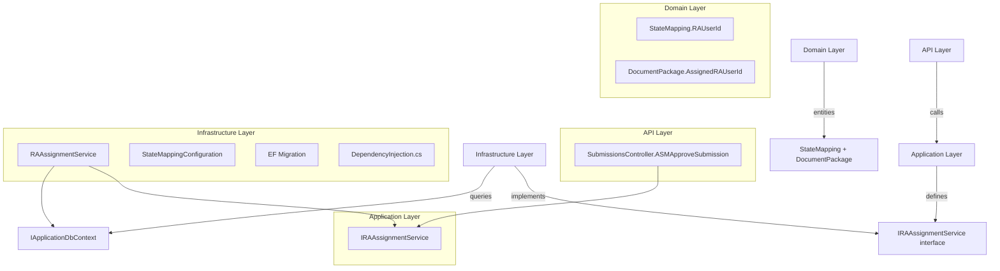
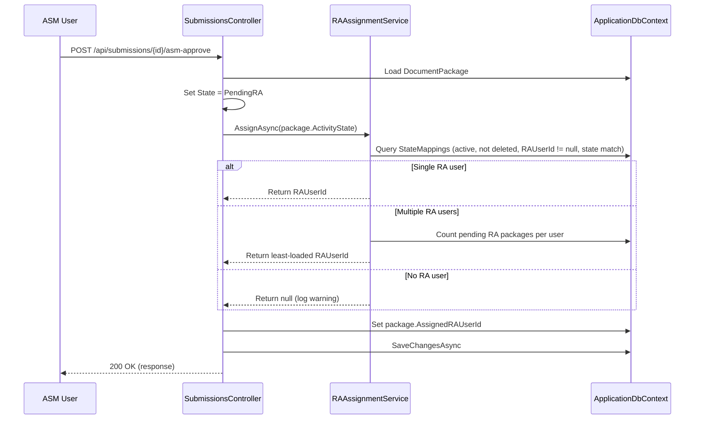

# Design Document: RA UserId State Mappings

## Overview

This feature adds an `RAUserId` column to the `StateMappings` table and introduces an `RAAssignmentService` that mirrors the existing `CircleHeadAssignmentService` pattern. When an ASM approves a submission (transitioning it to `PendingRA`), the system auto-assigns an RA user based on the submission's `ActivityState` by querying the `StateMappings` table.

The design reuses the proven CircleHead assignment architecture — same query pattern, same load-balancing strategy, same DI registration approach — applied to the RA role. The `DocumentPackage` entity gains an `AssignedRAUserId` property, and the `SubmissionsController.ASMApproveSubmission` action is extended to invoke the new service.

### Key Design Decisions

1. **Mirror, don't abstract**: Rather than creating a generic assignment service, we duplicate the CircleHead pattern for RA. This keeps each service focused, independently testable, and avoids premature abstraction. If a third role needs assignment later, a generic service can be extracted.
2. **Same table, new column**: `RAUserId` lives on `StateMappings` alongside `CircleHeadUserId`. This avoids a new table and keeps the state-to-user mapping co-located.
3. **Nullable column, no backfill**: Existing rows get `RAUserId = NULL`. The service excludes NULL rows, so the system degrades gracefully until RA data is populated.
4. **Load-balancing by pending RA submissions**: When multiple RA users map to a state, the service picks the one with the fewest `PendingRA` packages (matching the CircleHead approach but scoped to RA-relevant states).

## Architecture

The feature touches all four Clean Architecture layers:



### Data Flow (ASM Approval)



## Components and Interfaces

### 1. IRAAssignmentService (Application Layer)

**File**: `backend/src/BajajDocumentProcessing.Application/Common/Interfaces/IRAAssignmentService.cs`

```csharp
namespace BajajDocumentProcessing.Application.Common.Interfaces;

public interface IRAAssignmentService
{
    Task<Guid?> AssignAsync(string submissionState, CancellationToken cancellationToken = default);
}
```

Mirrors `ICircleHeadAssignmentService` exactly. Single method, same signature.

### 2. RAAssignmentService (Infrastructure Layer)

**File**: `backend/src/BajajDocumentProcessing.Infrastructure/Services/RAAssignmentService.cs`

Implements `IRAAssignmentService`. Dependencies: `IApplicationDbContext`, `ILogger<RAAssignmentService>`.

**Logic** (mirrors `CircleHeadAssignmentService`):
1. Query `StateMappings` where `State == submissionState && IsActive && !IsDeleted && RAUserId != null`.
2. Select distinct `RAUserId` values.
3. If 0 results → return `null`, log warning.
4. If 1 result → return it directly.
5. If multiple → load-balance: count `DocumentPackages` where `AssignedRAUserId` is in the candidate set and `State == PendingRA && !IsDeleted`, group by `AssignedRAUserId`, pick the user with the lowest count. Fall back to first candidate if no packages exist.

**Key difference from CircleHead service**: 
- Queries `RAUserId` instead of `CircleHeadUserId`.
- Load-balancing counts `AssignedRAUserId` on `DocumentPackages` filtered to `PendingRA` state only (CircleHead counts both `PendingASM` and `PendingRA`).
- Uses `AsNoTracking()` for all read queries (Requirement 3.6).

### 3. StateMapping Entity Changes (Domain Layer)

**File**: `backend/src/BajajDocumentProcessing.Domain/Entities/StateMapping.cs`

Add one property:

```csharp
/// <summary>
/// RA user assigned to this state for second-level submission review.
/// </summary>
public Guid? RAUserId { get; set; }
```

### 4. DocumentPackage Entity Changes (Domain Layer)

**File**: `backend/src/BajajDocumentProcessing.Domain/Entities/DocumentPackage.cs`

Add one property:

```csharp
/// <summary>
/// Gets or sets the unique identifier of the RA user assigned to review this submission.
/// Auto-assigned at ASM approval time via StateMapping.
/// </summary>
public Guid? AssignedRAUserId { get; set; }
```

### 5. StateMappingConfiguration Changes (Infrastructure Layer)

**File**: `backend/src/BajajDocumentProcessing.Infrastructure/Persistence/Configurations/StateMappingConfiguration.cs`

Add:
```csharp
builder.Property(s => s.RAUserId);

builder.HasIndex(s => s.RAUserId)
    .HasDatabaseName("IX_StateMappings_RAUserId");
```

### 6. DependencyInjection Registration

**File**: `backend/src/BajajDocumentProcessing.Infrastructure/DependencyInjection.cs`

Add after the CircleHead registration:
```csharp
services.AddScoped<IRAAssignmentService, RAAssignmentService>();
```

### 7. SubmissionsController Integration

**File**: `backend/src/BajajDocumentProcessing.API/Controllers/SubmissionsController.cs`

In `ASMApproveSubmission`, after setting `package.State = PackageState.PendingRA`:
1. Inject `IRAAssignmentService` via constructor.
2. Call `var raUserId = await _raAssignmentService.AssignAsync(package.ActivityState, cancellationToken)`.
3. Set `package.AssignedRAUserId = raUserId`.
4. If `raUserId` is null, log a warning but continue (submission still transitions to PendingRA).

## Data Models

### StateMappings Table (after migration)

| Column | Type | Nullable | Index | Notes |
|--------|------|----------|-------|-------|
| Id | uniqueidentifier | No | PK | From BaseEntity |
| State | nvarchar(100) | No | IX_StateMappings_State | |
| DealerCode | nvarchar(50) | No | IX_StateMappings_DealerCode | |
| DealerName | nvarchar(200) | No | | |
| City | nvarchar(100) | Yes | | |
| CircleHeadUserId | uniqueidentifier | Yes | | Existing |
| **RAUserId** | **uniqueidentifier** | **Yes** | **IX_StateMappings_RAUserId** | **New** |
| IsActive | bit | No | IX_StateMappings_State_IsActive (composite) | Default: true |
| IsDeleted | bit | No | | Default: false |
| CreatedAt | datetime2 | No | | From BaseEntity |
| UpdatedAt | datetime2 | Yes | | From BaseEntity |

### DocumentPackages Table (after migration)

New column only:

| Column | Type | Nullable | Notes |
|--------|------|----------|-------|
| **AssignedRAUserId** | **uniqueidentifier** | **Yes** | **New — set during ASM approval** |

### EF Migration

Migration name: `AddRAUserIdToStateMappings`

**Up**:
- Add nullable `uniqueidentifier` column `RAUserId` to `StateMappings`.
- Create index `IX_StateMappings_RAUserId` on `RAUserId`.
- Add nullable `uniqueidentifier` column `AssignedRAUserId` to `DocumentPackages`.

**Down**:
- Drop index `IX_StateMappings_RAUserId`.
- Drop column `RAUserId` from `StateMappings`.
- Drop column `AssignedRAUserId` from `DocumentPackages`.


## Correctness Properties

*A property is a characteristic or behavior that should hold true across all valid executions of a system — essentially, a formal statement about what the system should do. Properties serve as the bridge between human-readable specifications and machine-verifiable correctness guarantees.*

### Property 1: RA assignment filtering invariant

*For any* set of `StateMappings` rows and any state string, `AssignAsync` shall only consider rows where `IsActive == true`, `IsDeleted == false`, `State == submissionState`, and `RAUserId != null`. Rows that fail any of these conditions must never influence the returned GUID.

**Validates: Requirements 3.2, 6.2**

### Property 2: Single RA user direct return

*For any* state where exactly one distinct non-null `RAUserId` exists across all qualifying `StateMappings` rows, `AssignAsync` shall return that `RAUserId`.

**Validates: Requirements 3.3**

### Property 3: Load-balanced assignment picks least-loaded RA

*For any* state where multiple distinct non-null `RAUserId` values exist across qualifying `StateMappings` rows, and *for any* distribution of `DocumentPackages` in `PendingRA` state assigned to those RA users, `AssignAsync` shall return the `RAUserId` with the fewest pending packages. If multiple RA users are tied for fewest, any of the tied users is acceptable.

**Validates: Requirements 3.4**

### Property 4: No matching RA returns null

*For any* state string that has zero qualifying `StateMappings` rows (either no rows match the state, or all matching rows have `RAUserId == null`, or all matching rows are inactive/deleted), `AssignAsync` shall return `null`.

**Validates: Requirements 3.5**

### Property 5: Dealer search unaffected by RAUserId

*For any* set of `StateMappings` rows where some have `RAUserId == null` and some have `RAUserId` set, the dealer search endpoint shall return the same `DealerResult` set regardless of `RAUserId` values — the `RAUserId` column must not affect dealer visibility or filtering.

**Validates: Requirements 5.3**

## Error Handling

| Scenario | Behavior | HTTP Status |
|----------|----------|-------------|
| No RA user found for state | `AssignAsync` returns `null`, logs warning. Controller still transitions to `PendingRA`. | 200 OK (approval succeeds) |
| `ActivityState` is null/empty on DocumentPackage | Controller should handle gracefully — pass to `AssignAsync` which returns `null` (no state match). | 200 OK (approval succeeds) |
| Database query failure in `RAAssignmentService` | Exception propagates to global exception middleware. ASM approval fails. | 500 Internal Server Error |
| Cancellation requested | `CancellationToken` propagated through all async calls. `OperationCanceledException` handled by middleware. | Request cancelled |

The service follows the same error philosophy as `CircleHeadAssignmentService`: assignment failure is non-blocking for the approval workflow. The submission transitions to `PendingRA` regardless, and a warning log flags the missing assignment for manual intervention.

## Testing Strategy

### Property-Based Tests (FsCheck + xUnit)

Each correctness property maps to a single FsCheck property test with a minimum of 100 iterations.

**File**: `backend/tests/BajajDocumentProcessing.Tests/Infrastructure/Properties/RAAssignmentProperties.cs`

| Test | Property | Iterations |
|------|----------|------------|
| `AssignAsync_OnlyConsidersActiveNonDeletedMatchingRowsWithRAUserId` | Property 1: Filtering invariant | 100 |
| `AssignAsync_ReturnsSingleRAUser_WhenExactlyOneDistinctRAExists` | Property 2: Single RA direct return | 100 |
| `AssignAsync_ReturnsLeastLoadedRAUser_WhenMultipleRAUsersExist` | Property 3: Load-balanced assignment | 100 |
| `AssignAsync_ReturnsNull_WhenNoQualifyingRAUserExists` | Property 4: No match returns null | 100 |

Each test will:
- Use FsCheck generators to produce random `StateMappings` rows (varying `IsActive`, `IsDeleted`, `State`, `RAUserId` nullability).
- Use an in-memory `IApplicationDbContext` mock (via Moq + `DbSet` setup) to simulate the database.
- Tag with comment: `// Feature: ra-userid-state-mappings, Property {N}: {title}`

**Property 5** (dealer search unaffected) is best verified as a unit test since it validates that the existing `StateController` query projection does not include `RAUserId` — this is a structural assertion, not a randomized property.

### Unit Tests (xUnit + Moq)

**File**: `backend/tests/BajajDocumentProcessing.Tests/Infrastructure/RAAssignmentServiceTests.cs`

| Test | Validates |
|------|-----------|
| `AssignAsync_SingleRA_ReturnsGuid` | Req 3.3, 7.1 |
| `AssignAsync_MultipleRA_ReturnsLeastLoaded` | Req 3.4, 7.2 |
| `AssignAsync_NoRA_ReturnsNull` | Req 3.5, 7.3 |
| `AssignAsync_ExcludesInactiveAndDeleted` | Req 3.2, 7.4 |
| `AssignAsync_ExcludesNullRAUserId` | Req 6.2, 7.5 |
| `DealerSearch_DoesNotExposeRAUserId` | Req 5.1 |
| `DealerSearch_ReturnsRowsWithNullRAUserId` | Req 5.3 |
| `ASMApprove_AssignsRAUser_WhenServiceReturnsGuid` | Req 4.1, 4.2 |
| `ASMApprove_TransitionsToPendingRA_WhenServiceReturnsNull` | Req 4.3 |

### Testing Library

- **Property-based testing**: FsCheck (via `FsCheck.Xunit` — `[Property(MaxTest = 100)]` attribute)
- **Unit testing**: xUnit (`[Fact]`)
- **Mocking**: Moq (for `IApplicationDbContext`, `ILogger<T>`)
- Each property-based test MUST be implemented as a single `[Property]` test method referencing its design document property
- Tag format: `// Feature: ra-userid-state-mappings, Property {N}: {title}`
