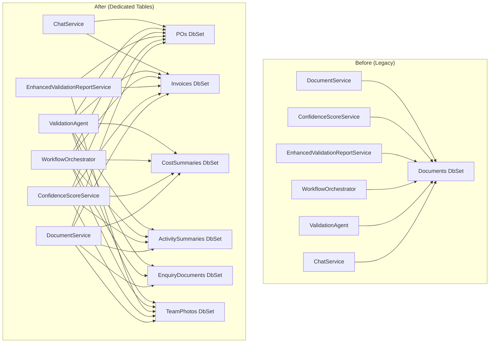

# Design Document: Remove Legacy Documents Table

## Overview

This design describes the migration of all service code from the legacy generic `Documents` table to the dedicated per-type document tables (PO, Invoice, CostSummary, ActivitySummary, EnquiryDocument, AdditionalDocument, TeamPhotos). The legacy `Document` entity, its DbSet, navigation properties, and the database table itself will be removed.

The approach is a systematic find-and-replace at the service layer: every query or write that touches `package.Documents` or `_context.Documents` gets rewritten to use the appropriate dedicated entity/DbSet. No new tables or entities are created — the dedicated tables already exist from the database redesign spec.

## Architecture

The change is confined to the Infrastructure and Application layers, with a small Domain layer deletion (Document.cs entity). No API controller signatures change — the `UploadDocumentResponse` DTO already abstracts away the storage entity.



### Migration Strategy

Each service is migrated independently. The order is:

1. **DocumentService** — the primary write path; must be migrated first so new uploads go to dedicated tables
2. **ConfidenceScoreService** — reads extraction confidence; straightforward navigation property swap
3. **EnhancedValidationReportService** — reads extracted data for reports; navigation property swap
4. **ValidationAgent** — reads extracted data for validation; navigation property swap
5. **WorkflowOrchestrator** — orchestrates extraction; remove old Documents code path
6. **ChatService** — reads document data for chat context; navigation property swap
7. **Remove legacy artifacts** — delete Document.cs, remove DbSet, remove navigation property, generate migration

## Components and Interfaces

### DocumentService Changes

The `UploadDocumentAsync` method currently creates a `Document` entity for all types. It will be refactored to create the appropriate dedicated entity based on `DocumentType`:

```csharp
// Pseudocode for the new upload flow
switch (documentType)
{
    case DocumentType.PO:
        var po = new PO
        {
            Id = Guid.NewGuid(),
            PackageId = actualPackageId,
            FileName = file.FileName,
            BlobUrl = blobUrl,
            FileSizeBytes = file.Length,
            ContentType = file.ContentType,
            VersionNumber = package.VersionNumber,
            CreatedAt = DateTime.UtcNow,
            CreatedBy = userId.ToString()
        };
        await _context.POs.AddAsync(po);
        // Return po.Id as DocumentId
        break;

    case DocumentType.Invoice:
        var invoice = new Invoice
        {
            Id = Guid.NewGuid(),
            PackageId = actualPackageId,
            FileName = file.FileName,
            BlobUrl = blobUrl,
            FileSizeBytes = file.Length,
            ContentType = file.ContentType,
            VersionNumber = package.VersionNumber,
            CreatedAt = DateTime.UtcNow,
            CreatedBy = userId.ToString()
        };
        await _context.Invoices.AddAsync(invoice);
        break;

    // Similar for CostSummary, ActivitySummary, EnquiryDocument, TeamPhoto
}
```

The `ExtractDocumentDataAsync` background method will be refactored to find and update the dedicated entity instead of `_context.Documents.FindAsync(documentId)`.

The `GetDocumentAsync` method will be replaced with a method that accepts both `documentId` and `documentType`, querying the appropriate DbSet.

### IDocumentService Interface Changes

```csharp
public interface IDocumentService
{
    Task<UploadDocumentResponse> UploadDocumentAsync(
        IFormFile file, DocumentType documentType, Guid? packageId, Guid userId);
    Task<bool> ValidateFileAsync(IFormFile file, DocumentType documentType);
    // Removed: Task<Document?> GetDocumentAsync(Guid documentId);
    // New: returns a DTO instead of the legacy entity
    Task<DocumentInfoDto?> GetDocumentAsync(Guid documentId, DocumentType documentType);
}
```

A new `DocumentInfoDto` will be introduced to replace the `Document` entity return type:

```csharp
public class DocumentInfoDto
{
    public Guid Id { get; set; }
    public Guid PackageId { get; set; }
    public DocumentType Type { get; set; }
    public string FileName { get; set; } = string.Empty;
    public string BlobUrl { get; set; } = string.Empty;
    public long FileSizeBytes { get; set; }
    public string ContentType { get; set; } = string.Empty;
    public string? ExtractedDataJson { get; set; }
    public double? ExtractionConfidence { get; set; }
    public bool IsFlaggedForReview { get; set; }
}
```

### ConfidenceScoreService Changes

Replace `Include(p => p.Documents)` with dedicated navigations:

```csharp
var package = await _context.DocumentPackages
    .Include(p => p.PO)
    .Include(p => p.Invoices)
    .Include(p => p.CostSummary)
    .Include(p => p.ActivitySummary)
    .Include(p => p.Teams)
        .ThenInclude(t => t.Photos)
    .AsSplitQuery()
    .FirstOrDefaultAsync(p => p.Id == packageId, cancellationToken);
```

Replace `GetDocumentConfidence` and `GetAveragePhotoConfidence` helper methods:

```csharp
private double GetPoConfidence(DocumentPackage package)
    => package.PO?.ExtractionConfidence ?? 0.0;

private double GetInvoiceConfidence(DocumentPackage package)
    => package.Invoices.FirstOrDefault()?.ExtractionConfidence ?? 0.0;

private double GetCostSummaryConfidence(DocumentPackage package)
    => package.CostSummary?.ExtractionConfidence ?? 0.0;

private double GetActivityConfidence(DocumentPackage package)
    => package.ActivitySummary?.ExtractionConfidence ?? 0.0;

private double GetAveragePhotoConfidence(DocumentPackage package)
{
    var photos = package.Teams.SelectMany(t => t.Photos).ToList();
    if (!photos.Any()) return 0.0;
    return photos.Average(p => p.ExtractionConfidence ?? 0.0);
}
```

### EnhancedValidationReportService Changes

Replace `LoadPackageWithAllDataAsync` to use dedicated navigations:

```csharp
var package = await _context.DocumentPackages
    .Include(p => p.PO)
    .Include(p => p.Invoices)
    .Include(p => p.CostSummary)
    .Include(p => p.Teams)
        .ThenInclude(t => t.Photos)
    .AsSplitQuery()
    .FirstOrDefaultAsync(p => p.Id == packageId, cancellationToken);
```

Replace all `package.Documents.FirstOrDefault(d => d.Type == ...)` patterns:
- `package.Documents.FirstOrDefault(d => d.Type == DocumentType.PO)` → `package.PO`
- `package.Documents.FirstOrDefault(d => d.Type == DocumentType.Invoice)` → `package.Invoices.FirstOrDefault()`
- `package.Documents.Where(d => d.Type == DocumentType.TeamPhoto)` → `package.Teams.SelectMany(t => t.Photos)`
- `package.Documents.Any(d => d.Type == DocumentType.CostSummary)` → `package.CostSummary != null`

### WorkflowOrchestrator Changes

Remove the entire "OLD MODEL" code path in `ExecuteExtractionStepAsync` that processes `package.Documents`. The hierarchical model (Teams → Invoices, Photos) is already implemented. Add extraction for package-level dedicated entities (PO, CostSummary, ActivitySummary, EnquiryDocument).

Replace the package loading query:

```csharp
var package = await _context.DocumentPackages
    .Include(p => p.PO)
    .Include(p => p.Invoices)
    .Include(p => p.CostSummary)
    .Include(p => p.ActivitySummary)
    .Include(p => p.EnquiryDocument)
    .Include(p => p.Teams)
        .ThenInclude(t => t.Invoices.Where(i => !i.IsDeleted))
    .Include(p => p.Teams)
        .ThenInclude(t => t.Photos.Where(p => !p.IsDeleted))
    .Include(p => p.SubmittedBy)
    .AsSplitQuery()
    .FirstOrDefaultAsync(p => p.Id == packageId, cancellationToken);
```

### ValidationAgent Changes

Replace the package loading query to use dedicated navigations. Replace all document data extraction patterns:

```csharp
// Before
var poDoc = package.Documents.FirstOrDefault(d => d.Type == DocumentType.PO);
if (poDoc?.ExtractedDataJson != null)
    poData = JsonSerializer.Deserialize<POData>(poDoc.ExtractedDataJson);

// After
if (package.PO?.ExtractedDataJson != null)
    poData = JsonSerializer.Deserialize<POData>(package.PO.ExtractedDataJson);
```

### ChatService Changes

Replace the packages query to use dedicated navigations:

```csharp
var packagesQuery = _context.DocumentPackages
    .Include(p => p.PO)
    .Include(p => p.Invoices)
    .Include(p => p.ConfidenceScore)
    .AsQueryable();
```

Replace the document iteration in the chat context builder to read from `package.PO` and `package.Invoices` instead of iterating `package.Documents`.

### Domain Layer Changes

- Delete `backend/src/BajajDocumentProcessing.Domain/Entities/Document.cs`
- Remove `ICollection<Document> Documents` from `DocumentPackage.cs`
- Remove `ICollection<Invoice> LinkedInvoices` from `Document.cs` (already being deleted)

### Application Layer Changes

- Remove `DbSet<Document> Documents` from `IApplicationDbContext.cs`
- Update `IDocumentService.GetDocumentAsync` to return `DocumentInfoDto?` instead of `Document?`

### Infrastructure Layer Changes

- Remove `DbSet<Document> Documents` from `ApplicationDbContext.cs`
- Remove `Document` soft-delete query filter from `OnModelCreating`
- Delete any EF Core configuration file for `Document` entity (if exists)
- Generate EF Core migration to drop the `Documents` table

## Data Models

No new data models are introduced. The existing dedicated entity models (PO, Invoice, CostSummary, ActivitySummary, EnquiryDocument, AdditionalDocument, TeamPhotos) already contain all the fields that were in the legacy `Document` entity:

| Legacy Document Field | Dedicated Entity Equivalent |
|---|---|
| `PackageId` | `PackageId` (all entities) |
| `Type` | Implicit by table (no discriminator needed) |
| `FileName` | `FileName` (all entities) |
| `BlobUrl` | `BlobUrl` (all entities) |
| `FileSizeBytes` | `FileSizeBytes` (all entities) |
| `ContentType` | `ContentType` (all entities) |
| `ExtractedDataJson` | `ExtractedDataJson` (all entities except AdditionalDocument) |
| `ExtractionConfidence` | `ExtractionConfidence` (all entities except AdditionalDocument) |
| `IsFlaggedForReview` | `IsFlaggedForReview` (all entities except AdditionalDocument) |

The only new DTO is `DocumentInfoDto` (described above) which replaces the `Document` entity as the return type of `GetDocumentAsync`.


## Correctness Properties

*A property is a characteristic or behavior that should hold true across all valid executions of a system — essentially, a formal statement about what the system should do. Properties serve as the bridge between human-readable specifications and machine-verifiable correctness guarantees.*

The prework analysis identified many acceptance criteria that are structurally identical (e.g., "upload PO creates PO entity" and "upload Invoice creates Invoice entity" are the same property parameterized by document type). After consolidation, four unique properties remain:

### Property 1: Upload routing by document type

*For any* valid DocumentType and any valid file metadata, uploading a document with that type SHALL create exactly one entity in the dedicated table corresponding to that type, and zero entities in any other dedicated table.

**Validates: Requirements 1.1, 1.2, 1.3, 1.4, 1.5, 1.6**

### Property 2: Upload-then-retrieve round trip

*For any* valid DocumentType and any valid file metadata, uploading a document and then retrieving it by ID and type SHALL return a DocumentInfoDto with equivalent FileName, BlobUrl, FileSizeBytes, ContentType, and DocumentType values.

**Validates: Requirements 1.8, 1.9**

### Property 3: Confidence score calculation from dedicated tables

*For any* DocumentPackage with dedicated document entities (PO, Invoice, CostSummary, ActivitySummary, TeamPhotos) each having an ExtractionConfidence value between 0 and 100, calculating the confidence score SHALL produce an OverallConfidence equal to the weighted sum (PO×0.30 + Invoice×0.30 + CostSummary×0.20 + Activity×0.10 + Photos×0.10), and missing document types SHALL contribute 0.0 to their weight.

**Validates: Requirements 2.1, 2.2, 2.3, 2.4, 2.5, 2.6, 2.7**

### Property 4: Completeness check from dedicated tables

*For any* combination of present/missing dedicated document entities (PO, Invoice, CostSummary, TeamPhotos) on a DocumentPackage, the completeness validation SHALL report exactly the set of missing document types — a type is reported missing if and only if its dedicated entity is null (for one-to-one) or empty (for one-to-many).

**Validates: Requirements 3.4, 5.7**

## Error Handling

### DocumentService Upload Errors

- If an unsupported `DocumentType` value is passed to `UploadDocumentAsync`, throw a `ValidationException` with a descriptive message listing valid types.
- If the dedicated entity creation fails (e.g., FK violation because package doesn't exist), the existing `NotFoundException` handling remains unchanged.
- Background extraction failures are logged and do not block the upload response (existing behavior preserved).

### ConfidenceScoreService Errors

- If the package is not found, throw `NotFoundException` (existing behavior preserved).
- If a dedicated entity is missing (e.g., no PO uploaded yet), use 0.0 for that type's confidence — do not throw.

### GetDocumentAsync Errors

- If the document is not found in the dedicated table, return `null` (existing behavior preserved).
- The caller is responsible for handling null (existing pattern).

### Migration Errors

- The migration uses `IF EXISTS` guards to be idempotent — safe to run on databases where the table was already dropped.
- If the migration fails, EF Core's built-in transaction rollback applies.

## Testing Strategy

### Dual Testing Approach

Both unit tests and property-based tests are used:

- **Unit tests** (xUnit + Moq): Verify specific examples, edge cases, and error conditions for each service migration. Focus on: correct entity type created per DocumentType, error handling for missing documents, migration idempotency.
- **Property tests** (FsCheck): Verify universal properties across all valid inputs. Focus on: upload routing correctness across all document types, round-trip consistency, confidence score calculation correctness.

### Property-Based Testing Configuration

- Library: **FsCheck.Xunit** (already in the project)
- Minimum 100 iterations per property test
- Each property test references its design document property with a tag comment
- Tag format: **Feature: remove-legacy-documents-table, Property {number}: {property_text}**
- Each correctness property is implemented by a single property-based test

### Test Organization

Property tests go in `backend/tests/BajajDocumentProcessing.Tests/Infrastructure/Properties/` following the existing convention. Unit tests go alongside in `backend/tests/BajajDocumentProcessing.Tests/Infrastructure/`.

### Key Test Scenarios

**Unit Tests:**
- Upload PO → verify PO entity created (specific example)
- Upload Invoice → verify Invoice entity created (specific example)
- Upload with invalid DocumentType → verify ValidationException
- GetDocumentAsync with non-existent ID → verify null returned
- ConfidenceScoreService with missing PO → verify 0.0 used for PO weight
- Photo count limit at 50 → verify 51st rejected from TeamPhotos table

**Property Tests:**
- Property 1: Generate random DocumentType, upload, verify correct dedicated table has exactly one new entity
- Property 2: Generate random document metadata, upload then retrieve, verify round-trip equivalence
- Property 3: Generate random confidence values for each document type, calculate weighted score, verify formula
- Property 4: Generate random subset of document types as present/missing, verify completeness check matches
