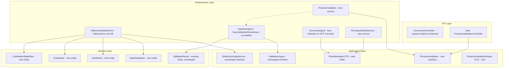
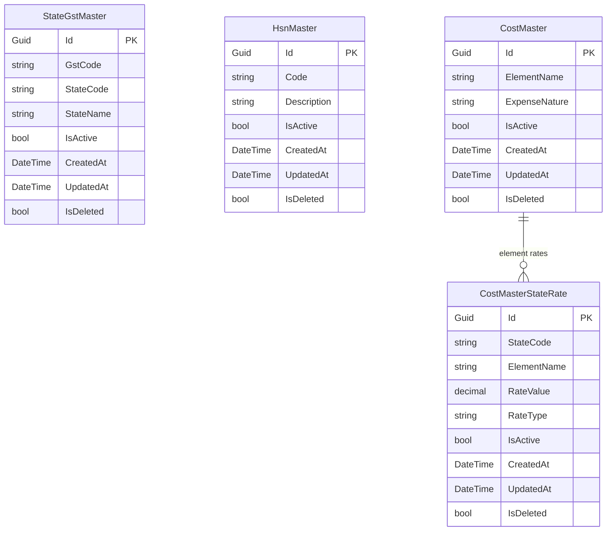

# Design Document: Validation Engine Gaps

## Overview

This design addresses five gaps in the Bajaj Document Processing validation engine:

1. **Proactive Validation on Upload** — A new endpoint that runs field presence checks immediately when a document is uploaded, giving Agency users instant feedback before submission.
2. **Duplicate Image Detection** — Perceptual hashing of uploaded photos to detect duplicate images within a package.
3. **Dedicated Face Detection** — New `HasHumanFace`, `FaceCount`, and `FaceDetectionConfidence` fields in `PhotoMetadata`, extracted via GPT-4 Vision independently of blue t-shirt detection.
4. **Database-Backed Reference Data** — Migration of hardcoded GST, HSN, cost element, and state rate dictionaries from `ReferenceDataService.cs` into SQL Server tables with EF Core entities.
5. **Validation Result Persistence** — Re-enabling `SaveValidationResultAsync` to persist per-document-type `ValidationResult` entities after reactive validation completes.

All changes follow the existing Clean Architecture (Domain → Application → Infrastructure → API) and maintain backward compatibility with the existing `ValidatePackageAsync` reactive flow.

## Architecture

The changes span all four layers:



## Components and Interfaces

### 1. Proactive Validation (Gap 1)

**New Interface: `IProactiveValidator`** (Application layer)

```csharp
public interface IProactiveValidator
{
    Task<ProactiveValidationResult> ValidateDocumentOnUploadAsync(
        Guid documentId,
        DocumentType documentType,
        CancellationToken cancellationToken = default);
}
```

**New DTO: `ProactiveValidationResult`** (Application layer)

```csharp
public class ProactiveValidationResult
{
    public bool Passed { get; set; }
    public DocumentType DocumentType { get; set; }
    public List<string> MissingFields { get; set; } = new();
    public List<string> Warnings { get; set; } = new();
    public DateTime ValidatedAt { get; set; }
}
```

**New Service: `ProactiveValidator`** (Infrastructure layer)

- Reuses the existing field presence validation methods from `ValidationAgent` (extracted into shared helpers or called directly).
- Loads the single document by ID, deserializes its `ExtractedDataJson`, and runs the appropriate field presence check.
- Does NOT run cross-document or SAP validation (those remain in the reactive flow).
- Returns `ProactiveValidationResult` with missing fields list.

**New Controller: Endpoint on `DocumentsController`**

A new `POST /api/documents/{id}/validate` endpoint that:
1. Accepts a document ID and document type.
2. Calls `IProactiveValidator.ValidateDocumentOnUploadAsync`.
3. Returns the `ProactiveValidationResult`.
4. Requires JWT auth and verifies resource ownership.

The upload endpoint itself (`POST /api/documents/upload`) is NOT modified to run validation inline — proactive validation is a separate call the frontend makes after upload + extraction completes. This keeps upload fast and decouples concerns.

### 2. Duplicate Image Detection (Gap 2)

**New Interface: `IPerceptualHashService`** (Application layer)

```csharp
public interface IPerceptualHashService
{
    Task<string?> ComputeHashAsync(Stream imageStream, CancellationToken cancellationToken = default);
    double ComputeSimilarity(string hash1, string hash2);
}
```

**New Service: `PerceptualHashService`** (Infrastructure layer)

- Implements average hash (aHash) algorithm: resize image to 8×8 grayscale, compute mean pixel value, generate 64-bit hash where each bit indicates above/below mean.
- `ComputeSimilarity` returns normalized Hamming distance (0.0 = identical, 1.0 = completely different).
- Configurable similarity threshold (default: 0.1 = 90% similar).

**Integration Points:**

- `DocumentAgent.ExtractPhotoMetadataAsync` calls `IPerceptualHashService.ComputeHashAsync` and stores the result in `PhotoMetadata.PerceptualHash`.
- `ValidationAgent.ValidatePhotoFieldPresence` (or a new helper) compares all photo hashes within a package and flags duplicates.
- Duplicate detection results are added to `PhotoFieldPresenceResult` as new fields:

```csharp
// Added to PhotoFieldPresenceResult
public List<DuplicatePhotoPair> DuplicatePhotos { get; set; } = new();

public class DuplicatePhotoPair
{
    public string Photo1FileName { get; set; } = string.Empty;
    public string Photo2FileName { get; set; } = string.Empty;
    public double SimilarityScore { get; set; }
}
```

### 3. Dedicated Face Detection (Gap 3)

**PhotoMetadata DTO Changes:**

```csharp
// New fields added to PhotoMetadata
public bool HasHumanFace { get; set; }
public int FaceCount { get; set; }
public double FaceDetectionConfidence { get; set; }
```

**DocumentAgent Changes:**

The GPT-4 Vision prompt in `AnalyzePhotoContentAsync` is extended to request face detection as a separate analysis field. The `PhotoVisionResponse` internal class gets new fields:

```csharp
// Added to PhotoVisionResponse
public bool HasHumanFace { get; set; }
public int FaceCount { get; set; }
public double FaceDetectionConfidence { get; set; }
```

**EnhancedValidationReportService Changes:**

Line ~546 in `EnhancedValidationReportService.cs` currently uses `metadata?.HasBlueTshirtPerson` as a proxy for face detection. This is updated to use `metadata?.HasHumanFace` instead.

**PhotoFieldPresenceResult Changes:**

A new `PhotosWithFace` count field is added alongside the existing `PhotosWithBlueTshirt`:

```csharp
// Added to PhotoFieldPresenceResult
public int PhotosWithFace { get; set; }
```

### 4. Database-Backed Reference Data (Gap 4)

**New Domain Entities:**

```csharp
public class StateGstMaster : BaseEntity
{
    public string GstCode { get; set; } = string.Empty;     // "01", "02", etc.
    public string StateCode { get; set; } = string.Empty;    // "JK", "HP", etc.
    public string StateName { get; set; } = string.Empty;    // "Jammu and Kashmir"
    public bool IsActive { get; set; } = true;
}

public class HsnMaster : BaseEntity
{
    public string Code { get; set; } = string.Empty;         // "8703", "995411"
    public string Description { get; set; } = string.Empty;
    public bool IsActive { get; set; } = true;
}

public class CostMaster : BaseEntity
{
    public string ElementName { get; set; } = string.Empty;  // "POS - Standee"
    public string ExpenseNature { get; set; } = string.Empty; // "Fixed Cost" or "Cost per Day"
    public bool IsActive { get; set; } = true;
}

public class CostMasterStateRate : BaseEntity
{
    public string StateCode { get; set; } = string.Empty;    // "Delhi", "UP & UTT"
    public string ElementName { get; set; } = string.Empty;  // "POS Standee"
    public decimal RateValue { get; set; }                    // 1200
    public string RateType { get; set; } = "Amount";          // "Amount" or "Percentage"
    public bool IsActive { get; set; } = true;
}
```

**DbContext Changes:**

New `DbSet` properties added to `ApplicationDbContext`:

```csharp
public DbSet<StateGstMaster> StateGstMasters => Set<StateGstMaster>();
public DbSet<HsnMaster> HsnMasters => Set<HsnMaster>();
public DbSet<CostMaster> CostMasters => Set<CostMaster>();
public DbSet<CostMasterStateRate> CostMasterStateRates => Set<CostMasterStateRate>();
```

**ReferenceDataService Refactoring:**

- The `IReferenceDataService` interface remains unchanged.
- The implementation is refactored to inject `IApplicationDbContext` and query the new tables instead of using static dictionaries.
- Results are cached in-memory with a configurable TTL (default: 1 hour) using `IMemoryCache` to avoid repeated DB queries on every validation.
- Cache is invalidated when reference data is updated (future admin endpoint, out of scope for this spec).

**EF Core Migration:**

A single migration creates all four tables and seeds them with the initial data provided in the requirements (38 GST state codes, ~15 HSN/SAC codes, 15 cost elements, 10 state × 15 element rate rows).

### 5. Validation Result Persistence (Gap 5)

**ValidationAgent Changes:**

The disabled `SaveValidationResultAsync` method is re-enabled and refactored to save per-document-type results:

```csharp
private async Task SaveValidationResultsAsync(
    PackageValidationResult result,
    DocumentPackage package,
    CancellationToken cancellationToken)
{
    // For each document type that was validated, create/update a ValidationResult entity
    // PO → SAPVerification, DateValidation
    // Invoice → InvoiceFieldPresence, InvoiceCrossDocument
    // CostSummary → CostSummaryFieldPresence, CostSummaryCrossDocument
    // ActivitySummary → ActivityFieldPresence, ActivityCrossDocument
    // EnquiryDocument → EnquiryDumpFieldPresence
    // TeamPhotos → PhotoFieldPresence, PhotoCrossDocument
}
```

For each document type:
1. Query for an existing `ValidationResult` with matching `DocumentType` and `DocumentId`.
2. If found, update it. If not, create a new one.
3. Serialize the relevant sub-results into `ValidationDetailsJson`.
4. Set `AllValidationsPassed` based on the sub-results for that document type.
5. Set `FailureReason` from the relevant issues.

The `WorkflowOrchestrator.ExecuteValidationStepAsync` commented-out code is removed — persistence now happens inside `ValidationAgent.ValidatePackageAsync` directly.

**Error Handling:** If saving any individual `ValidationResult` fails, the error is logged and the next document type is processed. The validation pipeline is never blocked by persistence failures.

## Data Models

### New Tables (EF Core Entities)



### Modified DTOs

**PhotoMetadata** — 3 new fields:
- `HasHumanFace` (bool)
- `FaceCount` (int)
- `FaceDetectionConfidence` (double, 0-100)
- `PerceptualHash` (string, nullable)

**PhotoFieldPresenceResult** — 2 new fields:
- `PhotosWithFace` (int)
- `DuplicatePhotos` (List<DuplicatePhotoPair>)

**ProactiveValidationResult** — new DTO (see Components section)


## Correctness Properties

*A property is a characteristic or behavior that should hold true across all valid executions of a system — essentially, a formal statement about what the system should do. Properties serve as the bridge between human-readable specifications and machine-verifiable correctness guarantees.*

### Property 1: Proactive validation pass/fail is consistent with missing fields

*For any* extracted document data of any document type, the `ProactiveValidationResult.Passed` field SHALL equal `true` if and only if `MissingFields` is empty. Equivalently, `Passed == (MissingFields.Count == 0)`.

**Validates: Requirements 1.1, 1.2, 1.3**

### Property 2: Duplicate photo detection identifies all pairs within threshold

*For any* set of photo hashes within a package, if two hashes have a Hamming distance within the configured similarity threshold, then the duplicate detection result SHALL contain a `DuplicatePhotoPair` entry for those two photos with the correct similarity score. Conversely, if no pair is within threshold, the duplicate list SHALL be empty.

**Validates: Requirements 2.2, 2.3**

### Property 3: Face detection field used for human presence in reports

*For any* `PhotoMetadata` instance, the photo validation report SHALL count the photo as having a human face based on the `HasHumanFace` field, not the `HasBlueTshirtPerson` field. Specifically, for any combination of `HasHumanFace` and `HasBlueTshirtPerson` values, the `PhotosWithFace` count SHALL increment only when `HasHumanFace` is true.

**Validates: Requirements 3.5**

### Property 4: GST state mapping validation matches seeded data

*For any* GST code and state code pair, `ValidateGSTStateMapping` SHALL return `true` if and only if the `State_GST_Master` table contains a row where `GstCode` matches the first 2 digits of the GST number and `StateCode` matches the provided state code.

**Validates: Requirements 4.5**

### Property 5: HSN/SAC code validation matches seeded data

*For any* HSN/SAC code string, `ValidateHSNSACCode` SHALL return `true` if and only if the `HSN_Master` table contains an active row with a matching `Code` value.

**Validates: Requirements 4.6**

### Property 6: Cost rate validation uses database rates

*For any* element name, cost amount, and state code, `ValidateElementCostAgainstStateRate` SHALL return `true` if and only if the cost is within 10% tolerance of the rate value found in the `Cost_Master_State_Rates` table for that element/state combination. If no rate exists, it SHALL return `true` (pass by default).

**Validates: Requirements 4.7**

### Property 7: Per-document-type ValidationResult count matches validated documents

*For any* DocumentPackage with N distinct document types present (e.g., PO, Invoice, CostSummary), after `ValidatePackageAsync` completes, the database SHALL contain exactly N `ValidationResult` rows for that package, one per document type.

**Validates: Requirements 5.1**

### Property 8: ValidationResult fields are fully populated

*For any* saved `ValidationResult` entity, the `DocumentType` SHALL be a valid enum value, `DocumentId` SHALL be non-empty, `ValidationDetailsJson` SHALL be non-null and non-empty, and `AllValidationsPassed` SHALL be consistent with the absence of failure reasons (i.e., `AllValidationsPassed == true` implies `FailureReason` is null or empty).

**Validates: Requirements 5.2**

### Property 9: Re-validation is idempotent on ValidationResult count

*For any* DocumentPackage, running `ValidatePackageAsync` twice SHALL result in the same number of `ValidationResult` rows as running it once. The second run SHALL update existing rows rather than creating duplicates.

**Validates: Requirements 5.3**

### Property 10: ValidationDetailsJson round-trip serialization

*For any* per-document validation result (e.g., `InvoiceFieldPresenceResult`), serializing it to JSON and storing it in `ValidationDetailsJson`, then deserializing it back, SHALL produce an object equivalent to the original.

**Validates: Requirements 5.5**

## Error Handling

| Scenario | Behavior |
|---|---|
| Proactive validation extraction fails | Return upload success with warning in `ProactiveValidationResult.Warnings`; do not fail the upload |
| Perceptual hash computation fails for a photo | Log warning, set `PerceptualHash` to null, skip that photo in duplicate detection |
| Face detection fields missing from GPT-4 Vision response | Default `HasHumanFace` to false, `FaceCount` to 0, `FaceDetectionConfidence` to 0 |
| Reference data DB query fails | Log error, fall back to returning `true` (pass validation) to avoid blocking the pipeline; log at WARNING level |
| Reference data cache miss with DB unavailable | Same as above — graceful degradation |
| SaveValidationResultAsync fails for one document type | Log error, continue saving results for remaining document types; do not block the validation pipeline |
| SaveValidationResultAsync fails for all document types | Log error at ERROR level, return validation result normally (validation itself succeeded, only persistence failed) |

## Testing Strategy

### Testing Framework

- **Unit tests**: xUnit + Moq (per tech.md)
- **Property-based tests**: FsCheck (per tech.md)
- **Minimum iterations**: 100 per property test

### Unit Tests

Unit tests cover specific examples, edge cases, and error conditions:

- Proactive validation with a fully-populated invoice returns Passed=true
- Proactive validation with a completely empty invoice returns all expected missing fields
- Duplicate detection with two identical image hashes returns one pair
- Duplicate detection with all unique hashes returns empty list
- Face detection fields default to false/0 when GPT-4 response is missing them
- GST validation with known valid code "07" + "DL" returns true
- GST validation with mismatched code "07" + "MH" returns false
- HSN validation with known valid code "8703" returns true
- HSN validation with unknown code "9999" returns false
- SaveValidationResultAsync creates new rows for first validation
- SaveValidationResultAsync updates existing rows on re-validation
- SaveValidationResultAsync continues when one document type save fails

### Property-Based Tests

Each property test references its design document property and is tagged accordingly. FsCheck generators produce random document data, photo metadata, hash strings, and reference data lookups.

- **Property 1**: Generate random document data with random field presence → verify `Passed == (MissingFields.Count == 0)`
  - Tag: `Feature: validation-engine-gaps, Property 1: Proactive validation pass/fail consistency`
- **Property 2**: Generate random sets of 64-bit hash strings → verify all pairs within threshold are detected
  - Tag: `Feature: validation-engine-gaps, Property 2: Duplicate photo detection`
- **Property 3**: Generate random PhotoMetadata with random HasHumanFace/HasBlueTshirtPerson → verify PhotosWithFace counts only HasHumanFace
  - Tag: `Feature: validation-engine-gaps, Property 3: Face detection field usage`
- **Property 4**: Generate random GST numbers with known state codes from seeded data → verify ValidateGSTStateMapping correctness
  - Tag: `Feature: validation-engine-gaps, Property 4: GST validation from DB`
- **Property 5**: Generate random HSN codes (mix of valid and invalid) → verify ValidateHSNSACCode correctness
  - Tag: `Feature: validation-engine-gaps, Property 5: HSN validation from DB`
- **Property 6**: Generate random element/state/cost combinations → verify ValidateElementCostAgainstStateRate uses DB rates with 10% tolerance
  - Tag: `Feature: validation-engine-gaps, Property 6: Cost rate validation from DB`
- **Property 7**: Generate random packages with varying document type combinations → verify ValidationResult count matches
  - Tag: `Feature: validation-engine-gaps, Property 7: ValidationResult count per document type`
- **Property 8**: Generate random validation results → verify all required fields are populated and consistent
  - Tag: `Feature: validation-engine-gaps, Property 8: ValidationResult field population`
- **Property 9**: Run validation twice on same package → verify row count unchanged
  - Tag: `Feature: validation-engine-gaps, Property 9: Re-validation idempotency`
- **Property 10**: Generate random field presence results → serialize to JSON → deserialize → verify equality
  - Tag: `Feature: validation-engine-gaps, Property 10: ValidationDetailsJson round-trip`
