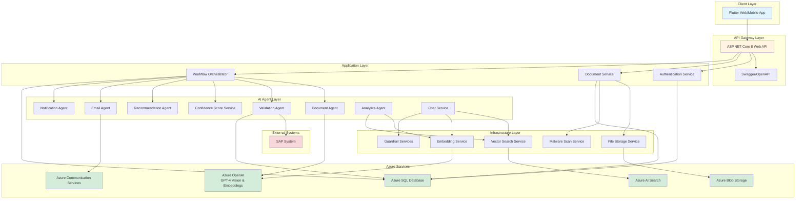
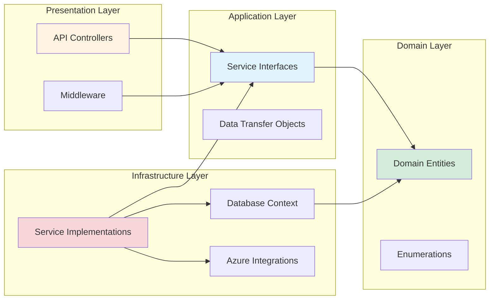
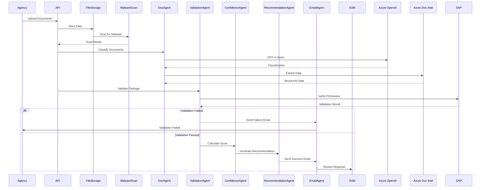
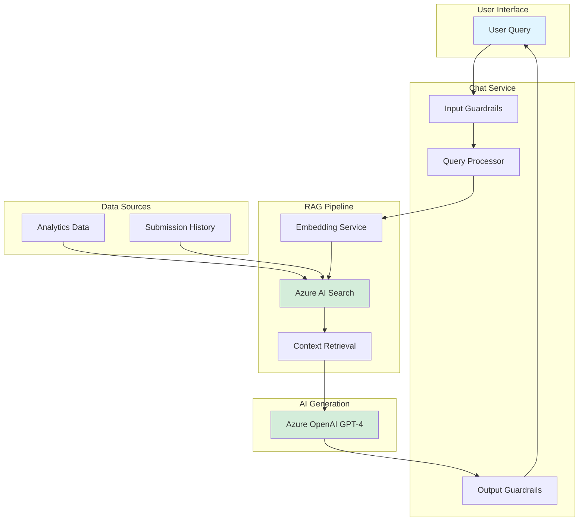
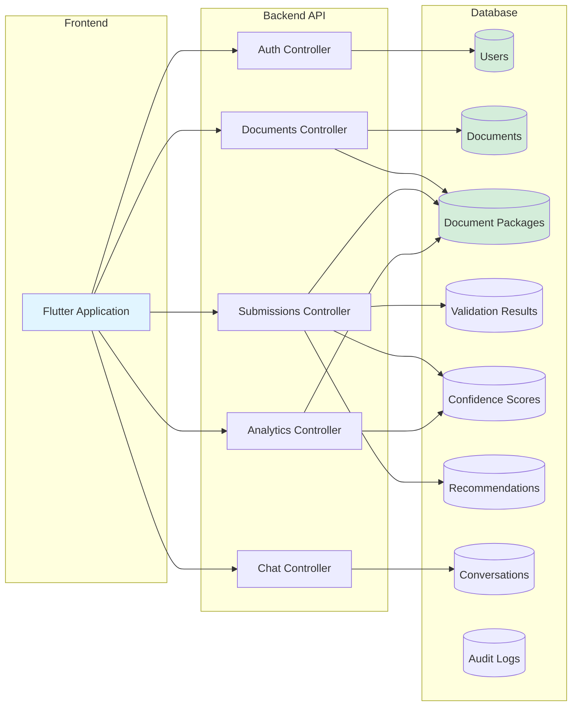
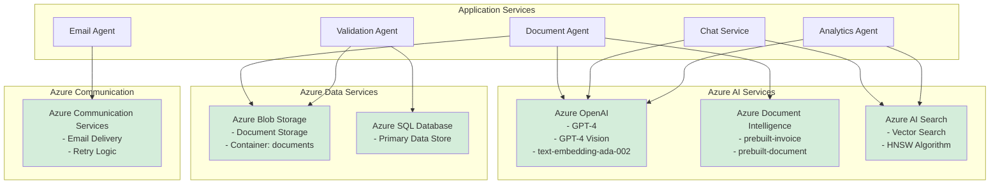
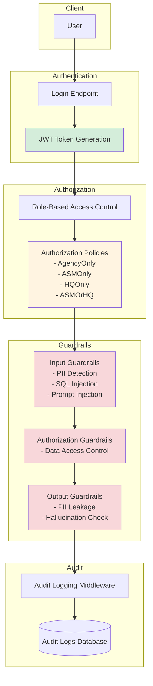
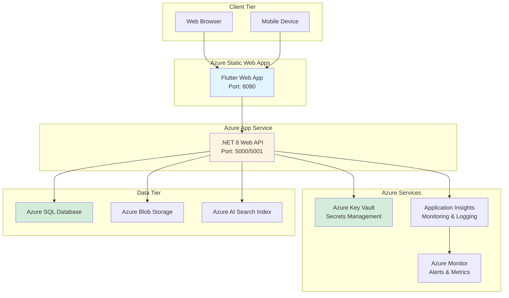

# Bajaj Document Processing System - Architecture Diagram

## System Architecture Overview

## Clean Architecture Layers

## Document Processing Workflow

## Chat Service Architecture

## Data Flow Architecture

## Azure Services Integration

## Security Architecture

## Deployment Architecture

## Technology Stack Summary

### Frontend
- **Framework**: Flutter 3.2+ (Dart 3.2+)
- **State Management**: Riverpod
- **HTTP Client**: Dio
- **Navigation**: GoRouter
- **Storage**: Flutter Secure Storage, Hive

### Backend
- **Framework**: ASP.NET Core 8 (C# .NET 8)
- **Architecture**: Clean Architecture
- **ORM**: Entity Framework Core 8
- **Database**: Azure SQL Database
- **Authentication**: JWT Bearer Tokens

### AI & Azure Services
- **AI Orchestration**: Semantic Kernel
- **LLM**: Azure OpenAI (GPT-4, GPT-4 Vision)
- **Embeddings**: text-embedding-ada-002
- **Document Processing**: Azure Document Intelligence
- **Vector Database**: Azure AI Search
- **File Storage**: Azure Blob Storage
- **Email**: Azure Communication Services

### Testing
- **Unit Testing**: xUnit
- **Property-Based Testing**: FsCheck
- **Mocking**: Moq

---

## Key Design Patterns

1. **Clean Architecture**: Separation of concerns with Domain, Application, Infrastructure, and API layers
2. **Multi-Agent System**: Specialized AI agents for different tasks
3. **Repository Pattern**: Data access abstraction
4. **Dependency Injection**: Loose coupling and testability
5. **CQRS-lite**: Separation of read and write operations
6. **Retry Pattern**: Resilient external service calls
7. **Circuit Breaker**: Fault tolerance for Azure services
8. **RAG (Retrieval-Augmented Generation)**: Context-aware AI responses

---

## Scalability Considerations

1. **Horizontal Scaling**: Azure App Service can scale out
2. **Caching**: Redis for frequently accessed data
3. **Async Processing**: Background jobs for document processing
4. **CDN**: Static assets served via Azure CDN
5. **Database Optimization**: Indexed queries, connection pooling
6. **Rate Limiting**: API throttling to prevent abuse

---

## Security Measures

1. **Authentication**: JWT tokens with expiration
2. **Authorization**: Role-based access control (RBAC)
3. **Data Encryption**: TLS in transit, encryption at rest
4. **Input Validation**: Guardrails for malicious input
5. **Output Filtering**: PII detection and removal
6. **Audit Logging**: Complete audit trail
7. **Secrets Management**: Azure Key Vault
8. **Malware Scanning**: File upload validation

---

*Last Updated: March 3, 2026*
